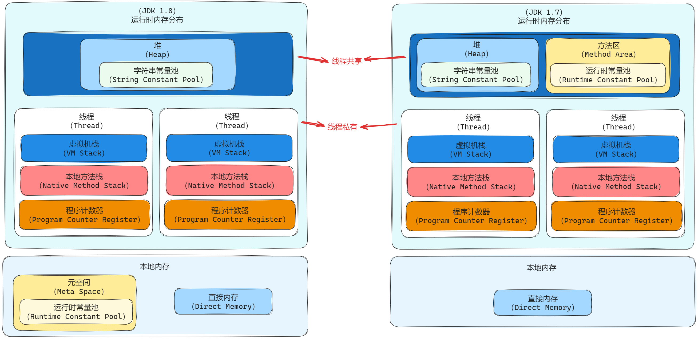
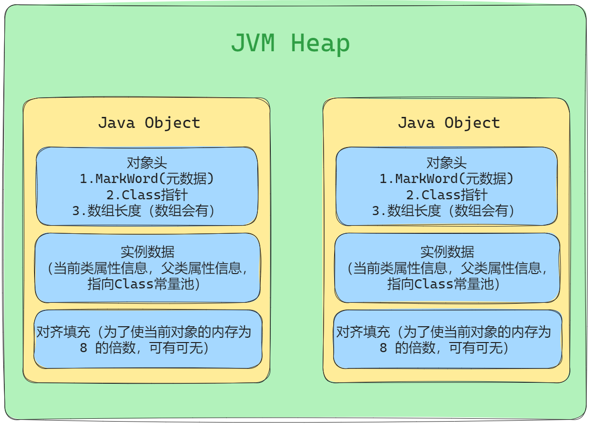
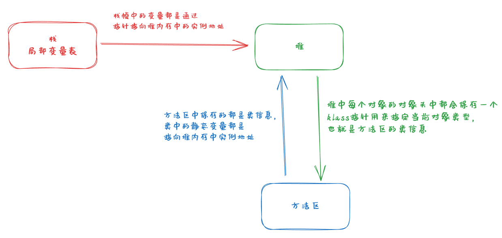
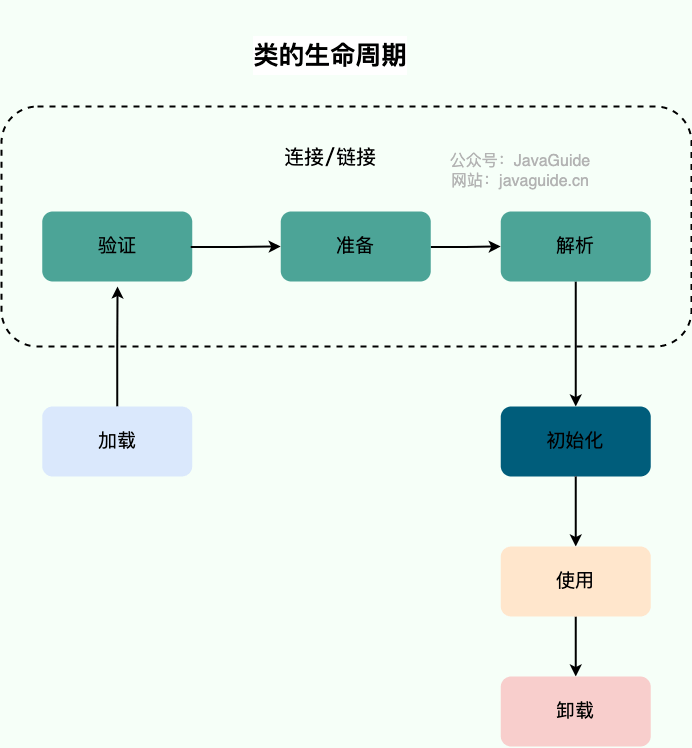

# JVM

### 作用

通过编译器把java代码转换成字节码，类加载器再把字节码加载到内存中，将其放在运行时数据区的方法区内，而字节码文件只是jvm的一套指令集规范，并不能直接交给底层操作系统去执行，因此需要特定的命令解析器执行引擎将字节码翻译成底层系统指令，再交由cpu去执行，这个过程需要调用其他语言的本地库接口来实现整个程序的功能。


### JVM 运行时内存空间





#### a.方法区

存储已经被jvm加载的类信息**(类的方法代码，变量名，方法名，访问权限，返回值)**，运行时常量池，静态变量，即时编译器编译后的代码等数据。方法区是一个概念，在1.8之前是通过堆中的永久代实现，1.8之后永久代剔除了，换成了元空间。

-   **运行时常量池**：属于方法区一部分，用于存放编译期生成的各种字面量和符号引用。编译器和运行期(String 的 intern())都可以将常量放入池中

#### b.堆

存储类对象实例，数组，jdk8以后将字符串常量池和静态变量移入堆中，被所有`线程共享`的一块内存区域，在虚拟机启动时创建。内部会划分出多个线程私有的分配缓冲区(Thread Local Allocation Buffer, TLAB)

##### 内存划分

1.8之前，新生代、老年代、永久代，JDK 8 版本之后 PermGen(永久代) 已被 Metaspace(元空间) 取代，元空间使用的是本地内存。

JVM 内存会划分为堆内存和非堆内存，堆内存中也会划分为年轻代和老年代，而非堆内存则为永久代。

年轻代又会分为Eden和Survivor区。Survivor 也会分为FromPlace和ToPlace，toPlace 的 survivor 区域是空的。Eden，FromPlace 和 ToPlace 的默认占比为 8:1:1

##### 堆内存分配特点

1. **对象优先在 Eden 区分配**

    对象创建会优先在新生代的Eden区分配，当Eden区没有足够内存的时候，会进行Minor GC,GC期间如果发现新生代Survivor内存足够会在Survivor中分配内存，如果发现不足会通过分配担保机制（确保在GC前老年代本身还有足够空间容纳新生代所有对象）将把新生代的对象提前放入老年代中，如果执行完GC发现Eden区有足够的内存还是会在eden区进行对象内存的分配。

2. **大对象直接进入老年代中**

    大对象需要大量连续的内存空间，比如数组、字符串；大对象直接进入老年代的行为是由虚拟机动态决定的，它与具体使用的垃圾回收器和相关参数有关。大对象直接进入老年代是一种优化策略，旨在避免将大对象放入新生代，从而减少新生代的垃圾回收频率和成本。

    -   G1垃圾回收器会根据堆区域大小和阈值，来决定哪些对象会直接进入老年代。

    -   Parallel Scavenge垃圾回收器中，默认情况下，由虚拟机根据当前的堆内存情况和历史数据动态决定。


3. **长期存活的对象会进入老年代**

    每个对象在对象头中都有一个年龄计数器初始值为0，对象每经历过一次GC这个计数器就会加1，大部分情况，对象都会优先在eden区创建，如果对象在eden区创建并经历过gc后仍能存活，并且能被survivor容纳的话，就会被移动到survivor内存中，并且将年龄设为1；如果对象在survivor区中很多次gc，对象年龄达到一定程度（虚拟机默认的阈值为15，但要区分收集器在CMS收集器中默认阈值为6）就会将对象移入老年代。


**为什么要将永久代 (PermGen) 替换为元空间 (MetaSpace) 呢?**

1.永久代是有固定大小限制的，会出现内存溢出问题；元空间是放在本地内存里，受本机内存限制，内存溢出问题变小。`-XX：MaxMetaspaceSize` 标志设置最大元空间大小。

2.内存变大，加载的类就更多。

>   -XX:MetaspaceSize=N //设置 Metaspace 的初始（和最小大小）
>   -XX:MaxMetaspaceSize=N //设置 Metaspace 的最大大小


#### c.虚拟机栈

指的是Java方法执行的内存模型：每个在执行时都会创建一个栈帧（stack frame）用于存储局部变量表，操作数栈，动态链接，方法出口等信息。每一个方法从调用到执行结束，就对应一个栈帧从虚拟机栈中入栈到出栈的过程。

>   -   8 种基本类型的局部变量、局部对象的引用变量、实例方法都是在栈里面分配内存
>   -   活动栈帧：栈最顶部的栈帧
>   -   `-Xss256k`:指定栈内存大小

问题：

1. 方法内的局部变量是否线程安全？

    - 如果方法内局部变量没有逃离方法的作用范围，它是线程安全的。

    - 如果局部变量引用了变量，并逃离方法的作用范围，它是线程不安全的

2. 栈内存溢出（<font color="red">***java.lang.StackOverflowError***</font>）

    - 栈帧过多导致栈内存溢出
    - 栈帧过大导致内存溢出

    

    

    - CPU占用过多

    ```markdown
    诊断步骤：
    1.通过top命令查询进程占用
    2.ps命令定位线程占用
    3.jstack id（根据线程id找到有问题的线程，定位到源代码）
    ```

    ```shell
    jstack 进程id(pid)  # 控制台输出指定进程的信息
    jstack  进程id >文件     #打印堆栈信息到文件中 
    jstack -l  进程id    #除堆栈外，会打印出额外的锁信息，在发生死锁时可以用jstack -l pid来观察锁持有情况  
    ```

    >   注意：
    >
    >   1.   jstack只能分析JVM虚拟机开启的进程，如果想看当前时间段下整个系统的运行状况需使用 `jmap` 命令导入 dump 文件。
    >
    >   2.   jstack生成快照中，tid 是java中为这个线程的id，nid 是这个线程对应的操作系统本地线程id，每一个java线程都有一个对应的操作系统线程，且它们都是通过16进制表示的

    - 程序运行长时间没有结果

    ```markdown
    诊断步骤同上
    ```


**d.本地方法栈**

功能与虚拟机栈类似，只不过本地方法栈是为虚拟机使用的native方法服务。

>   栈私有化：可以保证线程中的局部变量不被别的线程访问到


**e.程序计数器**

作用：**记住下一条jvm指令的执行地址**，当前指令执行同时会将下条jvm命令的执行内置放入程序计数器中。当前指令执行完毕后，解释器会通过程序计数器中的地址继续执行指令。

-   字节码解释器通过改变程序计数器来依次读取指令，从而实现代码的流程控制，如：顺序执行、选择、循环、异常处理。
-   线程是占用CPU执行的基本单位，而CPU一般是使用时间片轮转方式让线程轮询占用的，所以当前线程CPU时间片用完后，要让出CPU，等下次轮到自己的时候再执行。程序计数器就是**为了记录该线程让出CPU时的执行地址**，待再次分配到时间片时线程就可以从自己私有的计数器指定地址继续执行。

特点：

- 线程私有
- jvm中唯一没有内存泄漏的风险的区域

```markdown
通过改变这个计数器的值来选取下一条需要执行指令的字节码 指令，分支、循环、跳转、异常处理、线程恢复等基础功能都需要依赖计数器完成
```


**f.执行引擎**

将字节码翻译成底层系统指令

**g.本地库接口**

**h.本地内存**

-   直接内存非虚拟机运行时数据区的部分，是java虚拟机向操作系统申请的一片内存空间。
-   元空间：方法区。

**直接内存**

非虚拟机运行时数据区的部分，是java虚拟机向操作系统申请的一片内存空间


#### 常量池

**1.字符串常量池（存放引用或者是对象）**

1.7之前是在方法区中，之后移到堆中，为了重复利用资源，避免字符串重复。主要是因为永久代（方法区实现）的 GC 回收效率太低，只有在整堆收集 (Full GC)的时候才会被执行 GC。Java 程序中通常会有大量的被创建的字符串等待回收，将字符串常量池放到堆中，能够更高效及时地回收字符串内存。

>   -XX:StringTableSize // 设置常量池大小

**2.class常量池(包含：静态常量池)**

我们写的每一个Java类被编译后，就会形成一份class文件；class文件中除了包含类的版本、字段、方法、接口等描述信息外，还有一项信息就是常量池(constant pool table)，用于存放编译器生成的各种字面量(Literal)和符号引用(Symbolic References)；一个class文件对应一个class常量池。

**3.运行时常量池（引用）**

属于方法区一部分，用于存放编译期生成的各种字面量和符号引用。编译期和运行期都可以将常量放入池中。

-   字面量：源代码中直接表示值的一种记法
-   符号引用：描述所引用的目标，符号可以是任何形式的字面量，只要使用时能无歧义地定位到目标即可。
-   直接引用：是直接指向目标的指针，相对偏移量（内存地址）和能间接定位到目标的句柄。如果有直接引用，就标识目标已经存在于虚拟机内。

>   静态常量池（class常量池/全局常量池）和运行时常量池是放在元空间里，元空间里存放都是引用指向堆内存。


### JVM对象

> 在JVM中，对象在内存中的布局分为三块区域：对象头，实例数据，对齐填充。


#### 存储结构

在hotspot虚拟机中，对象在堆内存中的存储区域分为3块：**对象头，实际数据，对齐填充。**



**a.对象头（16字节）**

1.MarkWord（8字节，32位4字节）

用于存储对象自身运行时数据，如hashcode，gc分代年龄，锁状态标志，偏向线程id，偏向时间戳。

2.class指针（64位下8字节，32位4字节）

对象指向**实例类型**的指针，jvm会通过这个指针来确定这个对象是哪个类的实例。

3.数组长度

只有数组对象有

**b.实例数据**

存放类的**属性数据**信息，包括父类的属性信息。

**c.对齐填充**

当对象的大小不是**8**的整数倍时，会通过进行对齐填充的数据进行补全。

>   开启指针压缩的情况下对象头的大小为12字节；
>
>   数组对象长度（指针压缩）：数组长度4字节+数组对象头8字节+数组markWord4字节+对齐4字节=16字节；


#### 对象访问

Java通过栈中局部变量里的refrence区来操作堆中的具体对象。

**句柄**：如果使用句柄的话，Java 堆中将会划分出一块内存来作为句柄池，栈帧的局部变量表指向的是句柄池（reference区）中句柄地址，而非对象实例本身，句柄池中的一个个对象地址有两部分组成，一部分就是对象数据在堆内存中实例池中的地址，另一部分就是对象类型在方法区中的地址。

**直接指针**：使用直接指针访问，Java虚拟机需要在堆中为对象分配额外的空间存储指向方法区对象类型数据的指针，采用直接指针访问方式，栈帧里的本地变量表的对象引用直接存储堆中对象的地址，堆里的指针会指向方法区对象类型，只需要进行两次指针定位。


#### 内存指向问题

具体内存组成参考[内存组成](#1.主要组成)




#### 创建过程

1.  **类加载检查**

    遇到new指令时，会检查new指令参数的符号引用能不能在常量池中定位到，并检查这个符号引用是否已经被加载过、解析和初始化过。如果没有就先执行类加载过程。

2.  **分配内存**

    当前对象所需要的内存大小会在类加载完成后确定，会在堆里划分一片指定大小的内存。

    **内存分配问题**：

    分配方式有指针碰撞和空闲列表两种，两种方式由堆是否规整（有没有内存碎片）决定，而堆是否规整由采用的垃圾收集器是否带有压缩整理功能决定（标记-整理算法）。

    -   指针碰撞：适合内存规整的情况下，用过的内存全部整合到一边，没用过的内存放在另一边，中间有个分界指针，只需要向着没用过的内存方向移动对应内存大小即可。（标记-整理算法概念）适用的收集器：Serial,ParNew
    -   空闲列表：适合堆内存不规整情况下，虚拟机会维护一个列表，列表里记录哪些内存块可用，在分配内存时找一块大的内存块进行分配，然后更新列表记录。（标记-清除算法概念）适用收集器：CMS

    >   Java 堆内存是否规整，取决于 GC 收集器的算法是"标记-清除"，还是"标记-整理"（也称作"标记-压缩"），值得注意的是，复制算法内存也是规整的

    **线程安全问题(并发情况下，在给对象A划分内存时候，指针还没来得及修改，在同一位置又给B划分内存)**：

    -   **CAS+失败重试：** CAS 是乐观锁的一种实现方式。所谓乐观锁就是，每次不加锁而是假设没有冲突而去完成某项操作，如果因为冲突失败就重试，直到成功为止。**虚拟机采用 CAS 配上失败重试的方式保证更新操作的原子性。**
    -   **TLAB：** 为每一个线程预先在 Eden 区分配一块儿内存，JVM 在给线程中的对象分配内存时，首先在 TLAB 分配，当对象大于 TLAB 中的剩余内存或 TLAB 的内存已用尽时，再采用上述的 CAS 进行内存分配

3.  **初始化默认值**

    内存分配完成后，虚拟机会将分配的内存空间全部初始化为零值，保证对象实例在没有初始化值的时候就可以使用，程序能访问到这些字段的数据类型所对应的默认值。

4.  **设置对象头**

    虚拟机会把当前对象的类型指针、元数据信息、hash值、gc分代年龄一些信息放到对象头里，有些时候也会根据情况改变对象头的锁标志位。

5.  **执行init方法**

    执行init方法，标识当前对象创建完毕。


### Class 类


#### 类的生命周期

加载，验证，准备，解析，初始化，使用，卸载。



**类加载过程**

jvm将编译后的class文件加载到内存中，进行验证、准备、解析、初始化。一般发生在方法区里，方法区里在Java7的实现是永久代，在Java8之后是元空间。

1.  **加载**：先判断当前实例对象有没有被加载过，有的话直接进行内存分配，没有进行类加载；类加载器主要做了3件事情：

    -   通过全类限定名获取当前类的二进制流数据。
    -   将字节流的静态存储结构转换为方法区（元空间）的运行时数据结构。
    -   在内存中生成一个class对象，作为方法区（元空间）访问数据的入口。

2.  **验证**：确保Class文件的字节流包含的信息符合Java虚拟机规范的约束要求，保证程序安全。包含四个验证阶段：

    -   Class 文件格式检查,比如：主次版本号是否包含在当前虚拟机的处理范围内、常量池的常量是否有不被支持的类型...
    -   元数据验证/字节码语义检查，比如：这个类是否有父类（除了Object）、这个类是否继承了被final修饰的类...
    -   字节码验证/程序语义检查，比如：函数的形参类型是否正确、对象的类型转换是否合理...
    -   符合引用验证/类的正确性检查，比如：该类正在使用的其他类，方法，字段是否存在，是否具有访问权限...

3.  **准备**：为当前类变量（静态变量）分配内存并设置初始值。是在方法区（永久代中）分配。参考[JVM内存组成](#1.主要组成)

4.  **解析**：得到类、字段、方法在内存中的指针或者偏移量。（虚拟机将常量池中的符号引用转换为直接引用的过程）

5.  **初始化**：执行`<clinit>()`方法。

6.  **卸载**：当前类的Class对象被GC。

    >   被GC需要满足GC条件[方法区中的垃圾判断](#3.方法区中的垃圾判断)


**初始化时机（类加载时机）**

1.遇到new、getstatic、putstatic、invokestatic指令。

-   当 jvm 执行 `new` 指令时会初始化类。即当程序创建一个类的实例对象。
-   当 jvm 执行 `getstatic` 指令时会初始化类。即程序访问类的静态变量(不是静态常量，常量会被加载到运行时常量池)。
-   当 jvm 执行 `putstatic` 指令时会初始化类。即程序给类的静态变量赋值。
-   当 jvm 执行 `invokestatic` 指令时会初始化类。即程序调用类的静态方法。

2.使用反射，像Class.forName()、newInstance()

3.初始化一个类时，触发对其父类的初始化。

4.jvm启动，初始化主类。

5.使用MethodHandler和VarHandler(Java9)类需要先去初始化。

6.当接口包含默认方法时，如果要初始化接口的实现类时，必须优先初始化当前接口。


#### 类加载器

加载Java类的字节码（.class文件）到jvm中（在内存中生成一个代表该类的Class对象）。

>   类加载器还可以用来加载Java应用所需的资源：文件、图像、配置文件、视频。


**类加载器类型**

-   启动类加载器（BootStrapClassLoader）：由C++实现，主要用来加载JDK核心类库（lib目录下rt.jar,resource.jar,charset.jar）和被-Xbootclasspath指定路径下所有类。

-   扩展类加载器（ExtensionClassLoader）：负责加载JRE中ext目录下的类库和被java.ext.dirs系统变量指定路径下的所有类。在java9之后改名为平台类加载器（PlatformClassLoader）

    ```bash
    java -Djava.ext.dirs="jre.ext/:myext/" -jar my.jar
    # 需要显示指定jre中ext目录，否则不会去加载；多个目录用':'分割
    ```

-   应用程序类加载器（AppClassLoader）：加载当前应用classpath（项目编译后的classes目录）下所有的类库。

    ```bash
    java -cp ".;c:\dir1\lib.jar" Test
    # -cp: -classpath缩写，'.'表示当前目录下所有文件，多个目录用':'分割（linux用':',win用';'）
    ```

    >   ClassLoader(abstact class)是Java中除启动类加载器外所有加载器的顶级父类，若要自定义加载器需要继承ClassLoader,并重写`loadClass()`或`findClass()`方法。【官方文档建议只重写findClass()】
    >
    >   重写loadClass()方法可能会打破双亲委派机制。

**双亲委派机制**

**执行流程（loadClass()）**：

1.  在类加载时，会首先判断当前类有没有被加载过。如果已经被加载过会直接返回，否则才会尝试加载（每个父类加载器都会走一遍这个流程）。
2.  类加载器在加载类时，首先不会尝试自己加载类，而是调用父类加载器的loadClass方法去完成，所以最终请求都会打到启动类加载器（BootStarpClassLoader）上。
3.  只有当父类无法完成这个请求的时候（搜索范围内没有找到对应的类），子类才会去加载（调用findClass()加载类）。
4.  如果子类也无法加载的话，会抛出ClassNotFoundException()。

**好处**：避免类重复加载，保证程序稳定运行。


### GC 

在java中，程序员是不需要显示的去释放一个对象的内存的，而是由虚拟机自行执行。在JVM中，有一个垃圾回收线程，它是低优先级的，在正常情况下是不会执行的，只有在虚拟机（CPU）空闲或者当前堆内存不足时，才会触发执行，扫描那些没有被任何引用的对象，并将它们添加到要回收的集合中，进行回收。

#### 1.GC类型

1.  整堆收集 (Full GC): 收集整个堆和方法区。
2.  部分收集:
    -   新生代收集（Minor GC/Young GC）：只对新生代进行垃圾收集。
    -   老年代收集（Major GC/Old GC）：只会对老年代进行垃圾收集。
    -   混合收集（Mixed GC）：对整个新生代和部分老年代进行垃圾收集。

>   Minor GC触发条件： 当Eden区满时，触发Minor GC。
>
>   Full GC触发条件：
>   （1）调用System.gc时，系统建议执行Full GC，但是不必然执行
>   （2）老年代空间不足
>   （3）方法区空间不足
>   （4）通过Minor GC后进入老年代的平均大小大于老年代的可用内存


#### 2.gc判断回收算法

-   **引用计数器法**:当创建对象的时候，为这个对象在堆栈空间中分配对象，会产生一个引用计数器，同时引用计数器+1，当有新的引用的时候，引用计数器继续+1，而当其中一个引用销毁的时候，引用计数器-1，当引用计数器被减为零的时候，标志着这个对象已经没有引用了，可以回收了！
    -   缺点：增加了时间和空间消耗以及不能解决循环引用的问题；

-   **可达性分析算法**：从 GC Roots 开始向下搜索，搜索所走过的路径称为引用链。当一个对象到 GC Roots 没有任何引用链相连时，则证明此对象是不可达对象可以进行回收的对象；真正回收对象需要经过两次标记，两次标记筛选下来的对象会被真正回收。
-   可以作为GC Root的对象：

    -   虚拟机栈中引用的对象（局部变量）

    -   方法区中静态变量

    -   方法区中常量引用的对象

    -   本地方法栈中引用的对象（Native Object）

    -   被同步锁持有的对象

    -   JNI（Java Native Interface）引用的对象


#### 3.方法区中的垃圾判断

主要回收**无用的类**，需要满足下面所有条件：

1.   该类的**所有实例**都已经被回收，即Java堆中不存在该类的任何实例。

2.   加载该类的**ClassLoader**已经被回收。

     >   JDK 自带的 `BootstrapClassLoader`, `ExtClassLoader`, `AppClassLoader` 负责加载 JDK 提供的类，所以它们(类加载器的实例)肯定不会被回收。而我们自定义的类加载器的实例是可以被回收的，所以使用我们自定义加载器加载的类是可以被卸载掉的

3.   该类对应的**java.lang.Class对象**没有在任何地方被引用，无法在任何地方通过**反射**访问该类的方法。


#### 4.gc垃圾回收算法

-   **标记-清除算法**：分为标记阶段和清除阶段，首先标记有用对象，然后标记完成后在进行统一清除回收。
    -   缺点：效率不高，会产生内存碎片。

-   **复制算法**：为了解决标记-清除算法的效率和内存碎片问题，按照容量划分二个大小相等的内存区域，当一块用完的时候将活着的对象复制到另一块上，然后再把已使用的内存空间一次清理掉。HotSpot虚拟机默认Eden区和s区的比例为8:1
    -   缺点：内存使用率不高，不适用老年代，老年代的存活数量比较大，复制性能会变差。

-   **标记-整理算法**：分为标记、整理、清除阶段，主要针对老年代数量大的问题，效率不是很高。标记有用对象，让所有存活的对象都向一端移动，然后直接清除掉端边界以外的内存。

-   **分代算法**：根据对象存活周期的不同将内存划分为几块，一般是新生代和老年代（默认是1:2），新生代基本采用复制算法，老年代采用标记整理算法或标记清除。


**HotSpot 为什么要分为新生代和老年代？**

>   将 Java 堆分为新生代和老年代，这样我们就可以根据各个年代的特点选择合适的垃圾收集算法，提高GC效率。


#### 5.gc垃圾收集器

**JDK 默认垃圾收集器**：

JDK 8：Parallel Scavenge（新生代）+ Parallel Old（老年代）

```bash
[root@VM-4-7-centos ~]# java -XX:+PrintCommandLineFlags -version
-XX:InitialHeapSize=60170368 -XX:MaxHeapSize=962725888 -XX:+PrintCommandLineFlags -XX:+UseCompressedClassPointers -XX:+UseCompressedOops -XX:+UseParallelGC 
java version "1.8.0_162"
Java(TM) SE Runtime Environment (build 1.8.0_162-b12)
Java HotSpot(TM) 64-Bit Server VM (build 25.162-b12, mixed mode)
```

JDK 9 ~ JDK20: G1

```bash
-XX:G1ConcRefinementThreads=8 -XX:GCDrainStackTargetSize=64 -XX:InitialHeapSize=266979136 -XX:MaxHeapSize=4271666176 -XX:+PrintCommandLineFlags -XX:ReservedCodeCacheSize=251658240 -XX:+SegmentedCodeCache -XX:+UseCompressedClassPointers -XX:+UseCompressedOops -XX:+UseG1GC -XX:-UseLargePagesIndividualAllocation 
java version "11.0.12" 2021-07-20 LTS
Java(TM) SE Runtime Environment 18.9 (build 11.0.12+8-LTS-237)
Java HotSpot(TM) 64-Bit Server VM 18.9 (build 11.0.12+8-LTS-237, mixed mode)
```

>   使用 java `-XX:+PrintCommandLineFlags`（打印jvm简单配置信息）-version 命令查看

##### 1.Serial

　　Serial/Serial Old收集器是最基本最古老的收集器，它是一个单线程收集器，并且在它进行垃圾收集时，必须暂停所有用户线程。Serial收集器是针对新生代的收集器，采用的是复制算法，Serial Old收集器是针对老年代的收集器，采用的是标记-整理算法。它的优点是实现简单高效，但是缺点是会给用户带来停顿。

>   -   serial垃圾收集器是java虚拟机运行在client模式下默认的新生代垃圾收集器。
>   -   -XX:+UseSerialGC，新生代采用serial收集器，老年代采用serial old收集器.新生代和老年代都是采用串行收集器，新生代采用复制算法，老年代采用标记-整理算法

##### 2.ParNew

　　ParNew收集器是Serial收集器的多线程版本，使用多个线程进行垃圾收集。是许多运行在 Server 模式下的虚拟机的首要选择，除了 Serial 收集器外，只有它能与 CMS 收集器（真正意义上的并发收集器，后面会介绍到）配合工作。

>   命令：-XX:+UseParNewGC
>   开启后，只会将新生代的收集器转换为Parallel收集器，不会影响老年代。会采用Parallel+serial old组合。新生代采用复制算法，老年代标记-整理算法。（不推荐使用）

##### 3.Parallel Scavenge

　　Parallel Scavenge收集器是一个多线程收集器，它在回收期间不需要暂停其他用户线程，其采用的是复制算法，该收集器与前两个收集器有所不同，它主要是为了达到一个可控的吞吐量(CPU中用于运行用户代码的时间与总消耗时间的比值)。Parallel Old是Parallel Scavenge收集器的老年代版本（并行收集器），使用标记整理算法。

```bash
-XX:+UseParallelGC # 使用 Parallel 收集器+ 老年代串行
-XX:+UseParallelOldGC # 使用 Parallel 收集器+ 老年代并行
# 如果指定了-XX:+UseParallelGC 参数，则默认指定了-XX:+UseParallelOldGC，可以使用-XX:-UseParallelOldGC 来禁用该功能
# 采用Parallel+Parallel old组合，新生代采用复制算法，老年代采用标记-整理算法。(JDK1.8默认采用的组合)
```

##### 4.CMS

　　CMS（Current Mark Sweep）收集器是一种以获取最短回收停顿时间为目标的收集器，它是第一种并发收集器，采用的是标记清除算法。包含四个阶段：

1.  初始标记：暂停所有线程，记录直接与GC Root相连的对象，速度很快。
2.  并发标记：同时开启GC和用户线程，用闭包记录可达对象以及操作期间发生引用更新的地方，在进行修正。
3.  重新标记：修正并发标记期间用户线程运行导致标记产生变动的那一部分对象的标记记录，这个期间会发生停顿。
4.  并发清除：开启用户线程，同时GC线程对未标记的区域进行清除。

缺点：对CPU资源敏感，无法处理浮动垃圾，会产生内存碎片。

```bash
-XX:+UseConcMarkSweepGC # 会自动将-XX:+UseParNewGC打开
# 开启后会采用ParNew+CMS+Serial old组合。serial old是cms出错后的后备收集器。新生代采用复制，老年代采用标记-清除。
```


##### 5.G1

　　G1收集器是当今收集器技术发展最前沿的成果，它是一款面向服务端应用的收集器，它能充分利用多CPU、多核环境。因此它是一款并行与并发收集器，并且它能建立可预测的停顿时间模型。

G1收集器有以下特点：

(1). 并行和并发。G1 能充分利用 CPU、多核环境下的硬件优势，使用多个 CPU（CPU 或者 CPU 核心）来缩短 Stop-The-World 停顿时间。部分其他收集器原本需要停顿 Java 线程执行的 GC 动作，G1 收集器仍然可以通过并发的方式让 java 程序继续执行。

(2). 分代收集。独立管理整个堆，但是能够采用不同的方式去处理新创建对象和已经存活了一段时间、熬过多次GC的旧对象，以获取更好的收集效果。

(3). 空间整合。基于标记 - 整理算法，无内存碎片产生。

(4). 可预测的停顿。指定在一个毫秒级的消耗在垃圾收集上的时间。

   在G1之前的垃圾收集器，收集的范围都是整个新生代或者老年代，而G1不再是这样。使用G1收集器时，Java堆的内存布局与其他收集器有很大差别，它将整个Java堆划分为多个大小相等的独立区域（Region），每个块都可以作为新生代或者老年代，但新生代和老年代不再是物理隔离的了，它们都是一部分（可以不连续）Region的集合。

##### 6.ZGC收集器

低延迟垃圾收集器，采用复制算法，在Java15之后的版本支持。

```bash
java -XX:+UseZGC className
```


### 引用类型

1. 强引用：类似于 Object obj = new Object(); 创建的，只要强引用在就不回收。
2. 软引用：SoftReference 类实现软引用。在系统要发生内存溢出异常之前，将会把这些对象列进回收范围之中进行二次回收。
3. 弱引用：WeakReference 类实现弱引用。对象只能生存到下一次垃圾收集之前。在垃圾收集器工作时，无论内存是否足够都会回收掉只被弱引用关联的对象。
4. 虚引用：PhantomReference 类实现虚引用。无法通过虚引用获取一个对象的实例，为一个对象设置虚引用关联的唯一目的就是能在这个对象被收集器回收时收到一个系统通知。


### 调优参数

#### 1.参数类型

```properties
-XX参数：

1.boolean类型：（-：关闭，+：开启）
-XX:-PrintGCDetails:打印gc日志信息

2.k-v类型（-XX:参数名=值）
#元空间内存大小
-XX:MetaspaceSize=1000m
#老年代年龄
-XX:MaxTenuringThreshold=15
```


#### 2.常用参数

```properties
#堆初始空间大小（默认为物理内存的1/64）
-Xms: == -XX:InitialHeapSize
#堆内存空间最大值（默认为物理内存的1/4）
-Xmx: == -XX:MaxHeapSize
-Xmn:新生代内存大小
#设置单个线程的栈大小，默认0.5m-1m
-Xss:栈空间大小 == -XX:ThreadStackSize

#设置元空间内存大小，默认内存较小
-XX:MetaspaceSize=1024

#打印gc收集日志
-XX:+PrintGCDetails
#设置新生代内存占比
-XX:SurvivorRatio=8,Eden:S0:S1=8:1:1
#配置新生代和老年代的占比
-XX:NewRatio=2（默认老年代占比为2，新生代占比1/3）
#进入老年代年龄
-XX:MaxTenuringThreshold=15
```


#### 3.查询当前jvm默认参数命令

```properties
#查询某个参数是否开启:
jinfo -flag PrintGCDetails pid;

#打印java运行时的初始化参数
java -XX:+PrintFlagsInitial

#打印修改过后的参数
java -XX:+PrintFlagsFinal -version

#打印当前jvm默认的垃圾回收器
java -XX:+PrintCommandLineFlags -version

:=修饰的参数：更新过的参数；
```


### JDK监控和故障处理

#### oom

```properties
1.StackOverflowError
#递归调用层级太多，导致栈内存不够
2.OutOfMemoryError:Java heap space
#堆内存空间不够
3.OutOfMemoryError:GC overhead limit exceeded
#gc回收时间过长，超过98%的时间用来做gc并且回收了不到2%的堆内存
4.OutOfMemoryError:Direct buffer memory
#nio程序中使用buffer来进行io，可以去分配堆外内存也就是本地内存，此时产生的对象不会进行gc，当不断进行内存分配，如果本地内存使用完毕就会导致程序直接崩溃。
5.OutOfMemoryError:unable to create new native thread
#当前应用创建太多线程，超过系统承载极限
6.OutOfMemoryError:Metaspace
#元空间（方法区）内存不足
```

#### 线程运行诊断

```markdown
诊断步骤：
1.通过top命令查询进程占用
2.jstack pid打印进程信息
3.ps -T -p <pid>查询进程下的线程id或者通过 top -p 2036 -H查询线程的占用。
```

```shell
jstack 进程id(pid)  # 控制台输出指定进程的信息
jstack  进程id >文件     #打印堆栈信息到文件中 
jstack -l  进程id    #除堆栈外，会打印出额外的锁信息，在发生死锁时可以用jstack -l pid来观察锁持有情况  
```

>   注意：
>
>   1.   jstack只能分析JVM虚拟机开启的进程
>
>   2.   jstack生成快照中，tid 是java中为这个线程的id，nid 是这个线程对应的操作系统本地线程id，每一个java线程都有一个对应的操作系统线程，且它们都是通过16进制表示的

- 程序运行长时间没有结果，诊断步骤同上


#### 系统运行诊断

诊断步骤：

1.   通过top命令查询进程占用

2.   `jmap` pid打印进程信息，或者通过jmap -dump:format=b,file=文件名 [pid]导出dump文件

     >   -   要注意的是在使用CMS GC 情况下，jmap -heap的执行有可能会导致JAVA 进程挂起 
     >   -   查看JVM堆中对象详细占用情况jmap -histo [pid] 
     >   -   导出整个JVM 中内存信息jmap -dump:format=b,file=文件名 [pid]

3.   dump文件可以通过 visualVM 或者 idea的 jprofile 查看。（dump文件如果要通过工具查看要注意 JDK 版本）

#### 监控处理工具

**jdk中bin目录下命令行工具**：

1.  jps:类似Linux下ps命令，查询Java进程，以及进程相关的启动类、传入参数、虚拟机参数信息。
2.  jstat:收集Hotspot虚拟机的运行数据。
3.  jinfo:显示虚拟机配置信息。
4.  jmap:生成堆信息快照。
    1.  查看JVM堆中对象详细占用情况jmap -histo [pid] 
    2.  导出整个JVM 中内存信息jmap -dump:format=b,file=文件名 [pid]

5.  jhat:分析堆快照文件，建立一个HTTP服务器在浏览器上查看结果。
6.  jstack:生成当前虚拟机线程快照，每个线程正在执行的堆栈集合。

**可视化分析工具**

jconsole：监视本地及远程服务器的 java 进程的内存使用情况

visualVM：all in one，功能全面。
