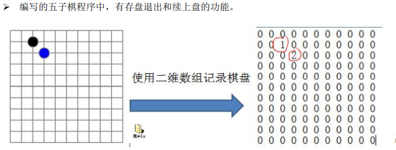

#### 常见问题解决方案

修路问题=>最小生成树（加权值）【数据结构】+普里姆算法

最短路径问题=>图+弗洛伊德算法

汉诺塔=>分支算法

八皇后问题=>回溯法


# 数据结构

### 概念

数据结构是一种研究组织数据方式的学科

数据结构包含两种<font color="red">**线性结构**</font>和<font color="red">**非线性结构**</font>。

-   线性结构
    1.  线性结构作为最常用的数据结构，其特点是数据元素之间**存在一对一**的线性关系。
    2.  线性结构有两种不同的存储结构，即**顺序存储结构（数组）**和**链式存储结构（链表）**。顺序存储的线性表称为顺序表，顺序表中的存储元素是连续的。
    3.  链式存储的线性表称为链表，链表中的存储元素不一定是连续的，元素节点中存放数据元素以及相邻元素的地址信息。
    4.  线性结构常见的有：数组，队列，链表，栈。
-   非线性结构
    1.  非线性结构包括：二维数组，多维数组，广义表，树结构，图结构。


## 线性结构

数据元素之间存在一对一的线性关系。

**数组（array）**

长度固定，内存地址连续，支持随机访问。

```markdown
访问：O(1) // 访问特定位置的元素
插入：O(n) // 最坏的情况发生在插入发生在数组的首部并需要移动所有元素时
删除：O(n) // 最坏的情况发生在删除数组的开头发生并需要移动第一元素后面所有的元素时
```

**链表（linked）**

底层结构有三个区域：左指针域prev（指向上个值的内存地址），值域，右指针域next（指向下一个值的内存地址）；内存地址随机，消耗内存要比数组大。

```markdown
插入和删除:O(1),只需知道目标元素的上一个元素即可。
访问：O(n)，需要遍历。
分类：
    单向：只有一个方向，节点上只会存在一个指针指向下一个节点，尾节点指向null。
    双向：包含两个指针，一个指向前一个节点，一个指向后一个节点。
    循环：特殊的单向链表，尾节点指向头节点。
    双向循环：尾节点的next指向头节点，头节点的prev指向尾节点。
```

>   数组和链表对比：
>
>   -   数组支持随机访问，链表不支持。
>   -   数组使用连续内存空间对CPU缓存机制友好，链表相反。
>   -   数组大小固定会有扩容机制，比较耗时，链表支持动态扩容。


**栈（stack）**

只允许在栈顶添加（`push`）和删除（`pop`）数据先进后出。可以用数组或者链表实现，数组：顺序栈；链表：链表栈。

>   访问：O(n)，插入删除：O(1)

应用场景：页面回退和前进。


**队列（queue）**

队列只允许在后端（rear）进行插入操作也就是入队 enqueue，在前端（front）进行删除操作也就是出队 dequeue，先进先出。通常用链表或者数组来实现，用数组实现的队列叫作顺序队列，用链表实现的队列叫作链式队列。

>   访问：O(n)，插入删除：O(1)

**分类**：

-   单队列：每次操作都是在队尾，存在假溢出问题。
-   循环队列：为了解决假溢出问题。
-   双端队列：队首和队尾都可以插入数据， Java 中普遍使用双端队列（Deque）来实现栈
-   优先级队列：一种会自动排序的线性队列。

**应用场景**：

1.   阻塞队列BlockingQueue，队列为空，出队阻塞；队列满，入队阻塞，实现消费者-生产者模型。
2.   线程池任务队列，有界队列通过数组队列实现，无界队列通过链式队列实现。
3.   通过双端队列实现栈。
4.   Linux内核进程队列。
5.   消息队列。


>   队列是先进先出（FIFO），即队列的修改是依先进先出的原则进行的。新来的成员总是加入队尾（不能从中间插入），每次离开的成员总是队列头上（不允许中途离队）。
>
>   而栈为后进先出（LIFO）,即每次删除（出栈）的总是当前栈中最新的元素，即最后插入（进栈）的元素，而最先插入的被放在栈的底部，要到最后才能删除。


#### 1.稀疏数组（SparseArray）

当一个数组中大部分元素为0，或者同一个值的数组时，可以使用稀疏数组来保存该数组。

##### 1.1 基本介绍：

1.  第一行记录数组一共有几行几列，有多少个不同的值。
2.  把具有不同值的元素的行列及值记录在一个小规模的数组中，从而缩小程序的规模。

##### 1.2 应用场景：

- 使用稀疏数组保留二维数组数据（棋盘，地图坐标）；

##### 1.3 案例：

通过稀疏数组保留棋盘数据



分析：

在使用二维数组保存棋子数据时，当棋子数量小于数组大小时，会造成资源浪费。无效的数据（0）会占用数组中剩余的位置。


二维数组转稀疏数组思路：

1.  遍历原始的二维数组，得到有效数据的个数num
2.  根据num就可以创建稀疏数组sparseArray int[num+1] [3]
3.  将二维数组的有效数据存入到稀疏数组中
4.  将稀疏数组存入文件中

稀疏数组转原始的二维数组思路

1.  读取文件中的数据，转化为稀疏数组
2.  先读取稀疏数组的第一行，根据第一行的数据，创建原始的二维数组，比如上面的chessArray=int[11] [11]
3.  在读取稀疏数组后几行的数据，并赋给原始的二维数组即可


##### 1.4 代码实现

```java
/**
     * 二维数组 转换为 稀疏数组
     * 1.  遍历原始的二维数组，得到有效数据的个数num
     * 2.  根据num创建稀疏数组
     * 3.  将二维数组的有效数据存入到稀疏数组中
     *
     * @return
     */
    public static int[][] toSparse(int[][] arr) {
        //1.记录有效数据
        int count = 0;
        for (int[] ints : arr) {
            for (int anInt : ints) {
                if (anInt != 0) {
                    count++;
                }
            }
        }
        /*
            2.创建稀疏数组
            有效数据的数量决定稀疏数组的大小和行数
            行数 = count + 1;
            列数 = 3;
         */
        int[][] sparseArr = new int[count + 1][3];
        sparseArr[0][0] = arr.length;
        sparseArr[0][1] = arr[0].length;
        sparseArr[0][2] = count;

        //3.将有效数据存入稀疏数组
        int num = 0;
        for (int i = 0; i < arr.length; i++) {
            for (int j = 0; j < arr.length; j++) {
                if (arr[i][j] != 0) {
                    ++num;
                    sparseArr[num][0] = i;
                    sparseArr[num][1] = j;
                    sparseArr[num][2] = arr[i][j];
                }
            }
        }
        return sparseArr;
    }
```


```java
/**
     * 稀疏数组 转换为 二维数组
     * 1. 获取稀疏数组第一行数据，根据数据创建二维数组
     * 2. 遍历稀疏数组，根据稀疏数组中坐标将值存二维数组
     *
     * @return
     */
    public static int[][] restore(int[][] sparse) {
        // 1.通过稀疏数组中第一行数据创建二维数组
        // 行数
        int row = sparse[0][0];
        //列数
        int col = sparse[0][1];

        //2.遍历稀疏数组将有效数据存入二维数组
        int[][] arr = new int[row][col];
        for (int i = 1; i < sparse.length; i++) {
            //变量复用
            //行坐标
            row = sparse[i][0];
            //列坐标
            col = sparse[i][1];
            //值
            arr[row][col] = sparse[i][2];
        }
        return arr;
    }
```

#### 2.队列（Queue）

##### 2.1基本介绍：

1.  队列是一个有序列表，可以用数组或者链表来表示。
2.  遵循先入先出的原则。即：先存入队列的数组要先取出。后存入的要后取出。

##### 2.2 应用场景：

需要进行排队等待的场景。

##### 2.3 案例

###### 2.3.1 数组实现队列


**变量含义**：

MaxSize：队列长度；

rear：队列数据输入时指针变化；

front：队列数据输出时指针变化；

##### 实现流程：

1.因为当前队列底层是数组实现的，所以队列的最大下标为MaxSize-1，rear初始化为0，fron初始化为0；

2.当用户添加数据时，rear需要变动;而且要考虑当rear+1=maxSize的时候，rear重新刷新，所以此时rear=(rear+1)%maxSize；

3.当用户输出数据时，front=(front+1)%maxSize；

4.若(rear+1)%MaxSize == front时，代表队列已满；

5.当rear == front 代表队列为空；

6.为什么需要front和rear进行加1,如果直接rear%MaxSize时，rear和front会一直为0；而且因为底层是数组，数组的下标最大值为length-1；

###### 2.3.2 链表实现队列

##### 2.4 代码实现

###### 2.4.1 数组实现

```java
public class Queue {
    /**
     * 容器
     */
    private int[] arr;

    /**
     * 容器最大容量
     */
    private int maxSize;

    /**
     * 后指针，队列数据输入时变化
     */
    private int rear;

    /**
     * 前指针，队列数据输出时变化
     */
    private int front;

    public Queue(int maxSize) {
        this.maxSize = maxSize;
        this.rear = 0;
        this.front = 0;
        arr = new int[maxSize];
    }

    /**
     * 添加数据
     */
    public void add(int num) {
        boolean full = isFull();
        if (full) {
            System.out.println("队列已满");
            return;
        }
        arr[rear] = num;
        rear = (rear + 1) % maxSize;
    }

    /**
     * 取出数据
     */
    public int get() {
        if (isEmpty()) {
            throw new RuntimeException("队列为空");
        }
        int num = arr[front];
        front = (front + 1) % maxSize;
        return num;
    }

    /**
     * 获取当前容器所有数据
     */
    public void showQueue() {
        for (int i = front; i < front + size(); i++) {
            System.out.println(arr[i % maxSize]);
        }
    }

    /**
     * 获取当前容器有效数据个数
     */
    public int size() {
        return (rear + maxSize - front) % maxSize;
    }

    /**
     * 判断容器是否为空
     */
    public boolean isEmpty() {
        return rear == front;
    }

    /**
     * 判断容器是否满
     */
    public boolean isFull() {
        return (rear + 1) % maxSize == front;
    }
}
```

###### 2.4.2 链表实现


## 非线性结构

多维数组，广义表 ，树结构，图结构，堆。


##### 二叉树

每个节点最多只有两个分支的树结构，具有左右次序，不容易颠倒。

**概念**：

-   **节点的高度**：该节点到叶子节点的最长路径所包含的边数。
-   **节点的深度**：根节点到该节点的路径所包含的边数。
-   **节点的层数**：节点的深度+1。
-   **树的高度**：根节点的高度。

**分类**

1.  **满二叉树**：每一层的节点数都达到最大值。
2.  **完全二叉树**：最后一层是满的或者缺失少`连续`若干节点，而其余层中所有节点数量都是满的，
3.  **平衡二叉树**：是二叉排序树，可以是一棵空树，如果不是空树，那它的左右两个子树的高度差不超过1，并且左右两个子树都是一个平衡二叉树。

**存储**

1.  链式存储：类似与链表。
2.  **顺序存储**：数组中的每一个位置存放节点的data，不存储左右节点的指针，子节点的访问通过数组的下标完成，根节点的下标为1。(Mysql聚簇索引)

**遍历**

1.  先序遍历：先遍历根节点，再遍历左节点，最后遍历右节点。

    ```java
    public void preOrder(TreeNode root){
    	if(root == null){
    		return;
    	}
    	system.out.println(root.data);
    	preOrder(root.left);
    	preOrder(root.right);
    }
    ```

    

2.  中序遍历：先递归中序遍历左子树，在输出根节点，再递归中序遍历右子树

    ```java
    public void inOrder(TreeNode root){
    	if(root == null){
    		return;
    	}
    	inOrder(root.left);
    	system.out.println(root.data);
    	inOrder(root.right);
    }
    ```

    

3.  后序遍历：先递归后序遍历左子树，再递归后序遍历右子树，最后输出根节点。

    ```java
    public void postOrder(TreeNode root){
    	if(root == null){
    		return;
    	}
        postOrder(root.left);
    	postOrder(root.right);
    	system.out.println(root.data);
    }
    ```

    

##### 红黑树

一种自平衡的二叉查找树。通过在插入和删除节点时进行颜色变换和旋转，来保证树的平衡，但是只是一种大致的平衡，会导致树的高度变高，查询数据效率略低。但是它的插入和删除操作效率很高，时间复杂度为O(1).

```
1.每个根节点必须是黑色
2.每个节点的颜色只能是红色或者黑色
3.每个叶子节点的颜色为黑色
4.如果一个节点的颜色为红色，它的子节点的颜色必须是黑色
5.每个节点的左右两侧黑色节点的数量必须相同
```


#### 布隆过滤器

由二进制向量（位数组）和随机映射函数（哈希函数）组成，占用空间少效率高；缺点:返回结果有概率性，不是非常准确。元素越多，误差越大，并且容器中元素不容易删除。

**原理**：

1.   加入元素
     -   使用哈希函数对元素值进行计算，得到哈希值（有几个哈希函数得到几个哈希值）。
     -   根据哈希值，在位数组中把对应下标位置的值设置为1。
2.   判断元素
     -   再次进行相同的哈希计算。
     -   得到值后判断位数组中每个元素是否为1，如果都为1，说明值存在，如果有一个不为1说明不存在，**`那就一定不存在`**。

**作用**：解决海量数据存在性问题，对于海量数据中判断某个数据是否存在并且容忍误差的场景很适合。

**应用场景**：

1.   判断数据是否存在：防止缓存穿透，垃圾邮件过滤，黑名单功能。
2.   去重：针对海量URL、QQ号、订单号去重。

**实现**：

1.  一个合适大小的位数组保存数据
2.  几个不同的哈希函数
3.  添加元素到位数组（布隆过滤器）的方法实现
4.  判断给定元素是否存在于位数组（布隆过滤器）的方法实现。


## Java常见容器

List(对付顺序的好帮手): 存储的元素是有序的、可重复的。

Set(注重独一无二的性质): 存储的元素不可重复的。

Queue(实现排队功能的叫号机): 按特定的排队规则来确定先后顺序，存储的元素是有序的、可重复的。

Map(用 key 来搜索的专家): 使用键值对（key-value）存储，类似于数学上的函数 y=f(x)，"x" 代表 key，"y" 代表 value，key 是无序的、不可重复的，value 是无序的、可重复的，每个键最多映射到一个值。

#### List

-   `ArrayList`：`Object[]` 数组，可以存储任何类型的对象，包括 `null` 值
-   `Vector`：`Object[]` 数组
-   `LinkedList`：双向链表(JDK1.6 之前为循环链表，JDK1.7 取消了循环)

##### ArrayList:

##### 扩容规则

以无参数构造方法创建 ArrayList 时，实际上初始化赋值的是一个空数组。当真正对数组进行添加元素操作时，才真正分配容量。即向数组中添加第一个元素时，数组容量扩为 10，再次扩容为上次容量的1.5倍
addAll()没有元素时，扩容为 Math.max(10, 实际元素个数)，有元素时为 Math.max(原容量 1.5 倍, 实际元素个数)

>   JDK6 new 无参构造的 `ArrayList` 对象时，直接创建了长度是 10 的 `Object[]` 数组 `elementData`


#####  ArrayList 与 LinkedList 区别?

-   **线程安全**： ArrayList 和 LinkedList 都是不同步的，也就是不保证线程安全；
-   底层数据结构： ArrayList 底层使用的是 Object 数组；LinkedList 底层使用的是 双向链表 数据结构（JDK1.6 之前为循环链表，JDK1.7 取消了循环。注意双向链表和双向循环链表的区别，下面有介绍到！）
-   插入和删除是否受**元素位置**的影响：
    -   ArrayList 采用数组存储，所以插入和删除元素的时间复杂度受元素位置的影响。 比如：执行add(E e)方法的时候， ArrayList会默认在将指定的元素追加到此列表的末尾，这种情况时间复杂度就是 O(1)。但是如果要在指定位置 i 插入和删除元素的话，时间复杂度就为 O(n)。
    -   LinkedList 采用链表存储，所以在头尾插入或者删除元素不受元素位置的影响，时间复杂度为 O(1)，如果是要在指定位置 i 插入和删除元素的话时间复杂度为 O(n) ，因为需要先移动到指定位置再插入和删除。
-   **快速随机访问**： LinkedList 不支持高效的随机元素访问，而 ArrayList（实现了 RandomAccess 接口） 支持。快速随机访问就是通过元素的序号快速获取元素对象(对应于get(int index)方法)。
-   **内存空间占用**： ArrayList 的空间浪费主要体现在在 list 列表的结尾会预留一定的容量空间，而 LinkedList 的空间花费则体现在它的每一个元素都需要消耗比 ArrayList 更多的空间（因为要存放直接后继和直接前驱以及数据）。


#### Set

无序性不等于随机性 ，无序性是指存储的数据在底层数组中并非按照数组索引的顺序添加 ，而是根据数据的哈希值决定的。
不可重复性是指添加的元素按照 equals() 判断时 ，返回 false，需要同时重写 equals() 方法和 hashCode() 方法。


#####  比较 HashSet、LinkedHashSet 和 TreeSet 三者的异同

-   HashSet、LinkedHashSet 和 TreeSet 都是 Set 接口的实现类，都能保证元素唯一，并且都不是线程安全的。
-   HashSet、LinkedHashSet 和 TreeSet 的主要区别在于底层数据结构不同。HashSet 的底层数据结构是哈希表（基于 HashMap 实现）。LinkedHashSet 的底层数据结构是链表和哈希表，元素的插入和取出顺序满足 FIFO。TreeSet 底层数据结构是红黑树，元素是有序的，排序的方式有自然排序和定制排序。
-   底层数据结构不同又导致这三者的应用场景不同。HashSet 用于不需要保证元素插入和取出顺序的场景，LinkedHashSet 用于保证元素的插入和取出顺序满足 FIFO 的场景，TreeSet 用于支持对元素自定义排序规则的场景。


####  Queue

Queue 是单端队列，只能从一端插入元素，另一端删除元素，实现上一般遵循 先进先出（FIFO） 规则。

**ArrayQueue**：可变长的数组和双指针来实现。

**PriorityQueue**：与 Queue 的区别在于元素出队顺序是与优先级相关的，即总是优先级最高的元素先出队。

**BlockingQueue**

BlockingQueue （阻塞队列）是一个接口，继承自 Queue。BlockingQueue阻塞的原因是其支持当队列没有元素时一直阻塞，直到有元素；还支持如果队列已满，一直等到队列可以放入新元素时再放入。
生产者-消费者模型中，生产者线程会向队列中添加数据，而消费者线程会从队列中取出数据进行处理。

##### 种类

-   ArrayBlockingQueue：使用数组实现的有界阻塞队列。在创建时需要指定容量大小，并支持公平和非公平两种方式的锁访问机制。
-   LinkedBlockingQueue：使用单向链表实现的可选有界阻塞队列。在创建时可以指定容量大小，如果不指定则默认为Integer.MAX_VALUE。和ArrayBlockingQueue类似， 它也支持公平和非公平的锁访问机制。
-   PriorityBlockingQueue：支持优先级排序的无界阻塞队列。元素必须实现Comparable接口或者在构造函数中传入Comparator对象，并且不能插入 null 元素。
-   SynchronousQueue：同步队列，是一种不存储元素的阻塞队列。每个插入操作都必须等待对应的删除操作，反之删除操作也必须等待插入操作。因此，SynchronousQueue通常用于线程之间的直接传递数据。
-   DelayQueue：延迟队列，其中的元素只有到了其指定的延迟时间，才能够从队列中出队。

##### ArrayBlockingQueue 和 LinkedBlockingQueue 有什么区别？

ArrayBlockingQueue 和 LinkedBlockingQueue 是 Java 并发包中常用的两种阻塞队列实现，它们都是线程安全的。不过，不过它们之间也存在下面这些区别：
底层实现：ArrayBlockingQueue 基于数组实现，而 LinkedBlockingQueue 基于链表实现。

-   是否有界：ArrayBlockingQueue 是有界队列，必须在创建时指定容量大小。LinkedBlockingQueue 创建时可以不指定容量大小，默认是Integer.MAX_VALUE，也就是无界的。但也可以指定队列大小，从而成为有界的。
-   锁是否分离： ArrayBlockingQueue中的锁是没有分离的，即生产和消费用的是同一个锁；LinkedBlockingQueue中的锁是分离的，即生产用的是putLock，消费是takeLock，这样可以防止生产者和消费者线程之间的锁争夺。
-   内存占用：ArrayBlockingQueue 需要提前分配数组内存，而 LinkedBlockingQueue 则是动态分配链表节点内存。这意味着，ArrayBlockingQueue 在创建时就会占用一定的内存空间，且往往申请的内存比实际所用的内存更大，而LinkedBlockingQueue 则是根据元素的增加而逐渐占用内存空间。


#####  Queue 与 Deque 的区别

-   Queue 是单端队列，只能从一端插入元素，另一端删除元素，实现上一般遵循 先进先出（FIFO） 规则。
-   Queue 扩展了 Collection 的接口，根据 因为容量问题而导致操作失败后处理方式的不同 可以分为两类方法: 一种在操作失败后会抛出异常，另一种则会返回特殊值。
-   Deque 是双端队列，在队列的两端均可以插入或删除元素。
-   Deque 扩展了 Queue 的接口, 增加了在队首和队尾进行插入和删除的方法，同样根据失败后处理方式的不同分为两类：


####  Map

**重复检查**

当你把对象加入HashSet时，HashSet 会先计算对象的hashcode值来判断对象加入的位置，同时也会与其他加入的对象的 hashcode 值作比较，如果没有相符的 hashcode，HashSet 会假设对象没有重复出现。但是如果发现有相同 hashcode 值的对象，这时会调用equals()方法来检查 hashcode 相等的对象是否真的相同。如果两者相同，HashSet 就不会让加入操作成功


##### HashMap

1. **数据存储机制**

​	jdk8之前是头插法
​		头插法：新插入的节点是链表的头节点

>   当一个桶位中有多个元素需要进行扩容时，多个线程同时对链表进行操作，头插法可能会导致链表中的节点指向错误的位置，从而形成一个环形链表，进而使得查询元素的操作陷入死循环无法结束。

​	jdk8及之后是尾插法（避免死循环`循环链表`的发生）
​		尾插法：新插入的节点是尾节点

2. **数据结构**

​	JDK1.7=**数组+链表**（拉链法）
​	JDK1.8=**数组+链表+红黑树**
​	当**数组的长度大于64、链表长度大于8**会把链表转换为红黑树，提高查询效率

3. **容量**
        HashMap的最大容量值为2^30,负载因子为0.75,默认初始容量16，扩容因子2.

4. **扩容机制**

    1. **空参数的构造函数**：实例化的HashMap默认内部数组是null，即没有实例化。第一次调用put方法时，则会开始第一次初始化扩容，长度为16，然后存入数据，然后判断是否需要扩容；
    2. **有参构造函数**：用于指定容量。会根据指定的正整数找到大于指定容量的2的幂数，将这个数设置赋值给阈值（threshold）。第一次调用put方法时，会将阈值赋值给容量，然后让 阈值=容量x负载因子 。（因此并不是我们手动指定了容量就一定不会触发扩容，超过阈值后一样会扩容！！）
    3. 如果不是第一次扩容，则容量变为原来的2倍，阈值也变为原来的2倍。（容量和阈值都变为原来的2倍时，负载因子还是不变）

5. **hash算法**

    hash算法就是通过hashcode与自己进行向右位移16的异或运算。这样做是为了计算出来的hash值足够随机，足够分散，还有产生的数组下标足够随机。

    -   扰动处理
        -   JDK1.7=4次位运算+5次异或运算
        -   JDK1.8=1次位运算+1次异或
        -   JDK1.7用了9次扰动处理=4次位运算+5次异或，而JDK1.8只用了2次扰动处理=1次位运算+1次异或。
    -   特点：
        -   键-值（key-value）都允许为空、线程不安全、不保证有序、存储位置随时间变化
        -   当key为空时，hash值默认设置为0，只能有一个key为null

6. **线程不安全会出现数据丢失的问题**

7. **常用方法底层原理**

    1. `new HashMap()`：底层没有创建数组，首次调用put()方法示时，底层创建长度为16的数组，jdk8底层的数组是：Node[],而非Entry[]，用数组容量大小乘以负载因子得到一个值，一旦数组中存储的元素个数超过该值就会调用rehash方法将数组容量增加到原来的两倍，专业术语叫做扩容，在做扩容的时候会生成一个新的数组，原来的所有数据需要重新计算哈希码值重新分配到新的数组，所以扩容的操作非常消耗性能.
    2.  `put() 原理`：table[i]：当前下标所对应的节点
        1. 判断数组是否初始化，没有则进行初始化。
        2. 根据键值对的key的hash值，通过hash算法计算值得到要插入的数组索引i,如果对应节点为null,直接新建节点添加进去,转向下面第六步；
        3. 如果对应节点不为空，判断对应节点的首个元素是否和key一样,如果相同就直接覆盖value,否则转向下面第四步,这里的相同值得是hashCode和equals
        4. 判断对应节点是否为红黑树,如果是红黑树,则直接在树中插入键值对；
        5. 是链表，就进行循环遍历链表,判断链表长度是否大于8,大于8的话把链表转换为红黑树,在红黑树中执行插入操作,否则进行链表的插入操作,遍历链表如果发现有相同的key,说明已经存在则直接覆盖value
        6. 插入成功后,判断实际存入的键值对数量size是否超过了最大容量threshold（阈值）,如果超过进行扩容.

    3. get()实现原理
        1. 先调用k的hashCode()方法得出哈希值，并通过哈希算法转换成数组的下标，通过下标定位对应数组中的位置,也就是节点
        2. 如果节点上的key就是要查找的key,则直接命中返回
        3. 如果节点上的key不是要查找的key,则判断是否有后续节点:
            1. 如果后续节点是红黑树节点,则通过调用树的方法查找该key
            2. 如果后续节点是普通链表结构,则通过循环遍历链表查找该key

8. >   **常见问题**
    >
    >   **1.为什么 HashMap 中 String、Integer 这样的包装类适合作为 key 键**
    >
    >   因为String和Interger等包装类型是final修饰的，具有不可变性，保证了key的不可更改性，内部重写了equals和hashcoad方法，不容易出现hash值得计算错误，有效减少hash碰撞的几率
    >
    >   **2.为什么转换成红黑树的阈值是8，而不是7或者是20呢**
    >
    >   1：如果选择6和8（如果链表小于等于6树还原转为链表，大于等于8转为树），中间有个差值7可以有效防止链表和树频繁转换。假设一下，如果设计成链表个数超过8则链表转换成树结构，链表个数小于8则树结构转换成链表，如果一个HashMap不停的插入、删除元素，链表个数在8左右徘徊，就会频繁的发生树转链表、链表转树，效率会很低。
    >
    >   2：由于treenodes的大小大约是常规节点的两倍，因此我们仅在容器包含足够的节点以保证使用时才使用它们，当它们变得太小（由于移除或调整大小）时，它们会被转换回普通的node节点，容器中节点分布在hash桶中的频率遵循泊松分布，桶的长度超过8的概率非常非常小。所以作者应该是根据概率统计而选择了8作为阀
    >
    >   **3.为什么在JDK1.7的时候是先进行扩容后进行插入，而在JDK1.8的时候则是先插入后进行扩容的呢？**
    >
    >   JDK1.7=4次位运算+5次异或运算
    >   JDK1.8=1次位运算+1次异或3
    >   JDK1.7用了9次扰动处理=4次位运算+5次异或运算效率较低，而JDK1.8只用了2次扰动处理=1次位运算+1次异或。
    >
    >   **4.扩容后的数组下标问题**
    >
    >   如果旧值的hash和旧的容量计算&为0，则扩容后的位置等于原来坐标。
    >   如果旧值的hash和旧的容量计算&为1，则扩容后的位置等于原来坐标+旧的容量
    >
    >   **5.数组大小为什么是2的n次方？**
    >
    >   总的来说HashMap每次扩容和初始容量都是2的次幂都是为了降低hash碰撞，提高HashMap的查找效率。
    >
    >   **6.hash算法为什么要高16位不变，低16位与高16位异或作为key的最终hash值？**
    >
    >   因为数组的大小是2的n次方并且初始大小为16，假设目前数组大小为16，如果不进行这样运算的话，直接进行hash值与16-1=15的二进制与运算的话，其实只有hash值的后四位参与了运算，这样发生碰撞的概率会提高，而且高16位只有在数组很大的时候才能参与运算，所以用高16位和低16位进行运算，让高位也参与运算，在数组很小的时候增加运算可能性，减少碰撞。
    >
    >   **7.负载因子为什么是0.75**
    >
    >   负载因子选得太大了，访问的时候冲突太多，链表长度会比较长，会降低效率；选得太小了，扩容会频繁，会浪费大量存储空间


##### ConcurrentHashMap

1.   整体结构
         1.7：Segment锁分段的技术保证线程安全；
         1.8: 移除Segment，使锁的粒度更小，采用Synchronized + CAS保证线程安全，synchronized在底层只锁定当前链表或红黑树的首节点，这样只要hash不冲突，就不会产生并发
2.   常见方法底层原理
     1.   put（）
          1.   1.7：先定位Segment，再定位桶，put全程加锁，没有获取锁的线程提前找桶的位置，然后进行自旋，并最多自旋64次获取锁，超过则挂起。
          2.   1.8：由于移除了Segment，类似HashMap，可以直接定位到桶，拿到first节点后进行判断，1、为空则CAS插入；2、为-1则说明在扩容，则跟着一起扩容
          3.   如果都不满足，则对当前节点进行synchronize加锁然后进行put操作，操作跟hashmap一样。
     2.   get（）：基本类似，由于node数组还有其他变量声明为volatile，保证了修改的可见性，因此不需要加锁。
     3.   resize（）【扩容】
          1.   `1.7`：跟HashMap步骤一样，只不过是搬到单线程中执行，避免了HashMap在1.7中扩容时死循环的问题，保证线程安全。
          2.   `1.8`：支持并发扩容，HashMap扩容在1.8中由头插改为尾插（为了避免死循环问题），ConcurrentHashmap也是，迁移也是从尾部开始，扩容前在桶的头部放置一个hash值为-1的节点，这样别的线程访问时就能判断是否该桶已经被其他线程处理过了。
     4.   size（）
          1.   1.7：很经典的思路：计算两次，如果不变则返回计算结果，若不一致，则锁住所有的Segment求和。
          2.   1.8：用baseCount来存储当前的节点个数，这就设计到baseCount并发环境下修改的问题（说实话我没看懂-_-!）。


##### ConcurrentHashMap 和 Hashtable 的区别

-   实现线程安全的方式（重要）：
    -   在 JDK1.7 的时候，ConcurrentHashMap 对整个桶数组进行了分割分段(Segment，分段锁)，每一把锁只锁容器其中一部分数据，多线程访问容器里不同数据段的数据，就不会存在锁竞争，提高并发访问率。
    -   到了 JDK1.8 的时候，ConcurrentHashMap 已经摒弃了 Segment 的概念，而是直接用 Node 数组+链表+红黑树的数据结构来实现，并发控制使用 synchronized 和 CAS 来操作。（JDK1.6 以后 synchronized 锁做了很多优化） 整个看起来就像是优化过且线程安全的 HashMap，虽然在 JDK1.8 中还能看到 Segment 的数据结构，但是已经简化了属性，只是为了兼容旧版本；
-   Hashtable(同一把锁) :使用 synchronized 来保证线程安全，效率非常低下。当一个线程访问同步方法时，其他线程也访问同步方法，可能会进入阻塞或轮询状态，如使用 put 添加元素，另一个线程不能使用 put 添加元素，也不能使用 get，竞争会越来越激烈效率越低。


 **ConcurrentModificationException 并发修改异常**

在我用迭代器遍历数组的时候，每次.next方法都会调用checkForComodification放伐，而checkForComodification方法就是用来判断集合发生结构性变化（加入元素，删除元素等操作）的次数是否发生改，如果发生改变就会抛出concurrentmodificationexception异常。所以连起来就是在使用Iterator.next方法的时候如果对集合进行了结构性操作就会抛出此异常
若是在使用迭代器遍历集合的同时修改集合,比如删除元素,要使用iterator.remove(),不要使用集合中的remove方法

```markdown
1. 导致原因
		并发修改，导致数据不一致异常。
2. 解决方案
		a.使用Vatcor
		b.使用Collections.synchronizedList(list);
		c.并发集合CopyOnWriteArrayList<> //写时复制		
3. 优化建议 
```

> 写时复制：往一个容器添加元素的时候，不直接往当前容器Object[]添加，而是先将当前容器Object[]进行Copy,复制一个新的容器Object[]数组 newElements，然后往新的容器里添加容器，添加完元素之后，再将原容器的引用指向新的容器setArray(newElements);这样做的好处是可以对容器进行并发读，而不需要加锁，因为当前容器不会添加任何元素，所以copyOnWrite容器也是一种读写分离的思想，读和写不同的容器


