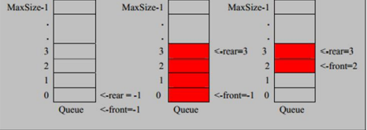

## 集合

## HashMap

```markdown
1. 数据存储机制：
		jdk8之前头插法：新插入的节点是链表的头节点
		jdk8之后是尾插法：新插入的节点的尾节点
2. 数据结构
		JDK7：数组+链表
		JDK8：数组+链表+红黑树
3. 容量：
		最大的容量值是2^30
		负载因子0.75
		默认初始容量为16，当数组容量达到size*0.75时就会进行扩容，扩容因子是2
4. 存储原理
		1.判断集是否为空,若是为空,直接存进数组中
		2.集合不为空,通过hashCode方法获取哈希值,比较哈希值是否相等,不相同直接存入数组
		3.若哈希值相同,判断==(内存地址)是否相等,相同不存
		4.若内存地址不同,通过equals方法比较是否相等,相同不存,相同存入链表
```


修路问题=>最小生成树（加权值）【数据结构】+普里姆算法

最短路径问题=>图+弗洛伊德算法

汉诺塔=>分支算法

八皇后问题=>回溯法


# 数据结构

概念：

数据结构是一种研究组织数据方式的学科

数据结构包含两种<font color="red">**线性结构**</font>和<font color="red">**非线性结构**</font>。

-   线性结构
    1.  线性结构作为最常用的数据结构，其特点是数据元素之间**存在一对一**的线性关系。
    2.  线性结构有两种不同的存储结构，即**顺序存储结构（数组）**和**链式存储结构（链表）**。顺序存储的线性表称为顺序表，顺序表中的存储元素是连续的。
    3.  链式存储的线性表称为链表，链表中的存储元素不一定是连续的，元素节点中存放数据元素以及相邻元素的地址信息。
    4.  线性结构常见的有：数组，队列，链表，栈。
-   非线性结构
    1.  非线性结构包括：二维数组，多维数组，广义表，树结构，图结构。


## 1.稀疏数组（SparseArray）

当一个数组中大部分元素为0，或者同一个值的数组时，可以使用稀疏数组来保存该数组。

### 1.1 基本介绍：

1.  第一行记录数组一共有几行几列，有多少个不同的值。
2.  把具有不同值的元素的行列及值记录在一个小规模的数组中，从而缩小程序的规模。

### 1.2 应用场景：

- 使用稀疏数组保留二维数组数据（棋盘，地图坐标）；

### 1.3 案例：

通过稀疏数组保留棋盘数据


分析：

在使用二维数组保存棋子数据时，当棋子数量小于数组大小时，会造成资源浪费。无效的数据（0）会占用数组中剩余的位置。


二维数组转稀疏数组思路：

1.  遍历原始的二维数组，得到有效数据的个数num
2.  根据num就可以创建稀疏数组sparseArray int[num+1] [3]
3.  将二维数组的有效数据存入到稀疏数组中
4.  将稀疏数组存入文件中

稀疏数组转原始的二维数组思路

1.  读取文件中的数据，转化为稀疏数组
2.  先读取稀疏数组的第一行，根据第一行的数据，创建原始的二维数组，比如上面的chessArray=int[11] [11]
3.  在读取稀疏数组后几行的数据，并赋给原始的二维数组即可


### 1.4 代码实现

```java
/**
     * 二维数组 转换为 稀疏数组
     * 1.  遍历原始的二维数组，得到有效数据的个数num
     * 2.  根据num创建稀疏数组
     * 3.  将二维数组的有效数据存入到稀疏数组中
     *
     * @return
     */
    public static int[][] toSparse(int[][] arr) {
        //1.记录有效数据
        int count = 0;
        for (int[] ints : arr) {
            for (int anInt : ints) {
                if (anInt != 0) {
                    count++;
                }
            }
        }
        /*
            2.创建稀疏数组
            有效数据的数量决定稀疏数组的大小和行数
            行数 = count + 1;
            列数 = 3;
         */
        int[][] sparseArr = new int[count + 1][3];
        sparseArr[0][0] = arr.length;
        sparseArr[0][1] = arr[0].length;
        sparseArr[0][2] = count;

        //3.将有效数据存入稀疏数组
        int num = 0;
        for (int i = 0; i < arr.length; i++) {
            for (int j = 0; j < arr.length; j++) {
                if (arr[i][j] != 0) {
                    ++num;
                    sparseArr[num][0] = i;
                    sparseArr[num][1] = j;
                    sparseArr[num][2] = arr[i][j];
                }
            }
        }
        return sparseArr;
    }
```


```java
/**
     * 稀疏数组 转换为 二维数组
     * 1. 获取稀疏数组第一行数据，根据数据创建二维数组
     * 2. 遍历稀疏数组，根据稀疏数组中坐标将值存二维数组
     *
     * @return
     */
    public static int[][] restore(int[][] sparse) {
        // 1.通过稀疏数组中第一行数据创建二维数组
        // 行数
        int row = sparse[0][0];
        //列数
        int col = sparse[0][1];

        //2.遍历稀疏数组将有效数据存入二维数组
        int[][] arr = new int[row][col];
        for (int i = 1; i < sparse.length; i++) {
            //变量复用
            //行坐标
            row = sparse[i][0];
            //列坐标
            col = sparse[i][1];
            //值
            arr[row][col] = sparse[i][2];
        }
        return arr;
    }
```

## 2.队列（Queue）

### 2.1基本介绍：

1.  队列是一个有序列表，可以用数组或者链表来表示。
2.  遵循先入先出的原则。即：先存入队列的数组要先取出。后存入的要后取出。

### 2.2 应用场景：

需要进行排队等待的场景。

### 2.3 案例

#### 2.3.1 数组实现队列



**变量含义**：

MaxSize：队列长度；

rear：队列数据输入时指针变化；

front：队列数据输出时指针变化；

##### 实现流程：

1.因为当前队列底层是数组实现的，所以队列的最大下标为MaxSize-1，rear初始化为0，fron初始化为0；

2.当用户添加数据时，rear需要变动;而且要考虑当rear+1=maxSize的时候，rear重新刷新，所以此时rear=(rear+1)%maxSize；

3.当用户输出数据时，front=(front+1)%maxSize；

4.若(rear+1)%MaxSize == front时，代表队列已满；

5.当rear == front 代表队列为空；

6.为什么需要front和rear进行加1,如果直接rear%MaxSize时，rear和front会一直为0；而且因为底层是数组，数组的下标最大值为length-1；

#### 2.3.2 链表实现队列

### 2.4 代码实现

#### 2.4.1 数组实现

```java
public class Queue {
    /**
     * 容器
     */
    private int[] arr;

    /**
     * 容器最大容量
     */
    private int maxSize;

    /**
     * 后指针，队列数据输入时变化
     */
    private int rear;

    /**
     * 前指针，队列数据输出时变化
     */
    private int front;

    public Queue(int maxSize) {
        this.maxSize = maxSize;
        this.rear = 0;
        this.front = 0;
        arr = new int[maxSize];
    }

    /**
     * 添加数据
     */
    public void add(int num) {
        boolean full = isFull();
        if (full) {
            System.out.println("队列已满");
            return;
        }
        arr[rear] = num;
        rear = (rear + 1) % maxSize;
    }

    /**
     * 取出数据
     */
    public int get() {
        if (isEmpty()) {
            throw new RuntimeException("队列为空");
        }
        int num = arr[front];
        front = (front + 1) % maxSize;
        return num;
    }

    /**
     * 获取当前容器所有数据
     */
    public void showQueue() {
        for (int i = front; i < front + size(); i++) {
            System.out.println(arr[i % maxSize]);
        }
    }

    /**
     * 获取当前容器有效数据个数
     */
    public int size() {
        return (rear + maxSize - front) % maxSize;
    }

    /**
     * 判断容器是否为空
     */
    public boolean isEmpty() {
        return rear == front;
    }

    /**
     * 判断容器是否满
     */
    public boolean isFull() {
        return (rear + 1) % maxSize == front;
    }
}
```

#### 2.4.2 链表实现