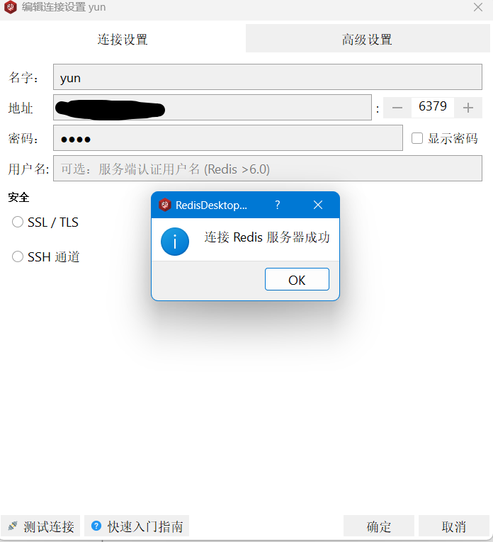

# Docker

### 基本命令

```bash
# 查询组件在docker中镜像列表
docker search [组件名]
# 查询当前下载镜像
docker images
# 拉取镜像
docker pull [组件名]:[版本号]
# 创建xxx容器
docker run -d -name xxx
# 更改容器状态
docker stop/strat/restart [容器id]
# 查询全部容器
docker ps -a 
```


#### 安装 rocketmq

拉取 rocketmq 镜像

```bash
docker pull apache/rocketmq
```

运行 namesrv

```bash
docker run -d \
        --name rmqnamesrv \
        --privileged=true \
        -p 9876:9876 \
        -v /tool/rocketmq/logs:/home/rocketmq/logs \
        -v /tool/rocketmq/store:/home/rocketmq/store \
        # 指定内存占用 xmx最大堆内存，xms堆初始空间大小
    	-e "JAVA_OPT_EXT=-Xmx128m -Xms128m" \
apache/rocketmq:latest \
# 应该是硬性规定namesrv的服务名为mqnamesrv
sh mqnamesrv
```

>   --name:容器名
>
>   --privileged 提供root权限
>
>   -p 映射端口 宿主机端口:容器端口
>
>   -v 文件/目录挂载 宿主机目录:容器内部目录
>
>   -e 启动配置

启动 broker，需要指定 namesrv 的地址，broker 默认监听的端口是10909,10911,10912

```bash
docker run -d \
	--name rmqbroker \
	--link rmqnamesrv:namesrv \
	--privileged=true \
	-p 10909:10909 \
	-p 10911:10911 \
	-p 10912:10912 \
	-v /tool/rocketmq/broker/logs:/home/rocketmq/logs \
	-v /tool/rocketmq/broker/store:/home/rocketmq/store \
	-v /tool/rocketmq/conf/broker.conf:/home/rocketmq/rocketmq-4.9.4/conf/broker.conf \
	-e "NAMESRV_ADDR=namesrv:9876" \
	# 指定内存占用 xmx最大堆内存，xms堆初始空间大小
	-e "JAVA_OPT_EXT=-Xmx128m -Xms128m" \
	# 可以通过 BROKER_PORT=XXXX 指定当前broker使用端口
apache/rocketmq:latest \ 
sh mqbroker -c /home/rocketmq/rocketmq-4.9.4/conf/broker.conf
```

可以使用默认的配置文件，也可以自定义配置，配置文件示例：

```properties
terName = DefaultCluster
brokerName = broker-a
brokerId = 0
deleteWhen = 04
fileReservedTime = 48
brokerRole = ASYNC_MASTER
flushDiskType = ASYNC_FLUSH
# namesrv 主机地址
namesrvAddr=服务器ip:9876
# 当前 broker 主机地址
brokerIP1=服务器ip
defaultTopicQueueNums=4
autoCreateTopicEnable=true
autoCreateSubscriptionGroup=true
listenPort=10911iskMaxUsedSpaceRatio=95
```


>   sh -c 指定配置文件启动容器

启动控制台

拉取控制台镜像

```bash
docker pull pangliang/rocketmq-console-ng
```

启动控制台容器，一定要先启动 namesrv

```bash
docker run -d \
        --restart=always \
        --name rmq-admin \
        -e "JAVA_OPTS=-Drocketmq.namesrv.addr=服务器ip:9876  \
                -Dcom.rocketmq.sendMessageWithVIPChannel=false" \
        -p 9999:8080 \
pangliang/rocketmq-console-ng \
sh rmq-admin
```

>   --restart 一直自动重启


#### 安装mysql

拉取镜像

```bash
docker pull mysql
```


创建mysql数据和配置目录

```bash
mkdir /tool/mysql/log
mkdir /tool/mysql/data
mkdir /tool/mysql/share
mkdir /tool/mysql/conf
```

创建配置文件my.cnf

```bash
vim /tool/mysql/conf/my.cnf
```

```ini
[mysqld]
character-set-server=utf8mb4
port = 3306
max_connections=2000
default-storage-engine=INNODB
lc-messages=en_US
[mysql]
default-character-set=utf8mb4

[mysql.server]
default-character-set=utf8mb4

[client]
default-character-set=utf8mb4
```

创建容器

```bash
docker run -d \
        -p 3306:3306 \
        --name mysql \
        --privileged=true \
	    --restart=always \
	    -v /tool/mysql:/usr/local/mysql/ \
        -v /tool/mysql/log:/var/log/mysql \
        -v /tool/mysql/data:/var/lib/mysql \
        -v /tool/mysql/conf/my.cnf:/etc/my.cnf \
        -v /etc/localtime:/etc/localtime:ro \
        -e MYSQL_ROOT_PASSWORD=root \
mysql:latest
```


创建完成查询容器列表


如果要配置远程连接的话，需要开放端口3306，如果是云服务器，需要开两次：

-   linux服务器防火墙

    ```bash
    # 开放3306端口
    firewall-cmd --zone=public --add-port=3306/tcp --permanent
    # 加载规则
    firewall-cmd --reload
    # 查询端口开启情况
    firewall-cmd --zone=public --query-port=3306/tcp
    ```

-   云服务器厂商防火墙，基本上都是在云服务器`监控`菜单中。

还需要查询当前mysql的对于root用户配置的连接权限

```bash
# 进入mysql容器
docker exec -it mysql bash
# 输入mysql连接命令
mysql -uroot -p
# 输入密码
# 使用mysql库
use mysql;
# 查询root用户连接权限,默认应该是 localhost 只支持本地连接
select host,user from user;
```


>   我这边是配置完成的，`%`代表支持所有ip访问。

改变root用户连接权限

```mysql
alter user 'root'@'localhost' identified by 'root';
update user set host = "%" where user = 'root';
flush privileges;
```

补上成功样例：


#### docker 安装 Redis

拉取镜像

```bash
docker pull redis
```

创建目录

```
mkdir /tool/redis
```

镜像里不包含配置文件，需要拉取redis配置文件，[查看](https://github.com/redis/redis/blob/unstable/redis.conf) **一定要注意redis版本**

下载完成直接通过ftp传到`/tool/reids`目录下就行

因为是官方配置，需要我们手动改下配置：

```bash
# 常用配置
bind 127.0.0.1 	# 注释掉这部分，使redis可以外部访问
daemonize no	# 用守护线程的方式启动
requirepass 你的密码 # 给redis设置密码
appendonly yes # redis持久化 默认是no
tcp-keepalive 300 # 防止出现远程主机强迫关闭了一个现有的连接的错误 默认是300
```

创建容器

```bash
docker run -d \
	-p 6379:6379 \
	--name redis \
	--restart=always \
	--privileged=true \
	-v /tool/redis:/usr/local/redis \
	-v /tool/redis/redis.conf:/etc/redis/redis.conf \
redis:latest
redis-server /etc/redis/redis.conf
```


进入redis容器

```bash
[root@VM-4-7-centos redis]# docker exec -it redis bash
root@e4e0a72ace3d:/data# redis-cli -h 127.0.0.1 -p 6379
127.0.0.1:6379> 
```

如果要配置远程连接需要几个前提:

-   注释掉配置`bind 127.0.0.1`
-   开放端口6379




##### docker启动redis常见问题和警告

以下是我通过docker部署redis时碰到的一些问题：


1.Warning: no config file specified, using the default config. In order to specify a config file use redis-server /path/to/redis.conf

机翻：警告：未指定配置文件，使用默认配置。要指定配置文件，请使用 redis-server /path/to/redis.conf

原因：配置文件未指定，docker拉取redis是没有配置文件的，可以手动让redis通过配置文件启动

```bash
# 前提，容器内部包含redis.conf，但是没有，所以需要去挂载宿主机的配置文件到容器内部，参考上方的redis启动命令
docker run --name redis -p 6379:6379 -d redis:latest redis-server /etc/redis/redis.conf
```


2.WARNING overcommit_memory is set to 0! Background save may fail under low memory condition. To fix this issue add 'vm.overcommit_memory = 1' to /etc/sysctl.conf and then reboot or run the command 'sysctl vm.overcommit_memory=1' for this to take effect.

机翻：警告 overcommit_memory设置为 0！在内存不足的情况下，后台保存可能会失败。要解决此问题，请将“vm.overcommit_memory = 1”添加到 /etc/sysctl.conf，然后重新启动或运行命令“sysctl vm.overcommit_memory=1”以使其生效。

个人解决方法：修改宿主机的内核参数`vm.overcommit_memory`，默认为0

```bash
vim /etc/sysctl.conf
# 添加以下行，保存
vm.overcommit_memory = 1
# 查看是否修改成功
sysctl -p
```


3.WARNING: The TCP backlog setting of 511 cannot be enforced because /proc/sys/net/core/somaxconn is set to the lower value of 128.

机翻：警告：无法强制执行 TCP 积压设置 511，因为 /proc/sys/net/core/somaxconn 设置为较低的值 128。

个人在网上看到的解决方法都是修改宿主机的sysctl.conf文件中`net.core.somaxconn`（内核参数 tcp最大连接值），修改完成后重启docker，重启redis都没用。docker的内核参数基本都是继承自宿主机的。但是为什么修改docker不生效，我还是有点懵，如果有大佬们知道并有幸看到这个贴子，麻烦指点下

具体解决方法：在创建redis容器时手动指定内核参数（docker容器的内核参数，不是宿主机的）

```bash
docker run -d \
	-p 6379:6379 \
	--name redis \
	# 指定内核参数
	--sysctl net.core.somaxconn=511 \
	--restart=always \
	--privileged=true \
redis:latest
```

<font color="red" >注意</font>

如果要解决上面这个警告，并且采用手动指定docker内核（也就是往宿主机里添加规则）的方式，会导致当前redis不能通过远程连接。解决这个远程连接问题有两种方式：

1.  直接重启加载宿主机配置，并重启dokcer,缺点就是需要**重启下docker**，我采用的是这种，至于还有没有其他问题还没发现

    ```bash
    systemctl daemon-reload
    systemctl restart docker
    ```

    

2.  禁用docker往iptables添加规则，让docker访问采用nat模式，缺点就是**也需要重启docker，容器内无法获取得到客户端的真实 IP**，常常nginx 日志上记录的是 docker0 网络的子网 IP

    ```bash
    vi /usr/lib/systemd/system/docker.service
    # 添加 --iptables=false
    
    systemctl daemon-reload
    systemctl restart docker
    # 开启 NAT 转发
    firewall-cmd --permanent --zone=public --add-masquerade
    # 检查是否允许 NAT 转发
    firewall-cmd --query-masquerade
    # 禁止防火墙 NAT 转发
    firewall-cmd --remove-masquerad
    ```

    


#### docker安装xxl-job

拉取xxl-job-admin项目MySQL初始化脚本，[查看](https://github.com/xuxueli/xxl-job/blob/master/doc/db/tables_xxl_job.sql)

创建xxl-job数据库

拉取镜像

```bash
docker pull xuxueli/xxl-job-admin:2.4.0
```

创建目录

```bash
mkdir /tool/xxl-job/logs
```

[官方配置信息](https://github.com/xuxueli/xxl-job/blob/master/xxl-job-admin/src/main/resources/application.properties)下载放置xxl-job目录下

创建容器

```bash
docker run  -d \
        -p 8088:8088 \
        -v /tool/xxl-job/logs:/data/applogs \
        -v /tool/xxl-job/application.properties:/xxl-job/xxl-job-admin/src/main/resources/application.properties \
        -e PARAMS="--server.port=8088 \
        --spring.datasource.url=jdbc:mysql://127.0.0.1:3306/xxl_job?useUnicode=true&characterEncoding=UTF-8&autoReconnect=true&serverTimezone=Asia/Shanghai \
        --spring.datasource.username=root \
        --spring.datasource.password=root" \
        --name xxl-job-admin  \
xuxueli/xxl-job-admin:2.4.0
```

通过 http://127.0.0.1:8088/xxl-job-admin/ 进入调度平台，默认用户名密码：`admin/123456`


#### docker安装rabbitmq


#### docker安装es

#### docker安装kibana
