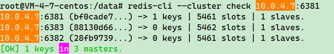

# Docker

## 操作系统程序模型

#### 虚拟化技术

在一台服务器中，以虚拟机为维度搭建多个虚拟机，每个虚拟机占用的内存有宿主机分配，拥有自己独立的网络、内存、数据环境，虚拟机之间相互隔离，虚拟机数量受宿主机配置限制。


特点：

-   基础镜像内存占比较大，GB级别。
-   创建使用操作复杂。
-   隔离性强。
-   启动速度慢。
-   移植与分享不方便。

#### 容器化技术

在宿主机中，由容器化插件将不同类型的应用抽象为一个个独立的容器，类似于独立的沙箱环境，每个容器存在的环境类似于一个小型的虚拟机，环境资源不受宿主机限制，比如内存、CPU、网络、用户组等。


特点：

-   镜像占用较小，MB级别
-   创建简单
-   隔离性强
-   启动速度较快
-   移植与分享方便


### Docker 运行基本流程

1. 用户使用 docker client 与 docker daemon 创建通信，并发送请求给后者
2. docker daemon 是 docker 架构中的主体部分，主要提供 docker server 功能使其可以接受 docker client 的请求
3. docker engine 执行 docker 内部的一系列工作，每一项工作都是以一个 Job 的形式存在
4. Job 的运行过程中，当需要容器镜像时，则从 docker registry 中下载镜像，并通过 镜像管理驱动 graph driver 将下载镜像以 graph 的形式存储
5. 当需要为 docker 创建网络环境时，通过 网络管理驱动 network driver 创建并配置 docker 容器网络环境
6. 当需要限制 docker 容器运行资源或执行用户指令等操作时，则通过 Execdriver 来完成
7. Libcontainer 是一项独立的容器管理包，Network driver 以及 Exec driver 都是通过 Libcontainer 来实现具体对容器进行的操作


## 基本命令


### 镜像命令

1. `docker images`：查询当前服务器下镜像列表

    > options：
    >
    > - **-a**：展现所有镜像
    >
    > - **-q**：只输出镜像id

    ```bash
    [root@VM-4-7-centos ~]# docker images
    REPOSITORY   TAG       IMAGE ID   CREATED   SIZE
    
    # `repository`：镜像仓库源
    # `tag`：镜像标签版本号，同一仓库源可以有多个 tag 标签，表示这个仓库源的不同版本。可以使用 `repository:tag` 定义不同的镜像。
    # `image id`：镜像id
    # `created`：镜像创建时间
    # `size`：镜像大小
    ```

    > 如果在拉取镜像是不指定镜像版本标签，会默认拉取最新的版本也就是：`镜像ID:latest`。

2. `docker search 镜像id`：查询远程镜像仓库列表。

    > options：
    >
    > **-- limit**：指定列出镜像数量，默认为25个。

    ```bash
    [root@VM-4-7-centos ~]# docker search redis
    NAME                              DESCRIPTION                                     STARS     OFFICIAL
    redis                             Redis is the world’s fastest data platform f…   12987     [OK]
    # -- limit：指定列出镜像数量
    [root@VM-4-7-centos ~]# docker search --limit 5 redis
    NAME                              DESCRIPTION                                     STARS     OFFICIAL
    redis                             Redis is the world’s fastest data platform f…   12987     [OK]
    ```

3. `docker pull 镜像名字[:tag]`：默认拉取指定镜像最新版。如果 tag 省略，等同于 `docker pull 镜像名称:latest`

    ```bash
    [root@VM-4-7-centos ~]# docker pull hello-world
    Using default tag: latest # 拉取 hello-world 镜像 latest版本
    latest: Pulling from library/hello-world
    c1ec31eb5944: Pull complete 
    Digest: sha256:53cc4d415d839c98be39331c948609b659ed725170ad2ca8eb36951288f81b75
    Status: Downloaded newer image for hello-world:latest
    docker.io/library/hello-world:latest
    ```

    

4. `docker system df`：查询镜像/容器/数据卷占用空间

    ```bash
    [root@VM-4-7-centos ~]# docker system df
    TYPE            TOTAL     ACTIVE    SIZE      RECLAIMABLE
    Images          1         0         13.26kB   13.26kB (100%)
    Containers      0         0         0B        0B
    Local Volumes   0         0         0B        0B
    Build Cache     0         0         0B        0B
    # RECLAIMABLE 可回收容量
    ```

5. `docker rmi 镜像名称`：删除指定镜像。

    - 删除多个：`docker rmi 镜像名:tag 镜像名:tag`
    - 参数续传，删除全部：`docker rmi -f ${docker images -qa}`

    > options：
    >
    > - **-i**：image镜像
    > - **-f**：强制执行

    ```bash
    [root@VM-4-7-centos ~]# docker rmi d2c94e258dcb
    Untagged: hello-world:latest
    Untagged: hello-world@sha256:53cc4d415d839c98be39331c948609b659ed725170ad2ca8eb36951288f81b75
    Deleted: sha256:d2c94e258dcb3c5ac2798d32e1249e42ef01cba4841c2234249495f87264ac5a
    Deleted: sha256:ac28800ec8bb38d5c35b49d45a6ac4777544941199075dff8c4eb63e093aa81e
    ```

6. `docker commit -m="提交信息" -a="作者" 容器id 镜像名:[版本号]`：生成镜像并提交到远程仓库。 

    ```bash
    [root@VM-4-7-centos ~]#docker commit -m="初始版本提交" -a="admin" test test:1.0.0
    ```

7. docker save/load

    - `docker save 镜像名 > xxx.tar`（`docker save -o xxx.tar 镜像名`）：将指定镜像保存成tar文件。

    - `docker load -i xxx.tar`（`docker load < xxx.tar`）：导入使用docker save命令导出的镜像

        ```bash
        docker save nginx:v1 > nginx.tar
        docker load -i nginx.tar
        ```


### 容器命令

1. docker run -d -name xxx：更改容器状态

    - docker run -it：启动容器并开启伪终端。

    > options：
    >
    > - **-d**：后台运行容器
    > - **-name**：指定容器名称
    > - **-i**：以交互模式运行容器，通常和 -t 同时使用
    > - -t：为容器分配一个伪终端
    > - -p：小写，指定端口映射
    > - -P：大写，随机端口映射
    > - -privileged：为此容器授予扩展权限，默认赋予当前用户的权限。
    > - -v：设置挂载目录
    > - -e：设置容器启动参数

2. docker stop/strat/restart [容器id]：改变容器状态

3. docker ps：查询所有正在运行的容器

    > options:
    >
    > - -a：列出所有容器，包含停止状态
    > - -l：显示最近创建的容器
    > - -n：显示最近 n 个创建的容器
    > - -q：只显示容器编号

4. docker rm 容器id/容器名：删除已经停止的容器。

5. docker logs 容器：查看容器日志

6. docker inspect 容器id：查询容器内部细节，默认以 json 格式输出。

    ```bash
    [root@VM-4-7-centos ~]# docker inspect test
    ```

    

7. docker attach 容器id：进入容器内部

    ```bash
    [root@VM-4-7-centos ~]# docker attach -it test
    ```

    

8. docker exec 容器：进入容器内部，options：其余参考 docker run

    ```bash
    [root@VM-4-7-centos ~]# docker exec -it test /bin/bash
    ```

    

    > - attach：直接进入容器内部，不会启动新的进程，退出容器会使容器停止
    > - **exec：在容器内部打开新的终端，并启动新的进程，退出容器不会使容器停止**

9. docker cp 容器id:容器内文件路径 宿主机目标路径：拷贝容器内文件到宿主机。

    ```bash 
    [root@VM-4-7-centos ~]# docker cp test:/bin/bash /bin
    ```

    

10. docker export 容器id > 目标文件：导出容器到目标文件，默认是当前宿主机目录下

    ```bash
    [root@VM-4-7-centos ~]# docker export test > test.tar
    ```

    

11. cat 文件名.tar | docker import -镜像用户/镜像名:镜像版本号：导入目标文件为镜像

      ```bash
      [root@VM-4-7-centos ~]# cat test.tar | docker import -user/test:latest
      ```

12.  docker update [OPTIONS] CONTAINER [CONTAINER...]：更改容器配置

     ```bash
      # 设置 redis 自动重启
      docker update --restart=always redis
     ```


> **docker save和docker export的区别**
>
> - **docker save**保存的是镜像（image）,**docker export**保存的是容器（container)；
> - **docker load**用来载入镜像包，**docker import**用来载入容器包，但两者都会恢复为镜像；
> - **docker load**不能对载入的镜像重命名，而**docker import**可以为镜像指定新名称。
> - **docker export**的包会比save的包要小，原因是save的是一个分层的文件系统，export导出的只是一个linux系统的文件目录。


## 容器数据卷

数据卷：将 docker 中指定文件、目录映射到宿主机中对应文件或者目录。以达到**文件备份**的目的。

- **-v 宿主机目录:容器内目录:[读写权限]**：读写权限默认是 `rw`支持读写，可以设置为`ro`：只读。

```bash
[root@VM-4-7-centos ~]#docker run -d --privileged=true -v /test:/test --name=test_con test
```

##### 数据卷继承和共享

`--volumes-from 父容器`：继承父容器中数据卷规则。（父容器状态不影响当前容器）

```bash
[root@VM-4-7-centos ~]#docker run -d --privileged=true --volumes-from test_A --name=test_B test
```


## Dockerfile 

Dockerfile 是用来构建 Docker 镜像的文件，是由一条条构建指令和参数组成的脚本文件。

#### 构建流程

1. 编写 Dockerfile 文件
2. `docker build .` 构建镜像：会去读取当前目录下的 Dockerfile 文件.
    - `docker build -t 新镜像名称:tag`（tag：版本号）
3. `docker run` 生成容器

#### 基本语法

- 每条保留字指令都必须为**大写字母**且后面至少跟随一个参数
- 指令按照从上到下，依次执行
- \# 表示注释
- 每条指令都会创建一个新的**镜像层**并对镜像进行提交


#### Docker 执行 Dockerfile 流程

1. docker 从基础镜像运行一个容器
2. 执行一条指令并对容器进行修改
3. 执行类似 `docker commit`的操作时会提交一个新的镜像层
4. docker 再基于刚提交的镜像运行一个新容器
5. 执行下一条指令，直到所有指令执行完成。


#### 保留字

##### 常用保留字

- **FROM**：基础镜像，当前新镜像是基于哪个镜像生成的，指定一个已经存在的镜像作为模板，第一条必须是 FROM

- **MAINTAINER**：镜像维护者的姓名和邮箱

- **RUN**：**容器构建时**需要运行的命令，RUN 是在 docker build 时运行

    - shell 命令：RUN <shell 命令>，等同于在终端上执行对应的命令

        ```dockerfile
        RUN apt-get update
        ```

        

    - exec 命令：RUN ["可执行文件","参数1","参数2"]

        ```dockerfile
        RUN ["test.sh","dev","enable"]
        # 等同于 RUN ./test.sh dev enable
        ```

        

- **EXPOSE**：当前容器对外暴露出的端口

- **WORKDIR**：指定在容器创建后，终端进入容器后所在的**工作目录**

- **USER**：指定镜像以哪个用户去执行，默认为 root

- **ENV**：在构建过程中设置环境变量

- **ADD**：将宿主机目录下的文件拷贝进镜像且会自动处理 URL 和解压 tar 压缩包。

- **COPY**：类似 ADD，拷贝文件和目录到镜像中。将从构建上下文目录中 <源路径> 的文件/目录复制到新的一层镜像内的 <目标路径> 下。

    ```dockerfile
    COPY src dest
    COPY ["src","dest"]
    # src：源文件或源目录
    # dest：容器内指定路径，该路径如果不存在会自动创建
    ```

    

- **VOLUME**：映射容器数据卷，用于数据保存和持久化工作

- **CMD**：指定**容器启动后**要做的工作，格式与 RUN 类似

    在指定了 ENTRYPOINT 指令后，用 CMD 指定具体的参数。Dockerfile 中可以有多个 CMD 指令，但只有最后一个有效，CMD 会被 docker run 之后的参数替换。

- **ENTRYPOINT**：指定一个容器启动时要运行的命令，类似于 CMD 指令，但是 ENTRYPOINT 不会被 docker run 后面的命令覆盖，而且这些命令行参数都会被当做参数传给 ENTRYPOINT 指令。

    格式：`ENTPYPOINT ["<executeable>","<param1>","<param2>"]`

    ```dockerfile
    FROM test
    ENTRYPOINT ["rm -rf","--param"]
    CMD ["/temp/logs"]
    # docker run test，正常情况执行：rm -rf --param /temp/logs
    
    # 假设 docker run test --param /temp，此时 /temp 会覆盖调 CMD 中的参数，将 /temp 传递给 ENTRYPOINT
    # 会变成：rm -rf --param /temp
    ```


#### Dockerfile 文件示例

```dockerfile
# 基础镜像
FROM openjdk:11
# 设置镜像作者
LABEL org.opencontainers.image.authors="plumsun@163.com"
# 文件映射
VOLUME /tmp
# 将宿主机 jar 包传递到镜像对应目录下
ADD short_chains.jar /tmp/
# 设置工作目录
WORKDIR /tmp/
# 设置容器启动命令
ENTRYPOINT ["java","-jar","short_chains.jar"]
# 端口映射
EXPOSE 8090
```


#### 虚悬镜像

docker 中 仓库名、版本号为空的镜像就是虚悬镜像 `dangling image`.


- 查询虚悬镜像：`docker image ls -f dangling=true` 
- 删除虚悬镜像：`docker image prune`

```dockerfile
# 生成虚悬镜像
FROM redis
CMD echo "success"
```


## Docker NetWork

docker 使用 Linux桥接，在宿主机上虚拟一个 docker 容器网桥（docker0），docker 启动一个容器时会根据 docker 网桥的网段分配给容器一个 ip 地址，称为 Container-IP。同时docker网桥是每个容器的**默认网关**，因为在同一个宿主机上的容器都接入同一个网桥，这样容器之间就能够通过容器的 Container-IP 直接通信。

docker 创建容器的时候，如果没有指定 network 的话会默认使用网桥模式就是 bridge，使用的就是 docker0。

网桥 docker0 创建一对**对等虚拟设备接口**一个叫 veth，一个叫 eth0，成对匹配。

- 整个宿主机的网桥模式都是 docker0，类似一个交换机有一堆接口，每个接口叫 veth，在本地主机和容器内分别创建一个虚拟接口，并让他们彼此连通
- 每个容器示例内部也有一个网卡每个接口叫 eth0
- docker0 上面的每个 veth 匹配某个容器实例内部的 eth0，两两配对

> docker0：docker 服务会默认创建一个 docker0 网桥（上面有一个 docker0 内部接口），在**内核层**连通了其他的物理或虚拟网卡，会将所有容器和本地主机都放到同一个物理网络。docker 默认指定了 docker0接口的ip地址和子网掩码，让主机和容器之间可以通过网桥通信。

### 网络模式

docker 会默认创建 `bridge`、`host`、`none`三个网络模式。

- **bridge**：虚拟网桥，默认为该模式，为每一个容器分配和设置独立 ip，并将容器连接到 `docker0`网卡上。

    ```bash
    docker run --network bridge docker0
    ```

    

- **host**：容器不会虚拟出自己的网卡，配置自己的 ip；而是使用宿主机的ip和端口。

    ```bash
    docker run --network host
    ```

    

- **none**：容器有独立的 network namespace，但没有进行任何网络设置，如：分配 veth pair 和网桥连接、ip等。

    ```bash
    docker run --network none
    ```

    

- **container**：新创建的容器不会创建自己的网卡和配置自己的ip，而是和一个指定的容器共享ip和端口范围。

    ```bash
    docker run --network container:Name或容器ID
    ```

- 自定义网络模式：自定义网络默认采用 bridge 模式，自定义网络会维护容器主机名和ip的对应关系，方便容器之间通信。

    > 自定义网络可以解决容器状态发生变动后ip地址变动的问题。

#### 基本命令

- `docker network ls`：查询 docker 默认的网络模式

    

- `docker network inspect 网络名字` ：查询对应网络基本信息

    

- `docker network rm xxx`：删除网络


## Docker-Compose 容器编排

Docker-Compose 是 Docker 官方的开源项目，主要负责对 Docker 容器集群的**快速编排**。

可以管理多个 Docker 容器组成一个应用，需要自定义 YAML 格式的配置文件 `docker-compose.yml`，在配置文件中维护好容器之间的调用关系。只需一个命令，就可以对所有容器进行关闭和启动。

#### 基本概念

- 服务（service）：docker 容器，Java 微服务、mysql、redis、Nginx等等都属于服务。
- 工程（project）：由一组关联的应用容器组成的一个完整业务单元，在 docker-compose.yml 中定义。


#### docker-compose.yml 示例

```yml
# 设置 service
services:
# docker-compose的service name
  app:
  # 基础镜像
    image: short_chain:1.0.0
    # 容器名称
    container_name: short_chain
    # 映射端口
    ports:
      - "8090:8090"
    # 文件挂载
    volumes:
      - /data/java/short_chain:/data
    # service 所属网卡
    networks:
      - my_net
	# 当前服务启动依赖项，表示 app 要在 redis、mysql启动完成后启动
    depends_on:
      - redis
      - mysql
  redis:
    image: redis:latest
    container_name: app_redis
    ports:
      - "6379:6379"
    volumes:
      - /data/java/redis/data:/data
      - /data/java/redis/redis.conf:/etc/redis/redis.conf
    networks:
      - my_net
    # 设置 service 启动命令
    command: redis-server /etc/redis/redis.conf
  mysql:
    image: mysql:8.0.39
    container_name: app_mysql
    # 设置 service 的环境变量，如果以下 user、database不存在会自动创建
    environment:
      MYSQL_ROOT_PASSWORD: 'root'
      MYSQL_ALLOW_EMPTY_PASSWORD: 'no'
      MYSQL_DATABASE: 'item_test'
      MYSQL_USER: 'test'
      MYSQL_PASSWORD: 'rzny0cB18&E+'
    ports:
      - "3306:3306"
    volumes:
      - /data/java/mysql/conf.d:/etc/mysql/conf.d
      - /data/java/mysql/log:/var/log/mysql
      - /data/java/mysql/data:/var/lib/mysql
      - /etc/localtime:/etc/localtime:ro
    networks:
      - my_net
# 创建网卡 my_net
networks:
  my_net:
```

> 如果所使用的镜像在本地不存在，会先去远程仓库拉取

#### 执行步骤

1. 编写 Dockerfile 定义各个微服务应用并构建出对应的镜像文件
2. 使用 docker-compose.yml 定义 project，安排好整体应用中的各个容器服务
3. 执行 `docker-compose up` 命令启动整个应用程序


#### 常用命令

- docker-compose -h：查询帮助
- docker-compose up：启动所有 docker-compose 服务
- docker-compose up -d：启动所有 docker-compose 服务并后台运行
- docker-compose down：停止并删除容器、网络、卷、镜像
- docker-compose exec 服务id：进入容器实例内部
- docker-compose ps：展示 docker-compose 编排过运行的所有容器
- docker-compose top：展示 docker-compose 编排过所有容器进程
- docker-compose logs 服务id：查看日志
- docker-compose config：检查配置
- docker-compose config -q：检查配置，有问题输出
- docker-compose restart：重启
- docker-compose start：启动
- docker-compose stop：停止


## Docker 生成新镜像

docker 中生成**新镜像**的方法：

1. docker commit：将已存在的容器中的镜像和修改内容提交为一个新的镜像
2. docker import：用于将导出的容器快照导入到本地镜像库（docker export 后使用 docker import 生成镜像）
3. 通过 Dockerfile 基于已存在镜像生成自定义镜像


## 安装 rocketmq

拉取 rocketmq 镜像

```bash
docker pull apache/rocketmq
```

运行 namesrv

```bash
docker run -d \
        --name rmqnamesrv \
        --privileged=true \
        -p 9876:9876 \
        -v /tool/rocketmq/logs:/home/rocketmq/logs \
        -v /tool/rocketmq/store:/home/rocketmq/store \
        # 指定内存占用 xmx最大堆内存，xms堆初始空间大小
    	-e "JAVA_OPT_EXT=-Xmx128m -Xms128m" \
apache/rocketmq:latest \
# 应该是硬性规定namesrv的服务名为mqnamesrv
sh mqnamesrv
```

>   `--name:容器名`
>
>   `--privileged=true`：提供root权限
>
>   `-p 宿主机端口:容器端口`：映射目标端口到宿主机中
>
>   `-v 宿主机目录:容器内部目录`：映射目标目录到宿主机中对应目录下（挂载）
>
>   `-e "-Dxxxx=xxx"`：设置容器启动参数

启动 broker，需要指定 namesrv 的地址，broker 默认监听的端口是10909,10911,10912

```bash
docker run -d \
	--name rmqbroker \
	--link rmqnamesrv:namesrv \
	--privileged=true \
	-p 10909:10909 \
	-p 10911:10911 \
	-p 10912:10912 \
	-v /tool/rocketmq/broker/logs:/home/rocketmq/logs \
	-v /tool/rocketmq/broker/store:/home/rocketmq/store \
	-v /tool/rocketmq/conf/broker.conf:/home/rocketmq/rocketmq-4.9.4/conf/broker.conf \
	-e "NAMESRV_ADDR=namesrv:9876" \
	# 指定内存占用 xmx最大堆内存，xms堆初始空间大小
	-e "JAVA_OPT_EXT=-Xmx128m -Xms128m" \
	# 可以通过 BROKER_PORT=XXXX 指定当前broker使用端口
apache/rocketmq:latest \ 
sh mqbroker -c /home/rocketmq/rocketmq-4.9.4/conf/broker.conf
```

可以使用默认的配置文件，也可以自定义配置，配置文件示例：

```properties
terName = DefaultCluster
brokerName = broker-a
brokerId = 0
deleteWhen = 04
fileReservedTime = 48
brokerRole = ASYNC_MASTER
flushDiskType = ASYNC_FLUSH
# namesrv 主机地址
namesrvAddr=服务器ip:9876
# 当前 broker 主机地址
brokerIP1=服务器ip
defaultTopicQueueNums=4
autoCreateTopicEnable=true
autoCreateSubscriptionGroup=true
listenPort=10911iskMaxUsedSpaceRatio=95
```


>   sh -c 指定配置文件启动容器

启动控制台

拉取控制台镜像

```bash
docker pull pangliang/rocketmq-console-ng
```

启动控制台容器，一定要先启动 namesrv

```bash
docker run -d \
        --restart=always \
        --name rmq-admin \
        -e "JAVA_OPTS=-Drocketmq.namesrv.addr=服务器ip:9876  \
                -Dcom.rocketmq.sendMessageWithVIPChannel=false" \
        -p 9999:8080 \
pangliang/rocketmq-console-ng \
sh rmq-admin
```

>   --restart 一直自动重启


## 安装mysql

拉取镜像

```bash
docker pull mysql:8.0.39
```


创建mysql数据和配置目录

```bash
mkdir -p /data/mysql/log
mkdir -p /data/mysql/data
mkdir -p /data/mysql/share
mkdir -p /data/mysql/conf.d
```

创建配置文件my.cnf

```bash
vim /data/mysql/conf.d/my.cnf
```

```ini
[client]
port=3306
[mysqld]
character-set-server=utf8mb4
port=3306
max_connections=200
default-storage-engine=INNODB
innodb_buffer_pool_size=128M
```

创建容器

```bash
docker run -d -p 3306:3306 --name mysql --privileged=true -v /data/mysql/conf.d:/etc/mysql/conf.d -v /data/mysql/log:/var/log/mysql -v /data/mysql/data:/var/lib/mysql -v /etc/localtime:/etc/localtime:ro -e MYSQL_ROOT_PASSWORD=root mysql:8.0.39
```


创建完成查询容器列表


如果要配置远程连接的话，需要开放端口3306，如果是云服务器，需要开两次：

-   linux服务器防火墙

    ```bash
    # 开放3306端口
    firewall-cmd --zone=public --add-port=3306/tcp --permanent
    # 加载规则
    firewall-cmd --reload
    # 查询端口开启情况
    firewall-cmd --zone=public --query-port=3306/tcp
    ```

-   云服务器厂商防火墙，基本上都是在云服务器`监控`菜单中。

还需要查询当前mysql的对于root用户配置的连接权限

```bash
# 进入mysql容器
docker exec -it mysql bash
# 输入mysql连接命令
mysql -uroot -p
# 输入密码
# 使用mysql库
use mysql;
# 查询root用户连接权限,默认应该是 localhost 只支持本地连接
select host,user from user;
```


>   我这边是配置完成的，`%`代表支持所有ip访问。

改变root用户连接权限

```mysql
alter user 'root'@'localhost' identified by 'root';
update user set host = "%" where user = 'root';
flush privileges;
```

补上成功样例：


#### 主从搭建

基本配置：同一台宿主机下搭建mysql一主一从

- 主机对应宿主机目录 ：`/data/mysql/master/`，从机对应宿主机目录：`/data/mysql/slave/`
- 主机端口：3307，从机端口：3308
- 主机 server-id=101，从机 server-id=102（同一局域网下 server-id 必须唯一）

##### 设置主机

1. 设置主机配置文件

    ```bash
    mkdir -p /data/mysql/master/log
    mkdir -p /data/mysql/master/data
    mkdir -p /data/mysql/master/share
    mkdir -p /data/mysql/master/conf.d
    vim /data/mysql/master/conf.d/my.cnf
    ```

    ```ini
    [client]
    port=3306
    [mysql]
    no-beep
    [mysqld]
    port=3306
    # 设置server-id 同一局域网内需要唯一
    server-id=101
    # 字符集
    character-set-server=utf8mb4
    # 默认使用存储引擎类型
    default-storage-engine=INNODB
    # 慢查询日志
    slow-query-log=1
    # 慢查询阈值 达到阈值才会记录 单位:s
    long_query_time=10
    # binlog 日志存放位置
    log-bin=master_binlog
    # 指定不需要同步的数据库名称
    binlog-ignore-db=mysql
    # 设置binlog文件使用的内存大小
    binlog_cache_size=1M
    # binlog_format=row 设置binlog刷盘策略 新版已被废弃，默认为 row
    # binlog 过期清理时间 默认为30天
    binlog_expire_logs_seconds=604800
    # 跳过主从复制中遇到的所有错误或指定类型的错误 避免 slave 主从同步失败
    # 1062:主键重复 1032:主从数据不一致
    replica_skip_errors=1062
    # 最大连接数量
    max_connections=151
    # 存储引擎内存大小
    innodb_buffer_pool_size=128M
    # 最大连接错误数量
    max_connect_errors=100
    ```

    

2. 创建并启动 mysql-master 容器

    ```bash
    docker run -d -p 3307:3306 --name mysql-master --privileged=true -v /data/mysql/master/conf.d:/etc/mysql/conf.d -v /data/mysql/master/log:/var/log/mysql -v /data/mysql/master/data:/var/lib/mysql -v /etc/localtime:/etc/localtime:ro -e MYSQL_ROOT_PASSWORD=root mysql:8.0.39
    ```

3. 进入容器，并设置主从同步用户

    ```bash
    docker exec -it mysql-master bash
    ```

    ```sql
    # 创建主从同步用户
    # 创建 slave 用户可以通过 root 密码登录当前机器
    mysql> create user 'slave'@'%' identified by 'root';
    Query OK, 0 rows affected (0.01 sec)
    
    # 赋予 slave 用户复制权限：Replication client、Replication slave
    mysql> grant replication slave,replication client on *.* to 'slave'@'%';
    Query OK, 0 rows affected (0.01 sec)
    
    mysql> flush privileges;
    Query OK, 0 rows affected (0.00 sec)
    ```

    > **replication client**：权限代表允许执行show master status,show slave status,show binary logs命令
    >
    > **replication slave**：权限代表允许slave从机通过此用户进行主从复制

##### 设置从机

1. 设置主机配置文件

    ```bash
    mkdir -p /data/mysql/slave/log
    mkdir -p /data/mysql/slave/data
    mkdir -p /data/mysql/slave/share
    mkdir -p /data/mysql/slave/conf.d
    vim /data/mysql/slave/conf.d/my.cnf
    ```

    ```ini
    [client]
    port=3306
    [mysql]
    no-beep
    [mysqld]
    port=3306
    # 设置server-id,同一局域网内需要唯一
    server-id=102
    # 字符集
    character-set-server=utf8mb4
    # 默认使用存储引擎类型
    default-storage-engine=INNODB
    # 慢查询日志
    slow-query-log=1
    # 慢查询阈值,达到阈值才会记录,单位:s
    long_query_time=10
    # binlog 日志存放位置
    log-bin=slave_binlog
    # 指定不需要同步的数据库名称
    binlog-ignore-db=mysql
    # 设置binlog文件使用的内存大小
    binlog_cache_size=1M
    # binlog_format=row 设置binlog刷盘策略 新版已被废弃，默认为 row
    # binlog 过期清理时间 默认为30天
    binlog_expire_logs_seconds=604800
    # 跳过主从复制中遇到的所有错误或指定类型的错误,避免 slave 主从同步失败
    # 1062:主键重复;1032:主从数据不一致
    replica_skip_errors=1062
    # 设置server-id,同一局域网内需要唯一
    # 设置从机中继日志存放位置
    relay_log=relay_log
    # 表示从机将主机的 binlog 写入自己 binlog 中
    log_slave_updates
    # 最大连接数量
    max_connections=151
    # 存储引擎内存大小
    innodb_buffer_pool_size=128M
    # 最大连接错误数量
    max_connect_errors=100
    ```

    > log_slave_updates=1：如果不配置，**从库从主库复制的数据不会写入log-bin日志文件里**；假如从机宕机重启后，就会造成数据丢失。

2. 创建并启动 mysql-master 容器

    ```bash
    docker run -d -p 3308:3306 --name mysql-slave --privileged=true -v /data/mysql/slave/conf.d:/etc/mysql/conf.d -v /data/mysql/slave/log:/var/log/mysql -v /data/mysql/slave/data:/var/lib/mysql -v /etc/localtime:/etc/localtime:ro -e MYSQL_ROOT_PASSWORD=root mysql:8.0.39
    ```

3. 查询**主机**状态

    ```sql
    mysql> show master status;
    +----------------------+----------+--------------+------------------+-------------------+
    | File                 | Position | Binlog_Do_DB | Binlog_Ignore_DB | Executed_Gtid_Set |
    +----------------------+----------+--------------+------------------+-------------------+
    | master_binlog.000003 |      878 |              | mysql            |                   |
    +----------------------+----------+--------------+------------------+-------------------+
    1 row in set (0.00 sec)
    ```

    

4. 进入容器，并配置主从复制

    ```bash
    docker exec -it mysql-slave bash
    ```

    ```sql
    # 创建主从同步用户
    # 创建 slave 用户可以通过 root 密码登录当前机器
    mysql> change master to master_host='宿主机ip',master_user='slave',master_password='root',master_port=3307,master_log_file='master_binlog.000003',master_log_pos=878,master_connect_retry=30;
    Query OK, 0 rows affected, 10 warnings (0.03 sec)
    
    # 查询主从同步状态
    mysql> show slave status \G;
    
    # 开启主从同步
    mysql> start slave;
    Query OK, 0 rows affected, 1 warning (0.03 sec)
    ```

    > **master_port**：主机暴露的端口，注意：如果主从不在一台机器，要将对应端口暴露出来。
    >
    > **master_log_file**：主机中要同步的binlog文件名
    >
    > **master_log_pos**：当前主机中 binlog 的数据大小
    >
    > **master_connect_retry**：连接失败重试时间间隔


##### 主从连接问题

**This was attempt 1/86400, with a delay of 30 seconds between attempts. Message: Authentication plugin 'caching_sha2_password' reported error: Authentication requires secure connection.**

问题描述：密码认证失败

原因：mysql 高版本的密码都是用 caching_sha2_password 加密过的，从机使用明文进行连接不会成功。

解决：

1. 主机创建用户时，不要对密码进行加密处理，以下操作是在**主机**中：

    ```sql
    mysql> create user 'slave'@'%' identified with 'mysql_native_password' by 'root';
    ```

    

2. 使用对应的主从同步用户获取主机中的公钥，下列操作均在**从机**中：

    - （推荐）get_master_public_key=1

        ```sql
        mysql> change master to master_host='宿主机ip',master_user='slave',master_password='root',master_port=3307,master_log_file='master_binlog.000003',master_log_pos=878,master_connect_retry=30,get_master_public_key=1;
        ```

        

    - --server-public-key-path=/xxx/xxx/public_key.pem：获取主机中的公钥并保存在对应目录下

        ```sql
        mysql> mysql -u slave -proot -h 宿主机ip -P3307 --server-public-key-path=/xxx/xxx/public_key.pem;
        
        mysql> change master to master_host='宿主机ip',master_user='slave',master_password='root',master_port=3307,master_log_file='master_binlog.000003',master_log_pos=878,master_connect_retry=30;
        ```

参考：https://www.modb.pro/db/29919


## docker 安装 Redis

拉取镜像

```bash
docker pull redis
```

创建目录

```bash
mkdir -p /data/redis/data
```

镜像里不包含配置文件，需要拉取redis配置文件，[查看](https://github.com/redis/redis/blob/unstable/redis.conf) **一定要注意redis版本**

下载完成直接通过ftp传到`/tool/reids`目录下就行

因为是官方配置，需要我们手动改下配置：

```bash
# 常用配置
bind 127.0.0.1 	# 注释掉这部分，使redis可以外部访问
daemonize no	# 用守护线程的方式启动
requirepass 你的密码 # 给redis设置密码
appendonly yes # redis持久化 默认是no
tcp-keepalive 300 # 防止出现远程主机强迫关闭了一个现有的连接的错误 默认是300
```

创建容器

```bash
docker run -d \
	-p 6379:6379 \
	--name redis \
	--privileged=true \
	-v /data/redis/data:/data \
	-v /data/redis/redis.conf:/etc/redis/redis.conf \
redis:latest \
redis-server /etc/redis/redis.conf
```


进入redis容器

```bash
[root@VM-4-7-centos redis]# docker exec -it redis bash
root@e4e0a72ace3d:/data# redis-cli -h 127.0.0.1 -p 6379
127.0.0.1:6379> 
```

如果要配置远程连接需要几个前提:

-   注释掉配置`bind 127.0.0.1`
-   开放端口6379


##### docker启动redis常见问题和警告

以下是我通过docker部署redis时碰到的一些问题：


1.**Warning: no config file specified, using the default config. In order to specify a config file use redis-server /path/to/redis.conf**

机翻：警告：未指定配置文件，使用默认配置。要指定配置文件，请使用 redis-server /path/to/redis.conf

原因：配置文件未指定，docker拉取redis是没有配置文件的，可以手动让redis通过配置文件启动

```bash
# 前提，容器内部包含redis.conf，但是没有，所以需要去挂载宿主机的配置文件到容器内部，参考上方的redis启动命令
docker run --name redis -p 6379:6379 -d redis:latest redis-server /etc/redis/redis.conf
```


2.**WARNING overcommit_memory is set to 0! Background save may fail under low memory condition. To fix this issue add 'vm.overcommit_memory = 1' to /etc/sysctl.conf and then reboot or run the command 'sysctl vm.overcommit_memory=1' for this to take effect.**

机翻：警告 overcommit_memory设置为 0！在内存不足的情况下，后台保存可能会失败。要解决此问题，请将“vm.overcommit_memory = 1”添加到 /etc/sysctl.conf，然后重新启动或运行命令“sysctl vm.overcommit_memory=1”以使其生效。

个人解决方法：修改宿主机的内核参数`vm.overcommit_memory`，默认为0

```bash
vim /etc/sysctl.conf
# 添加以下行，保存
vm.overcommit_memory = 1
# 查看是否修改成功
sysctl -p
```


3.**WARNING: The TCP backlog setting of 511 cannot be enforced because /proc/sys/net/core/somaxconn is set to the lower value of 128.**

机翻：警告：无法强制执行 TCP 积压设置 511，因为 /proc/sys/net/core/somaxconn 设置为较低的值 128。

个人在网上看到的解决方法都是修改宿主机的sysctl.conf文件中`net.core.somaxconn`（内核参数 tcp最大连接值），修改完成后重启docker，重启redis都没用。docker的内核参数基本都是继承自宿主机的。但是为什么修改docker不生效，我还是有点懵，如果有大佬们知道并有幸看到这个贴子，麻烦指点下

具体解决方法：在创建redis容器时手动指定内核参数（docker容器的内核参数，不是宿主机的）

```bash
docker run -d \
	-p 6379:6379 \
	--name redis \
	# 指定内核参数
	--sysctl net.core.somaxconn=511 \
	--restart=always \
	--privileged=true \
redis:latest
```

<font color="red" >注意</font>

如果要解决上面这个警告，并且采用手动指定docker内核（也就是往宿主机里添加规则）的方式，会导致当前redis不能通过远程连接。解决这个远程连接问题有两种方式：

1.  直接重启加载宿主机配置，并重启dokcer,缺点就是需要**重启下docker**，我采用的是这种，至于还有没有其他问题还没发现

    ```bash
    systemctl daemon-reload
    systemctl restart docker
    ```

    

2.  禁用docker往iptables添加规则，让docker访问采用nat模式，缺点就是**也需要重启docker，容器内无法获取得到客户端的真实 IP**，常常nginx 日志上记录的是 docker0 网络的子网 IP

    ```bash
    vi /usr/lib/systemd/system/docker.service
    # 添加 --iptables=false
    
    systemctl daemon-reload
    systemctl restart docker
    # 开启 NAT 转发
    firewall-cmd --permanent --zone=public --add-masquerade
    # 检查是否允许 NAT 转发
    firewall-cmd --query-masquerade
    # 禁止防火墙 NAT 转发
    firewall-cmd --remove-masquerad
    ```


#### 集群搭建

集群中的节点都需要打开两个 TCP 连接。一个连接用于正常的给 Client 提供服务，比如 6379，还有一个额外的端口（通过在这个端口号上加10000）作为数据端口，例如：**`redis的端口为 6379，那么另外一个需要开通的端口是：6379 + 10000， 即需要开启 16379`**。

16379 端口用于集群总线，这是一个用二进制协议的点对点通信信道。这个集群总线（Cluster bus）用于节点的失败侦测、配置更新、故障转移授权等等。

1. 运行节点

    ```bash
    docker run -d --net host --name redis-node1 -p 16381:16381 --privileged=true -v /data/redis/share/node1/data:/data redis:latest --cluster-enabled yes --appendonly yes --port 6381
    
    docker run -d --net host --name redis-node2 -p 16382:16382 --privileged=true -v /data/redis/share/node2/data:/data redis:latest --cluster-enabled yes --appendonly yes --port 6382 
    
    docker run -d --net host --name redis-node3 -p 16383:16383 --privileged=true -v /data/redis/share/node3/data:/data redis:latest --cluster-enabled yes --appendonly yes --port 6383 
    
    docker run -d --net host --name redis-node4 -p 16384:16384 --privileged=true -v /data/redis/share/node4/data:/data redis:latest --cluster-enabled yes --appendonly yes --port 6384 
    
    docker run -d --net host --name redis-node5 -p 16385:16385 --privileged=true -v /data/redis/share/node5/data:/data redis:latest --cluster-enabled yes --appendonly yes --port 6385 
    
    docker run -d --net host --name redis-node6 -p 16386:16386 --privileged=true -v /data/redis/share/node6/data:/data redis:latest --cluster-enabled yes --appendonly yes --port 6386 
    ```

    > --net host：使用宿主的ip和端口
    >
    > -p 16386:16386：集群总线端口
    >
    > --port：redis占用端口
    >
    > 注意：一定要开启端口

    

2. 进入 redis 节点，创建集群关系，`redis-cli --cluster create`。

    ```bash
    [root@VM-4-7-centos ~]# docker exec -it redis-node1 bash
    root@VM-4-7-centos:/data# redis-cli --cluster create 10.0.4.7:6381 10.0.4.7:6382 10.0.4.7:6383 10.0.4.7:6384 10.0.4.7:6385 10.0.4.7:6386 --cluster-replicas 1
    ```

    > --cluster-replicas：副本数量

    

3. 查看集群状况，`redis-cli --cluster check 10.0.4.7:6381`

    

    

    > 查看集群信息命令很多，以下是常用命令
    >
    > 需要进入redis内部：
    >
    > - `cluster nodes`
    > - `cluster info`
    >
    > 不需要进入 redis 内部：
    >
    > - `redis-cli --cluster check redis机器ip:redis端口`

4. 插入数据测试

    

    > (error) MOVED 12706 10.0.4.7:6383
    >
    > 正常单机连接的情况下，插入数据可能会出现以上错误
    >
    > k1 经过哈希运算得到的槽为12706，而redis-node只维护了0-5460的槽，路由不到 12706 槽位，所以插入失败

    解决方法：

    使用集群连接状态：`redis-cli -p 6381 -c`

    `-c`：开启集群模式

    > -c：Enable cluster mode (follow -ASK and -MOVED redirections)
    >
    > - ask：临时重定向，后续操作依然在旧节点。
    > - moved：永久重定向，后续操作在新节点。

    ```bash
    [root@VM-4-7-centos ~]# docker exec -it redis-node1 bash
    root@VM-4-7-centos:/data# redis-cli -p 6381 -c
    ```

    


#### 扩容

通过 docker 新建两台 redis 机器，一主一从；主机端口：6387，从机端口：6388。

1. 创建机器，注意端口开放。

    ```bash
    docker run -d --net host --name redis-node7 -p 16387:16387 --privileged=true -v /data/redis/share/node7/data:/data redis:latest --cluster-enabled yes --appendonly yes --port 6387
    docker run -d --net host --name redis-node8 -p 16388:16388 --privileged=true -v /data/redis/share/node8/data:/data redis:latest --cluster-enabled yes --appendonly yes --port 6388 
    ```

    

2. 添加主机，redis-cli --cluster add-node new_host:new_port existing_host:existing_port。这个操作会将要加入的那台机器添加进集群，并设置为 master 机器。

    > 同时添加主从，前面的机器为从机，后面的为主机：
    >
    > `redis-cli --cluster add-node new_slave_host:new_slave_port new_master_host:new_master_port existing_host:existing_port`
    >
    > 添加从机指定主机id：
    >
    > `redis-cli --cluster add-node new_slave_host:new_slave_port existing_host:existing_port --cluster-slave --cluster-master-id <id>`

    ```bash
    redis-cli --cluster add-node 10.0.4.7:6387 10.0.4.7:6381
    ```

    

    

    

3. 查看集群状况

    ```bash
    redis-cli --cluster check 10.0.4.7:6381
    ```

    

    

4. 添加从机

    ```bash
    # --cluster-master-id <arg>：arg 所属主机id
    redis-cli --cluster add-node 10.0.4.7:6388 10.0.4.7:6381 --cluster-slave --cluster-master-id e244827efe2bf120e738567bf5d4cbe7a61e320e
    ```

    

    

5. 查询当前集群状况，`redis-cli --cluster check 10.0.4.7:6381`

    

6. 重新分配槽号，`redis-cli --cluster reshard 10.0.4.7:6381`

    目前只能手动指定槽数分配，**会从其余 master 节点中分配一些槽位到新的节点**，如果加入新节点，redis 不能对重新平均分配集群的哈希槽。[redis 官网参考](https://redis.io/docs/latest/operate/oss_and_stack/management/scaling/#:~:text=This%20allows%20to,in%20the%20future.)

    > This allows to build some automatism if you are likely to reshard often, however currently there is no way for `redis-cli` to automatically rebalance the cluster checking the distribution of keys across the cluster nodes and intelligently moving slots as needed. This feature will be added in the future.
    >
    > 如果您可能经常重新分片，这允许构建一些自动化，但是目前 redis-cli 无法自动重新平衡集群，检查集群节点之间的密钥分配并根据需要智能移动插槽。此功能将在未来添加。

    

    - **How many slots do you want to move (from 1 to 16384)?**，设置新的节点占用多少个槽位。

    - **What is the receiving node ID?**，这些槽位分配给那个节点。

    - **Please enter all the source node IDs.Type 'all' to use all the nodes as source nodes for the hash slots.**

        要从哪些节点获取这些槽位，all：所有 master 节点。

    

7. 查看集群状况，`redis-cli --cluster check 10.0.4.7:6381`。我这边因为分配了两次，所以 6387 端口的 redis 拥有 8192 个槽位。

    

8. 查看槽位分配的**均衡性**，`redis-cli --cluster rebalance 10.0.4.7:6381`

    如果当前集群中槽位分配不均匀，rebalance 命令会触发重新分配，将多余的槽位分配给其余 master 节点。因为我上面分配了两次槽位，6387节点槽位为 8192个。

    rebalance之后槽位 = 8192 - 1366 -1365 - 1365 = 4096。（正好和 16384 / 4 相等）

    

    再次执行，节点负责的槽数据差异在2%以内，集群槽位分配是均匀的。

    

9. 再看下集群状况，每个 master 节点都分配了 4096 个槽位。

    

#### 缩容

流程：先删除从节点 6388 -> 重新分配槽位 -> 删除主节点 6387

1. 删除从节点 6388，`redis-cli --cluster del-node 节点ip:端口 节点id`

    ```bash
    redis-cli --cluster del-node 10.0.4.7:6388 ba4f57a9d38e6b3c52abb4c1008243e2a2fe130e
    ```

    

    > 这里的ip、端口、id都是被删除节点的

    

    看下集群状态，6388节点已经没了

    

2. 分配槽位，可以将 6387 节点的槽位都分给某一台机器，也可以平均分配，这里我都分配给 6381节点。（如果不满意也可以在 6387 节点删除完后通过 `rabalance`命令自动分配槽位）

    **不能直接删除 master 节点，一定要先重新分配**，附上失败图

    

    ```bash
    redis-cli --cluster reshard 10.0.4.7:6381
    ```

    

    看下集群状态

    

    > **注意此时 6387 节点变成了 slave节点，并且所属的 master节点为 6381**

3. 删除 6387 节点

    ```bash
    redis-cli --cluster del-node 10.0.4.7:6387 e244827efe2bf120e738567bf5d4cbe7a61e320e
    ```

    

    看下集群状态，6381 节点下的从节点又变成了 1 个

    

4. 自动分配槽位，`redis-cli --cluster rebalance 10.0.4.7:6381`，附上集群状态图（3个 master 节点平分 16384 个槽位）：

    


## docker安装xxl-job

拉取xxl-job-admin项目MySQL初始化脚本，[查看](https://github.com/xuxueli/xxl-job/blob/master/doc/db/tables_xxl_job.sql)

创建xxl-job数据库

拉取镜像

```bash
docker pull xuxueli/xxl-job-admin:2.4.0
```

创建目录

```bash
mkdir /tool/xxl-job/logs
```

[官方配置信息](https://github.com/xuxueli/xxl-job/blob/master/xxl-job-admin/src/main/resources/application.properties)下载放置xxl-job目录下

创建容器

```bash
docker run  -d \
        -p 8088:8088 \
        -v /tool/xxl-job/logs:/data/applogs \
        -v /tool/xxl-job/application.properties:/xxl-job/xxl-job-admin/src/main/resources/application.properties \
        -e PARAMS="--server.port=8088 \
        --spring.datasource.url=jdbc:mysql://127.0.0.1:3306/xxl_job?useUnicode=true&characterEncoding=UTF-8&autoReconnect=true&serverTimezone=Asia/Shanghai \
        --spring.datasource.username=root \
        --spring.datasource.password=root" \
        --name xxl-job-admin  \
xuxueli/xxl-job-admin:2.4.0
```

通过 http://127.0.0.1:8088/xxl-job-admin/ 进入调度平台，默认用户名密码：`admin/123456`


## docker安装rabbitmq


## docker安装es

## docker安装kibana
