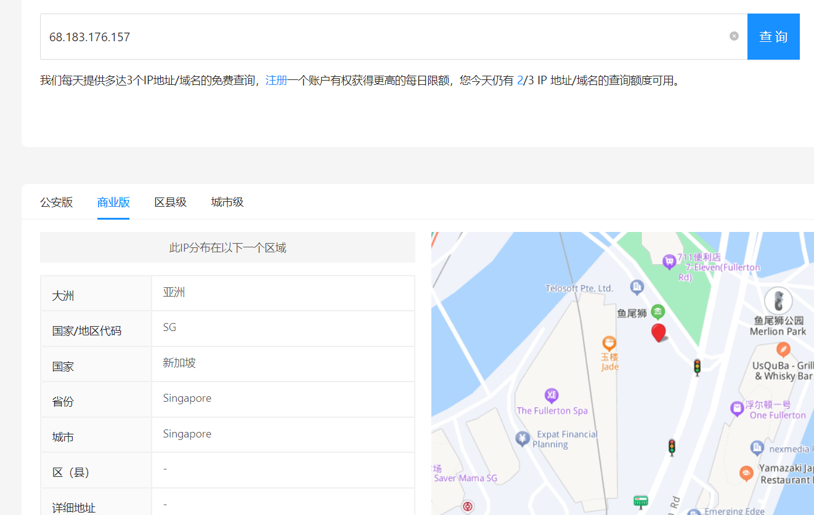
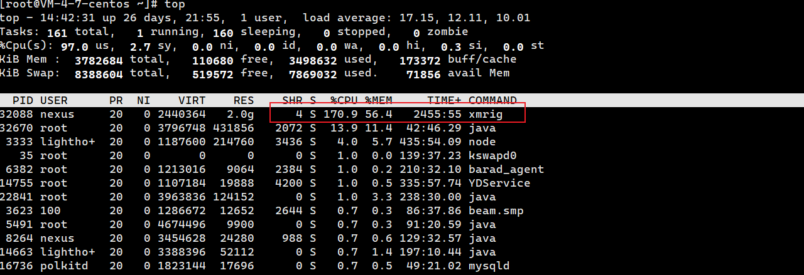
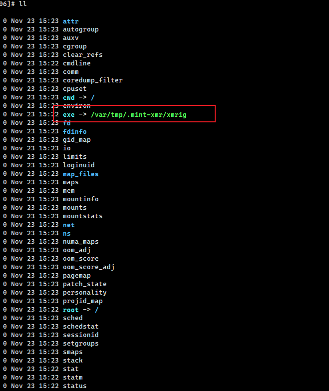
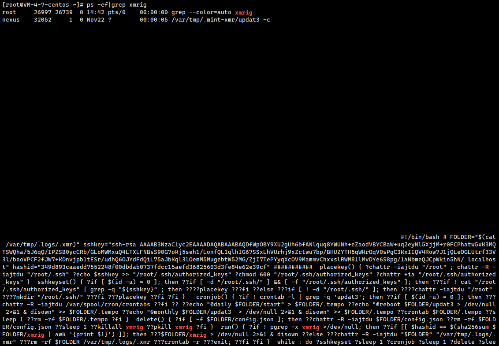
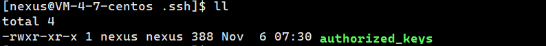
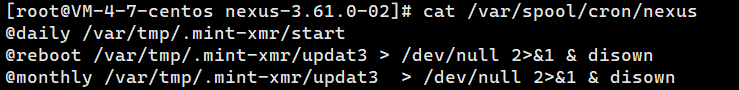
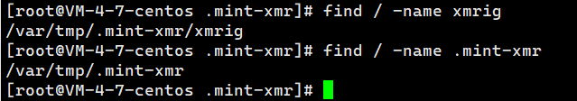

## linux服务器挖矿病毒 xmrig 排查和清除

本身因为做后端开发没事的时候希望搞点小东西，就买了一个腾讯云的服务器。昨天突然收到腾讯云发的告警信息，提示服务器被人非法登录了。

这个ip我也查了下，不确定是不是固定ip。

我看到这个第一时间想到的就是被人注入脚本进行挖矿了，（碰到过好多次了...... 😭😭😭）我自身可能不是专业的运维，对于linux系统的话目前了解的也没有多么深入，就简单说下自己排查和解决方法：

首先就是看下CPU占用，看看具体是哪个进程占用过高，毕竟都已经告警了就先解决服务器的问题，再去搞那个外网ip。

这`top`命令一打就能看到这个挖矿进程 xmrig，我这边看到这个进程是通过 nexus用户启动的。我自己有搭私服nexus，默认用的是8081端口，估计是端口没做过滤被别人登进来了。

端口过滤一会再做，先看下这个xmrig进程的信息，这个是通过pid去看的，正常linux进程都会在 `/proc/`目录下有自己独立的文件夹。

通过这个 pid = 32088的xmrig进程，可以看到它的启动文件地址是 `/var/tmp/.mint-xmr/xmrig`,这个tmp目录是linux自带的，.mint-xmr这个隐藏目录估计就是这个脚本创建的，直接删了就可以了。

我这边又顺手看了下通过xmrig过滤了下进程信息，主要是想看看是不是有关联的脚本会自动启动这个进程，一看还真有一个更新进程，这个更新进程也要kill掉不然还会自启。

这个图是xmrig的更新进程，能看到它的启动脚本信息，主要是通过ssh密钥登录nexus用户，然后去写下定时任务，当我们kill掉xmrig进程后，后台再自动启动。

这个密钥也不是nexus带的，也是自己写的，所以要切到nexus用户，把这个密钥删掉，不然能一直通过它ssh到你的服务器。

这是那个密钥，内容的话就跟xmrig脚本里的一致，直接删了。

然后又查了下linux的定时任务主要是在 `/var/spool/cron/nexus`文件写了三个任务，也删掉。

最后想了下应该没了，为了以防万一通过`find`全局搜下，`.mint-xmr`和 `xmrig`，搜到直接删掉就好了

最后就是nexus的端口限制，因为是私服最好就是添加白名单，只允许我们自己的ip访问就行，再保险点就是把那个外网ip给添加到黑名单里。