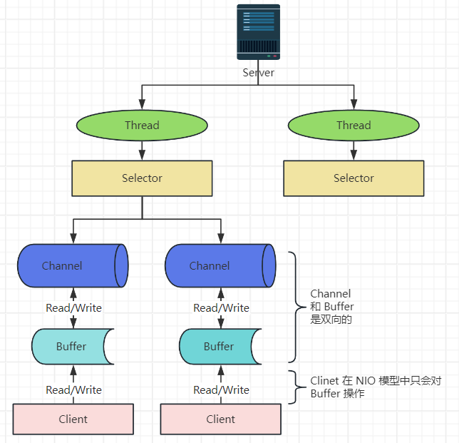

# Netty

## 介绍

1. Netty 是由 JBOSS 提供的一个 Java 开源框架，是一个**异步**、**基于事件驱动**的网络应用框架，用以快速开发高性能、高可靠性的网络 IO 程序。
2. Netty 主要针对在 TCP 协议下，面向 Clients 端的高并发应用，或者是 Peer-to-Peer 场景下的大量数据持续传输应用。
3. 本质上是一个 NIO 框架，适用于服务器通讯相关的多种应用场景。

### 应用场景

#### 互联网行业

- RPC 框架：Dubbo 协议默认使用 Netty 作为基础通信组件

#### 游戏行业

- 账户登录服务器：Netty 提供了 **TCP/UDP 和 HTTP 协议栈**，方便定制和开发私有协议栈。
- 地图服务器

#### 大数据

- Hadoop：Hadoop 中的通信和序列化组件 Avro 采用 Netty 进行通信。

## I/O 模型

I/O 模型通常指的是数据传输时的**通道**。Java 目前支持 3种 I/O 模型：BIO、NIO、AIO.

#### BIO

JDK1.4 之前默认使用，同步阻塞，服务器实现模式为一个连接一个线程。客户端连接时服务器会启动一个线程进行处理，如果这个连接不做任何事情就会造成资源浪费。

其相关的类和接口在 `java.io` 包下。可以通过**线程池机制**改善，实现多个客户端连接服务器，并减少资源消耗。

##### 适用场景

适用于连接数量小且固定的架构

##### 工作流程

1. 服务端启动一个 ServerSocket
2. 客户端启动 Socket 对服务端进行通信，默认情况下服务器需要对每个客户端建立一个线程与之通信
3. 客户端发送请求后，会先询问服务器是否有线程响应，如果没有则会等待，或者拒绝
4. 如果有响应，客户端线程会等待请求结束后，继续执行

#### NIO

JDK1.4 之后开始支持，同步非阻塞，Java NIO 全称 java non-blocking IO（New IO），NIO 相关的类、接口在 `java.nio`包下，并且对原 java.io 包中的很多类进行了改写。

NIO 是面向缓冲区（面向块）编程的。数据会先读取到缓冲区中，需要时可以在缓冲区中前后移动，增加了处理过程中的灵活性，使其可以提供非阻塞式的高伸缩性网络。

在读和写的时候，线程不会保持阻塞状态，在数据操作完成之前（读或写操作），该线程可以继续做其他事情。

> HTTP2.0 使用了多路复用机制（NIO实现），做到同一个连接并发处理多个请求，而且并发请求数量对比HTTP1.1多了几个数量级。

##### 核心

- Channel（通道）：类似于流（也可以理解为 **链接**）

    - 通道可以同时进行读写操作，而流只能同时执行一种操作
    - 通道可以实现异步读写数据
    - 通道可以从缓冲区读取数据，也可以往缓冲区写入数据

- Buffer（缓存区）：本质上是一个可以进行读写数据的内存块（容器对象（数组）），内置了一些机制能够跟踪和记录缓冲区的状态变化情况。Channel 提供读取数据的渠道，但是读取或写入的数据必须经由 Buffer.

    

    Buffer 内置了一些变量：

    - int mark，默认为 -1，标记。
    - int position，指向下一个要被读或者写的元素的索引，每次读写缓存区数据时都发生改变，默认为 0。
    - int limit，缓冲区的当前终点，不能对缓冲区超过极限的位置进行读写操作，且极限是可以修改的。
    - int capacity，缓冲区最大容量，在缓冲区创建完成后不能**改变**。

- Selector（选择器）

##### 适用场景

适用于连接数较多且连接时间短的应用。

- 聊天服务器
- 弹幕系统
- 服务器之间通讯

#### AIO

JDK7 开始支持，异步非阻塞，AIO 引入**异步通道**的概念，采用 Proactor 模式，简化了程序编写，有效的请求才会启动线程，特点是先由操作系统完成后才通知服务端程序启动线程去处理，

##### 适用场景

一般适用于连接数较多且连接时间长的应用。

- 相册服务器