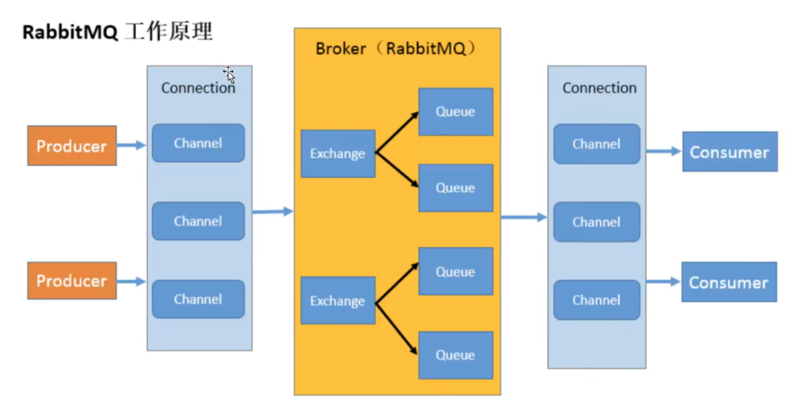

# RabbitMQ

### 1.MQ概念

MQ字面意思上看是一个队列，FIFO先入先出，只不过队列中存放的内容是message而已。还是一种跨进程的通信机制，用于上下游传递消息。

### 2.MQ作用

1.  流量消峰

    假设一个订单系统每秒支持1万的请求量，当超过这个阈值系统会宕机，若是订单系统前加入mq时，可以超出阈值的请求进行等待处理，这样虽然会导致用户体验不好，但系统不会出现宕机的情况。

2.  模块解耦

    以电商项目为例，假设项目中包含订单，库存，支付，物流系统，用户创建订单后，如果耦合调用库存系统，支付，物流系统，任何一个子系统出现了故障，都会造成下单操作异常。如果使用消息队列会减少系统间交互的问题，比如物流系统出现问题，消息队列会监视此系统直到业务完成。

3.  异步处理

    可以将一些非核心流程，如日志，短信，邮件等，通过MQ的方式异步去处理。这样做的好处是缩短主流程的响应时间，提升用户体验。


### 3.区别

ActiveMQ:

​	java语言实现，万级数据量吞吐，处理速度ms级，主从架构，成熟度高。

RabbitMQ

​	erlang语言实现，万级数据吞吐量，梳理速度us级，主从架构

RocketMQ:

​	JAVA语言实现，十万级数据吞吐量，处理速度ms级，分布式架构，功能强大，扩展性强

kafka:

​	scala语言实现，十万级数据吞吐量，处理速度ms级，分布式架构，功能较少，应用于大数据较多


### 4.核心概念

```
生产者
	产生数据发送消息的程序。
交换机
	可以接收，存储，转发消息。
队列
消费者
```

5.名词介绍




Broker：接收和分发消息的应用，rabbitmq

Producer：生产者

connection：publisher/consumer和broker之间的tcp连接。

channel：信道，每次消息发送，接收时会在连接中为每个thread创建单独的信道，而不是占用整个连接，减少了tcp连接的开销。

exchange：交换机，消息到达broker的第一站，根据分发规则匹配查询表中的routing key，分发消息到queue中。常用的类型：direct，topic and fanout。

queue：队列，消息最终会被送到这里等待消费者接收。

consumer：消费者


