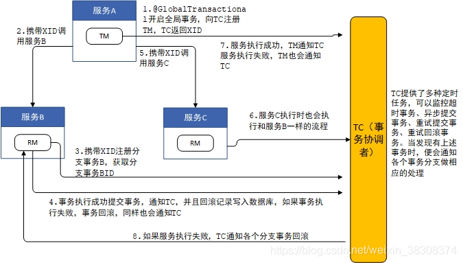

## Seate

### 1.简介

 Seata 是一款开源的分布式事务解决方案，致力于提供高性能和简单易用的分布式事务服务。Seata 将为用户提供了 AT、TCC、SAGA 和 XA 事务模式，为用户打造一站式的分布式解决方案。

`TM` transaction manager,全局事务的管理者，可以理解为全局调用的发起者，哪个服务发起了全局服务调用，这个服务就是TM
`RM` Resouce Manager，可以简单理解为整个全局调用中，每个节点都是一个RM
`TC` Tracnaction Coordinator 全局事务的协调者，可以理解为Seata Server

1.通过@GlobaTransactional开启全局事务，向tc注册tm，tc返回一个全局锁xid

2.tm携带全局锁调用服务a，服务a携带全局锁注册分支事务，获取本地锁

3.事务执行成功，会通过tc，并且会将回滚记录写到undo.log表中，如果事务执行失败，会通过回滚记录进行数据回滚，同时也会通知tc

4.tm携带全局锁调用b，b也会携带全局锁注册分支事务，获取本地锁

5.事务执行成功，会通过tc，并且会将回滚记录写到undo.log表中，如果事务执行失败，会通过回滚记录进行数据回滚，同时也会通知tc

6.当其中一个分支事务执行失败，tc会通知各个分支事务进行事务回滚

**AT 模式分布式事务概念**
通过一张undo_log表来记录回滚日志信息，在执行更新的sql语句之前，先通过这个sql语句生产一条查询语句，查询出前镜像，再执行更新的sql，执行完之后，通过前镜像的id查询出后镜像，把前后镜像加上业务逻辑的sql生产一条回滚日志信息的记录，插入到回滚日志信息表。将来需要回滚数据，就是通过这张表的数据来进行回滚，通过这个回滚日志信息，生产一个update语句，把数据更新回来，这样就完成了回滚的操作。 回滚的方式是反向补偿

AT 模式 基于 **支持本地 ACID 事务** 的 **关系型数据库**：

-   一阶段 prepare 行为：在本地事务中，一并提交业务数据更新和相应回滚日志记录。
-   二阶段 commit 行为：马上成功结束，**自动** 异步批量清理回滚日志。
-   二阶段 rollback 行为：通过回滚日志，**自动** 生成补偿操作，完成数据回滚。

### 整体机制

两阶段提交协议的演变：

-   一阶段：业务数据和回滚日志记录在同一个本地事务中提交，释放本地锁和连接资源。
-   二阶段：
    -   提交异步化，非常快速地完成。
    -   回滚通过一阶段的回滚日志进行反向补偿。