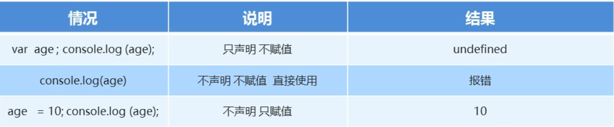
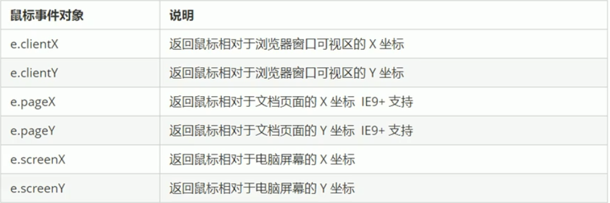
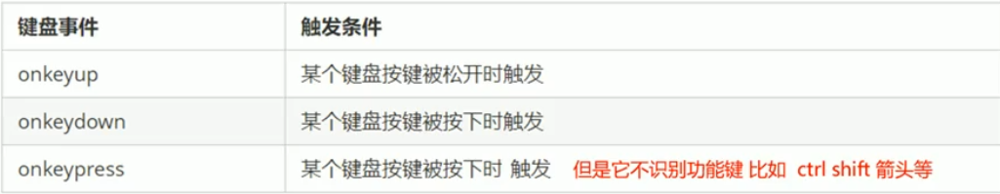

# JS

### 概念

JavaScript 是运行在客户端的脚本语言。不需要编译，运行过程中是由 `js 解释器`（js 引擎）逐行来进行解释并执行的。

JavaScript 有 3种书写位置，分别为 行内式、内嵌式、外部式。

> - 现在可以基于 node.js 进行服务端编程。
> - Java 运行服务端。


### 作用

- 表单验证

- 网页特效

- 服务端开发（node.js）

- 桌面程序（Electron）

- app（Cordova）

- 控制硬件（Ruff）

- 游戏开发（cocos2d-js）

    ......


### 组成

JavaScript 主要由三部分组成：ECMAScript、DOM、BOM。

- ECMAScript：JavaScript 基本语法，规定了js的编程语法和基础核心。
- DOM：页面文档对象模型，用于处理可扩展标记语言的标准编程接口。可以通过 DOM 提供的接口对页面上的各种元素进行操作（大小、位置、颜色等等）。
- BOM：浏览器对象模型，提供了独立于内容的、可以与浏览器窗口进行互动的对象结构。通过 BOM 可以操作浏览器窗口，比如弹出框、浏览器跳转、获取分辨率等等。


### 输入输出语句

- alter(msg)：浏览器弹出警示框。
- console.log(msg)：浏览器控制台打印输出信息。
- prompt(info)：浏览器弹出输入框，用户可以输入，返回值是 `String`。


### 变量

变量是程序在内存中申请的一块用于存放数据的空间。




#### 命名规范


### 数据类型

JavaScript 变量的数据类型是程序运行时根据值的类型来确定的。


> - 数字前加 0 表示八进制
> - 十六进制前加 0x


#### 数字型

JavaScript 中存在三个特殊的数字型值：

- Infinity，表示无穷大，大于任何数值。
- -Infinity，表示无穷小，小于任何数值。
- NaN，Not a number，代表一个非数值。


#### 布尔类型

JavaScript 中 布尔类型可以参与运算，true = 1，false = 0；


#### 简单数据类型

- Undefined：当变量没有赋值时，此时这个变量的数据类型就是 undefined。如果 undefined 参与运算时，结果为 NaN。

    ```js
    console.log(undefined + 1); // NaN
    ```

    

- Null：object对象，表示空值，如果 null 参与运算时，结果为原来数据。

    ```js
    console.log(null + 1); // 1
    ```

    


###### typeof 关键字

typeof 是 JavaScript 中的关键字，可以用来检测当前变量的**数据类型**。

```js
console.log(typeof 1); // number
console.log(typeof null); // object
```

#### 字面量

字面量是源代码中一个固定值的表示法。用来表示某个值。


#### 数据类型转换

**转成字符串**


**转成数字类型**


**转成布尔类型**

Boolean() 函数会将其他类型的值转成布尔值。

如果入参为：`空字符、0、NaN、Null、undefined`时，会转成 false，其余则转成 true。


### 运算符

JavaScript 中有个比较特殊的运算符 `===`和 `!==` 表示全等，要求**值和数据类型**都要一致。

^ 异或运算：只有两侧值一致时为 true，反之为 false。

#### 短路运算

##### 短路与

语法：表达式1 && 表达式2.

- 如果第一个表达式结果为真，则返回**表达式2**；
- 如果第一个表示式结果为假，则返回**表达式1**；


### 数组

JavaScript 中一个数组可以同时存放**不同类型**的元素，基本用法与 Java 类似。

#### 创建方式

```js
var arr = [];
var arrTemp = new Array();
```


### 函数

函数都是有返回值的，通过 `return` 进行返回，如果没有 `return`则会返回 `undefined`。

##### 特殊的函数声明方式

```js
// 函数表达式
var test = function(){}
```


### 作用域

全局作用域：作用在整个 script 标签内或者一个单独 js 文件内。

> 如果在函数内部没有通过修饰符声明的变量也是全局变量。

局部作用域：只在某个函数内有效。

全局变量只有浏览器关闭时才会销毁，局部变量的生命周期跟函数一样，函数执行完毕局部变量都会销毁。


### 对象

#### 创建对象方式

1. 使用 `字面量` 创建对象。

    ```js
    var test = {
    	name:"test",
        age:12
    }
    console.log(test.name);
    ```

2. 使用 `new Object()` 创建对象。

    ```js
    var test = new Object();
    test.name = "名字";
    ```

3. 使用 `构造函数` 创建对象。

    ```js
    function Instance(name,sex){
    	this.name = name;
    	this.sex = sex;
    }
    var test = new Instance("1",12);
    ```

    

#### 获取对象属性方式

1. 直接使用 `对象名.属性名`
2. 使用 `对象名['属性名']`

```js
console.log(test.name);
console.log(test['name']);
```


#### 遍历对象属性

使用 `for... in...` 遍历对象中的所有属性。

```js
var test = {
	name:"test",
    age:12
}
for (var val in test){
	console.log(val); // 打印属性名
    console.log(test[val]); // 打印属性值
} 
```


### 内置对象

JavaScript 中对象分为3种：自定义对象、内置对象、浏览器对象（js独有）。

内置对象指的是 js 语言中自带的一些对象，主要提供一些最基本的必要功能，包含属性和方法。


#### 数组

数组添加元素

- `push(...)`：在数组**末尾**添加一个或多个元素。
- `unshift(...)`：在数组**开头**添加一个或多个元素。

> 以上添加元素函数都会返回新数组大小。

数组删除元素

- pop()：删除数组最后一个元素，并返回被删除的元素（取出数组中最后一个元素）。
- shift：从数组开头删除元素（取出数组中第一个元素）。


### DOM

document object model 文档对象模型，是用来处理可扩展语言（html、xml）的标准编程接口。

可以通过 dom 实现网页内容、结果和样式的改变。


#### DOM 树


- 文档：一个 dom 就对应一个文档。

- 元素：页面中（文档中）所有的标签都是元素，用 element 表示。

- 节点：网页中所有的内容：标签、属性、文本、注释等等都叫节点，用 node 表示，每个节点都会包含以下属性：

    - nodeType：节点类型

        > 1：表示是元素节点，2：表示是属性节点，3：表示是文本节点（包含文字、空格、换行）。

    - nodeName：节点名称

    - nodeValue：节点值


> 以上所有内容都可以当做**对象**。


#### 元素获取

1. 根据 id 获取元素，document#getElementById(String)，返回一个 Document 对象。

    ```js
    var doc = document.getElementById("test");
    console.dir(doc);
    ```

2. 根据标签名获取元素

    - document#getElementByTagName(String)，返回一个 Document 集合。
    - 获取子元素：element#getElementByTagName(String)，返回一个 Document 集合，不包含自身。

    ```js
    var list = document.getElementByTagName("test");
    console.log(list);
    ```


**H5 新增方法**

1. 根据 class 获取元素，document#getElementByClassName(String)，返回一个 Document 集合。

2. 根据指定选择器返回**元素对象**。

    - 根据指定选择器返回符合要求的所有元素对象，document#querySelectorAll(String)，返回一个 Document 集合。
    - 根据指定选择器返回**第一个元素对象**，document#querySelector(String)，返回一个 Document 对象。

    ```js
    var nav = document.querySelector("#nav"); // #nav，id选择器
    var navList = document.querySelectorAll("#nav"); // #nav，id选择器
    console.dir(nav);
    ```

#### 事件

**三要素**

1. 事件源：指事件被触发的对象。
2. 事件类型：通过什么事件来触发这个对象，比如点击事件，滑动事件，悬浮事件等等。
3. 事件处理程序：事件触发后的结果，比如执行某个函数。


**事件执行步骤**

1. 选中事件源。
2. 注册事件。
3. 设置事件处理程序。

```js
var btn = document.getElementById("btn"); // 选中事件源
// 注册事件，并设置事件处理程序
btn.onclick = function() {
    alert("123");
}
```


#### 事件类型

###### 鼠标事件


- 右键菜单 contentmenu
- 选中文字 selectstart


> mouseover 和 mouseenter 的区别？
>
> - mouseover 除了经过本身元素之外，假如经过子元素也会被触发
> - mouseenter 只有经过本身元素才会触发，原因：mouseenter 事件没有冒泡阶段。


鼠标事件对象 MouseEvent，常用属性和方法：




###### 键盘事件

常见键盘事件：



> 以上三个事件的执行顺序：keydown --> keypress --> keyup


**键盘事件对象 KeywordEvent**


> onkeydown、onkeyup 事件对象中**不区分**字母大小写。
>
> onpress 事件对象会**区分**字母大小写。


#### 操作元素

##### 改变元素内容

- element.innerText：获取 html 标签中从起始位置到终止位置的内容，不会识别 html 标签，**会自动去除空格和换行**。
- element.innerHTML：获取 包含html标签在内的起始位置到终止位置的内容，保留空格和换行。 


##### 获取元素属性

- element.属性名：可以获取标签**内置属性**（不能获取自定义属性）。

H5 新增：

- element.getAttribute("属性名")：可以获取自定义属性。
- element.dataset.属性名
- element.dataset['属性名']

    如果自定义属性里面是通过多个 `-`进行连接的，在获取时要采用 **驼峰命名** 获取。

> H5 规定自定义属性要以`data-`开头。

##### 改变元素属性

通过 dom 修改样式，会自动在标签中添加行内样式。

- element.style：修改标签样式属性。

    ```js
    var divDoc = document.querySelector("div");
    divDoc.style.width = "100px";
    ```

    > element.style 只能操作**行内样式**，对于 style 标签中和外部样式表的样式不能采取这种样式。

- element.className：修改标签 class 属性，通过触发事件动态添加 class 属性值。

    ```js
    var divDoc = document.querySelector("div");
    divDoc.onclick = function(){
        divDoc.className = "close"; 
    }
    ```
    


#### 节点操作

##### 获取节点

- Element.childNodes：获取当前元素的所有子节点（包含元素节点、文本节点）。
- Element.children：获取当前元素的所有子元素节点。
- Element.firstElementChild：获取第一个子元素节点。
- Element.lastElementChild：获取最后一个子元素节点。


##### 添加节点

- Element.innerHTML：添加元素。

- Document.write(String HTML)：创建元素。如果页面加载完毕时，在调用会触发页面重绘。

- Document.createElement(String)：动态创建节点。

- Node.appendChild(Node)：添加节点到当前节点的**尾部**。

- Node.insertBefore(Node,指定元素 Node)：在指定元素节点前加入节点。

    > Element 继承 Node。

三种创建元素的区别：

1. write 会触发重绘。
2. innerHTML 对比 createElement 效率要高。（但是要使用数组进行拼接，不要直接使用字符串拼接）


##### 复制节点

- Node.cloneNode(boolean)：将当前节点复制一份。
    - 不传参/ false：浅拷贝，只复制当前标签，不会复制里面属性、节点。
    - true：深拷贝。


#### 事件操作

##### 事件注册方式

###### 传统事件注册

以 on 开头的事件都是属于传统事件。

同一个元素同一事件只能设置一个处理函数，最后注册的处理函数会将前面注册的处理函数覆盖掉。

- btn.onclick = function(){}

- \<button onclick = "alter('')"/>

    

###### 方法监听注册事件

- addEventListener()

    ```js
    test.addEventListener("click",function(){})
    ```

    

- attachEvent()：IE9 之前的替代方案。

    ```js
    test.attachEvent("onclick",function(){})
    ```

##### 删除事件

###### 传统方式

element.onclick = null;

###### 方法监听注册方式

element.removeEventListener()

```js
function fn(){}
element.removeEventListener("click",fn);
```


#### 事件流

事件流描述的是从页面中接收事件的顺序。

事件发生时会在元素节点之间按照特定的顺序传播，这个传播过程就是事件流。

DOM 事件流分为 3个阶段：

1. 捕获阶段，由 DOM 最顶层节点（document节点）开始，然后逐步向下级传播到具体的元素接收过程。
2. 当前目标阶段
3. 冒泡阶段，事件开始时由具体的元素接收，然后逐步向上传播到 DOM 最顶级节点的过程。

JS 中只能执行捕获或者冒泡其中一个阶段，在 `addEventListener` 函数中第三个参数是 boolean 值，用来标识当前事件处于哪种阶段：

- false/为空：冒泡阶段
- true：捕获阶段

```js
element.addEventListener("click",function(){},true); // 捕获阶段
element.addEventListener("click",function(){},false); // 冒泡阶段
```

> 有些事件没有冒泡阶段：onblur（失去鼠标焦点），onfocus（获得鼠标焦点），onmouseenter，onmouseleave


###### 事件委托

原理：将事件监听器设置在父节点上，通过冒泡原理影响到每个子节点上。


#### 事件对象

function(event){}：event就是一个事件对象，是写到处理函数中的，可以当做形参。

事件对象只存在有事件的情况下，是系统自动创建的。

##### 常见属性和方法


### BOM

BOM 是浏览器对象模型，提供了独立于内容而与浏览器窗口进行交互的对象。核心是 `window`

主要构成：


window 对象是浏览器的顶级对象，具有双重角色。

- 是 js 访问浏览器窗口的一个接口。
- 是一个全局对象，定义在全局作用域中的变量、函数都会变成 window 对象的属性和方法。

#### 常用事件

##### 窗口加载事件

- load：是窗口加载事件，当文档内容完全加载完成会去触发该事件（包括图像、脚本文件、css文件等等）。
- DOMContentLoaded：发生在 DOM 加载完成之后（不包含样式表、图片、flash等等）。

##### 窗口大小事件

- resize：发生在窗口大小变化之后。
- DOMContentLoaded：发生在 DOM 加载完成之后（不包含样式表、图片、flash等等）。

##### 窗口加载事件

- window.onload：是窗口加载事件，当文档内容完全加载完成会去触发该事件（包括图像、脚本文件、css文件等等）。以下属性常用这个事件联用：
    - window.innerWidth：窗口当前宽度
    - window.innerHeight：窗口当前高度
- DOMContentLoaded：发生在 DOM 加载完成之后（不包含样式表、图片、flash等等）。


#### 定时器

- `setTimeout(function,延迟时间)`，用于设置一个定时器，**只会执行一次**，当指定延迟时间达到后，就会执行传入的函数。时间单位：ms.

    ```js
    setTimeout(function(){},1000);
    ```

    - window.clearTimeout(timeoutID)：停止定时器

- `setInterval(function,延迟时间)`，设置一个定时器，**会循环执行对应的函数**，每隔一段时间重复调用函数。时间单位：ms.

    ```js
    setInterval(function(){},1000);
    ```

    - window.cleraInterval(intervalID)：停止定时器

> 如果没有对时间进行赋值为空的情况，默认是 0 也就是直接执行。


#### 执行队列

js 是单线程语言，同一时间只能做一件事。 H5 后通过 CPU 多核机制，可以在同一时间做不同事件。

##### 同步任务

js 将所有的同步任务放入了一个**栈**中。

##### 异步任务（回调函数）

异步任务会放入 `任务队列（消息队列）` 中。

- 普通事件

- 资源加载

- 定时器

    


##### 执行流程


1. 先执行栈中的同步任务。

2. 将回调函数放入队列。

    > 队列中的回调函数顺序由`异步进程`进行排序：
    >
    > - 事件：当触发事件后，异步进程会将对应的回调函数放入队列
    > - 定时器：当达到指定时间后，回调函数才会放入队列。

3. 执行队列中的回调函数。

> 主线程会不断的 查询任务队列->获取任务->执行任务，这种机制叫**事件循环**。


#### location 对象

window 对象提供了一个 location 属性，可以用于获取、设置、解析窗体的 URL。

##### 常用属性


##### 常用方法


#### navigator 对象

常用属性：

- userAgent：返回客户端发送到服务端的 `user-agent` 请求头值。

```js
function IsPC() {
        var userAgentInfo = navigator.userAgent;
        var Agents = ["Android", "iPhone",
                    "SymbianOS", "Windows Phone",
                    "iPad", "iPod"];
        var flag = true;
        for (var v = 0; v < Agents.length; v++) {
            if (userAgentInfo.indexOf(Agents[v]) > 0) {
                flag = false;
                break;
            }
        }
        return flag;
    }
```


#### history 对象

history 对象可以与浏览器历史记录进行交互。

**常用方法：**


### offset 元素偏移量

offset 偏移量，使用 js 提供的 offset 系列相关属性可以动态获取该元素的位置（偏移）、大小等。（注意：不会反悔数值单位）

- 可以获取元素距离带有**定位父元素**的位置
- 获取元素自身的大小

**常用属性**

| 属性名称             | 作用                                                         |
| -------------------- | ------------------------------------------------------------ |
| element.offsetParent | 返回该元素所在带有定位属性的父级元素，如没有则返回 body      |
| element.offsetTop    | 返回元素相对带有定位父元素上方的偏移量                       |
| element.offsetLeft   | 返回元素相对带有定位父元素左边的偏移量                       |
| element.offsetWidth  | 返回元素自身包括 padding、边框、内容区的宽度，返回数值不带单位 |
| element.offsetHeight | 返回元素自身包括 padding、边框、内容区的高度，返回数值不带单位 |


### client 元素可视区

client 属性可以动态获取元素的边框大小、元素大小等等。

**常用属性**

| 属性名称             | 作用                                                         |
| -------------------- | ------------------------------------------------------------ |
| element.clientTop    | 返回元素上边框大小                                           |
| element.clientLeft   | 返回元素左边框大小                                           |
| element.clientHeight | 返回元素自身包括 padding、内容区的高度，不包含边框，返回数值不带单位 |
| element.clientWidth  | 返回元素自身包括 padding、内容区的宽度，不包含边框，返回数值不带单位 |


### 立即执行函数

字面含义，不需要调用，立马执行。通常用来创建一个独立的作用域。

会有两个独立的 `()`，第一个通常用来声明函数，第二个用来调用参数，并且如果函数带有形参也可以进行参数传递。

**常见写法**

1. `(function(){})()` 

    ```js
    // 1
    (function(){
    	console.log("123");
    })
    ()
    // 2
    (function(a,b){
    	console.log(a+b);
    })
    (1,2)
    ```

    

2. `(function(){}())`

    ```js
    // 1
    (function(){
    	console.log("123");
    }())
    // 2
    (function(a,b){
    	console.log(a + b);
    }(1,2))
    ```

**好处**

- 函数中所有变量都是局部变量，当函数执行完毕就会被回收
- 可以存在多个立即执行函数，里面存在的变量不会出现冲突


### scroll 元素滚动

通过 scroll 可以动态获取相关元素的大小、滚动距离等等。

**常用属性**

| 属性名称             | 作用                                               |
| -------------------- | -------------------------------------------------- |
| element.scrollTop    | 返回被卷去的上侧距离，返回数值不带单位             |
| element.scrollLeft   | 返回被卷去的左侧距离，返回数值不带单位             |
| element.scrollHeight | 返回元素自身实际高度，不包含边框，返回数值不带单位 |
| element.scrollWidth  | 返回元素自身实际宽度，不包含边框，返回数值不带单位 |


### 动画实现原理

动画本身是通过**定时器** `setInterval()` 来不断移动盒子位置实现的。（当前元素要添加定位）

**简单流程**

1. 获取当前盒子位置
2. 让盒子在当前位置上加一个**移动距离**
3. 通过定时器重复上述步骤
4. 添加定时器结束事件

#### 封装动画函数

**具体流程**

1. 定义动画函数
2. 在函数中定义定时器
3. 设置定时停止条件
4. 调用函数

```js
// 封装动画函数
function animation(domObj, target, offset, timeout) {
    // 首先清除定时器，防止在 domObj 中存在多个定时器
    clearInterval(domObj.timer);
    // 设置定时器，并将其赋值给 domObj.timer 属性
    domObj.timer = setInterval(function () {
        if (domObj.offsetLeft >= target) {
            // 停止定时器，停止动画
            clearInterval(domObj.timer);
        }
        domObj.style.left = domObj.offsetLeft + offset + "px";
    }, timeout);
}

let divElement = document.querySelector("div");
let spanElement = document.querySelector("span");
animation(divElement, 300, 2, 15);
animation(spanElement, 200, 5, 15);
```

#### 缓动动画原理

缓动动画就是让元素运动速度有所变化，最常见的就是让速度递减。

**简单流程**

1. 让盒子每次移动的距离慢慢减小，速度就会随之降下来
2. 核心算法：`（目标值 - 现在的位置）/ 10` 做为每次移动距离步长
3. 停止条件：当前盒子位置等于目标位置

```js
// 封装动画函数
function animation(domObj, target, timeout) {
    // 首先清除定时器，防止在 domObj 中存在多个定时器
    clearInterval(domObj.timer);

    let number = (target - domObj.offsetLeft) / 10;
    number = number > 0 ? Math.ceil(number) : Math.floor(number);

    // 设置定时器，并将其赋值给 domObj.timer 属性
    domObj.timer = setInterval(function () {
        if (domObj.offsetLeft === target) {
            // 停止定时器，停止动画
            clearInterval(domObj.timer);
        }
        domObj.style.left = domObj.offsetLeft + number + "px";
    }, timeout);
}

let divElement = document.querySelector("div");
let spanElement = document.querySelector("span");
animation(divElement, 300, 15);
animation(spanElement, 200, 15);
```


**添加回调函数**

```js
// 封装动画函数
function animation(domObj, target, timeout, callback) {
    // 首先清除定时器，防止在 domObj 中存在多个定时器
    clearInterval(domObj.timer);

    let number = (target - domObj.offsetLeft) / 10;
    number = number > 0 ? Math.ceil(number) : Math.floor(number);

    // 设置定时器，并将其赋值给 domObj.timer 属性
    domObj.timer = setInterval(function () {
        if (domObj.offsetLeft === target) {
            // 停止定时器，停止动画
            clearInterval(domObj.timer);
            // 添加回调
            if (callback) {
                callback(domObj);
            }
        }
        domObj.style.left = domObj.offsetLeft + number + "px";
    }, timeout);
}

function callback(obj) {
    obj.style.left = "0px";
}


let divElement = document.querySelector("div");
let spanElement = document.querySelector("span");
animation(divElement, 300, 15, callback);
animation(spanElement, 200, 15, callback);
```

