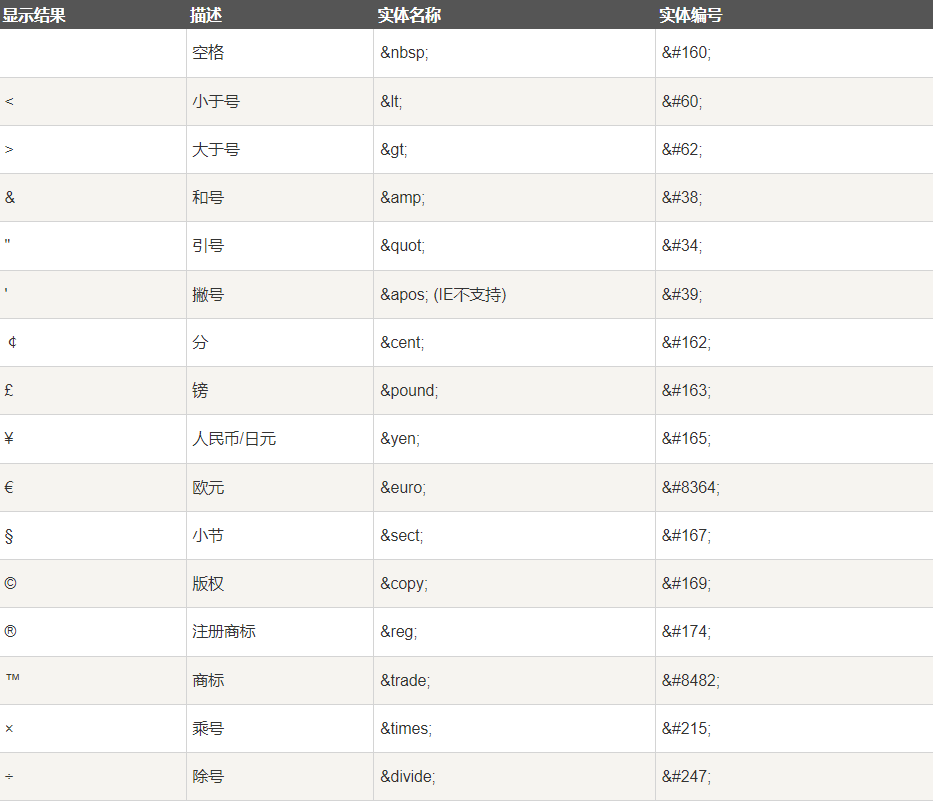

# 前端学习

## web基础

#### 什么是网页？

网站是因特网上根据一定规则，使用html制作的用来展示特定内容的集合。

网页是一个网站的一'页'，通常是html格式的文件，主要通过浏览器来阅读。

网页是构成网站的基本元素，通常由图片、链接、文字、声音、视频等元素组成，通常看到的网页，常常是以.html或者.htm后缀结尾的文件，因此称为html文件。


什么是HTML？

HTML 是`超文本标记语言（Hyper Text Markup Language）`，是用来描述网页的一种语言。

-   在HTML文件中可以加入各种元素：视频、图片、声音等。
-   通过HTML可以实现链接进行文件调转功能。

HTML不是一种编程语言，是一种标记语言。

>   标记语言：是一套标记标签（markup tag）


#### 浏览器

##### 常用浏览器

火狐、Chrome、Safari、Opera、IE

##### 浏览器内核

浏览器渲染引擎，主要负责读取网页内容，整理讯息，计算网页的显示方式并显示页面。

-   Gecko，火狐浏览器。
-   Blink，Chrome、Opera浏览器，Blink是webkit的分支，高度封装。
-   Webkit，苹果浏览器Safari。
-   Trident，IE浏览器、猎豹浏览器、360浏览器、百度浏览器。


#### web标准

是由W3C（万维网联盟）组织和其他标准化组织制定的一系列标准的集合，主要是为了统一浏览器差异，由结构、表现、行为三部分构成。

**构成**

-   结构，用于对网页元素进行整理和分类，主要指HTML
-   表现，用于设置网页元素的版式、颜色、大小等外观样式，主要指CSS
-   行为，网页模型的定义和交互的编写，主要指JS。


## HTML

#### HTML语法规范

1.  HTML标签是由尖括号包围的关键词，例如`<html>`。
2.  HTML标签通常是成对出现的，例如`<html>`和`</html>`，通常称为双标签，第一个标签称为开始标签，第二个标签称为结束标签。
3.  有些特殊标签必须是单个标签，例如`<br />`，通常称为单标签。

**标签关系**

双标签之间的关系分为：包含关系和并列关系。

-   包含关系，类似于 `<head>`和`<title>`
-   并列关系，类似于 `<body>`和`<head>`


#### 基本结构标签

每个网页中都会包含一个基本结构标签，页面内容都是在这些基本标签上编写的。

-   `<html>`，HTML标签，根标签。
-   `<head>`，表示文档的头部，在head标签中必须设置title标签。
-   `<title>`，表示文档的标题，让页面拥有一个属于自己的网页标题。
-   `<body>`，表示文档的主体，元素包含文档的所有内容，页面内容基本都是放到body中。


#### 基本标签

`<!DOCTYPE html> `，文档声明标签，告诉浏览器这个页面的采用什么类型来显示，html默认指`HTML5`。

`<html lang="en">`，告诉浏览器或者搜索引擎这个是一个英文网站，本页面采用英文显示。如果想切换为中文：`lang="zh-Cn"`。

`<meta charset="UTF-8">`，标识当前文本的编码集。


### 常用标签


#### 基本标签

`<!DOCTYPE html> `，文档声明标签，告诉浏览器这个页面的采用什么类型来显示，html默认指`HTML5`。

`<html lang="en">`，告诉浏览器或者搜索引擎这个是一个英文网站，本页面采用英文显示。如果想切换为中文：`lang="zh-Cn"`。

`<meta charset="UTF-8">`，标识当前文本的编码集。


#### 1.标题标签

都是双标签。

`<h1> - <h6>`，语义：网页标题，单词head的缩写

代码示例：

```htmL
<h1>一级标题</h1>
<h2>二级标题</h2>
<h3>三级标题</h3>
<h4>四级标题</h4>
```

>   特点：
>
>   -   加了标题标签的文字会变粗，字号变大。
>   -   文字独占一行

#### 2.段落、换行标签

-   `<p>`，双标签，`paragraph`段落标签，语义：可以将HTML文档分割为若干段落。代码示例：

    ```html
    <!-- p:段落标签 -->
    <p>段落标签，第一段</p>
    ```

    >   特点：
    >
    >   -   文本内容会根据标签页窗口大小自动换行
    >   -   段落和段落之间保留空隙。

-   `<br>`，`break`换行标签，语义：强制换行。代码示例：

    ```html
    <!-- p:段落标签 -->
    <p>段落标签，第一段</p>
    <br />
    ```

    >   特点：
    >
    >   -   单标签
    >   -   只是对文档内容做另起一行操作，不会新创建一个段落。

#### 3.文本格式化标签

双标签，标签语义：突出重要性，比普通文本更重要。

-   加粗，`<strong>`、`<b>`，推荐使用strong。
-   倾斜，`<em>`、`<i>`，推荐使用em。
-   删除，`<del>`、`<s>`，推荐使用del。
-   下划线，`<ins>`、`<u>`，推荐使用ins。

#### 4.div和span标签

-   **块级元素 vs. 行内元素：**

    -   `<div>` 是块级元素，它独占一行，可以设置宽度、高度以及边距等样式属性。它适合用于创建页面的大块结构，例如页面的主体区域、容器、布局等。
    -   `<span>` 是行内元素，它不会独占一行，宽度默认由其内容决定。它适合用于对文本或其他行内元素进行样式化、标记或包裹。

    **默认样式和布局：**

    -   `<div>` 元素的默认样式为块级显示，会以块的形式占据可用空间。
    -   `<span>` 元素的默认样式为行内显示，它不会独占一行，只占据其内容的宽度。

    **嵌套关系：**

    -   <div> 可以容纳其他块级元素和行内元素，包括其他的 <div> 和 <span> 元素。

    -   `<span>` 通常被用来包裹文本或其他行内元素，比如用来设置特定文本的样式。

    总之，`<div>` 用于创建页面结构和布局，而 `<span>` 用于对文本或行内元素进行样式化或包裹。它们在页面设计和样式设置中有不同的用途和作用。

代码示例：

```html
<div>
    容器1
    <span>子容器1.1</span>
</div>
<div>
    容器2
    <span>子容器2.1</span>
</div>
```


#### 5.图像标签

` (image)`标签用于在HTML页面中插入图像信息，单标签。

包含属性：

-   `src`，必须属性，指定图像文件的路径和文件名。
-   alt，替换文本，当图片不能正常显示时用文本代替。
-   title，提示信息，鼠标移动到图片上时显示的信息。
-   width，图片宽度。
-   height，图片高度。
-   border，图片像素，边框粗细。

代码示例：

```html

```


>   注意：
>
>   1.  属性必须位于标签上。
>   2.  属性之间没有先后顺序，属性之间用空格分开。
>   3.  属性采用key-value形式赋值。


#### 6.路径

路径主要分为相对路径、绝对路径。

-   相对路径，相对于当前文件的目标文件位置，以当前文件位置为基础。示例：`images/test.img`
-   绝对路径，目标文件在本地文件系统中的路径。示例：`D:/test/test.img`

>   绝对路径基本都是以盘符或者根目录开始。
>


#### 7.超链接标签

`<a>`双标签，标签主要用于定义超链接，将一个页面链接到另一个页面。

属性：

-   href，必须属性，跳转目标必须是一个url地址。
-   target，目标窗口的弹出方式，新窗口（`_blank`）、当前窗口（`_self`）默认值。

语法规范：

```html
<a href="http://www.baidu.com" target="_blank">文本信息</a>
```

分类：

-   外部链接，href指定的是一个url地址。

-   内部链接，href指定当前网站中其他HTML页面。

-   空链接，href的值为`#`，默认跳转到当前网页的顶部。

-   下载链接，href指定一个文件，比如exe文件，zip压缩包等等，不是一个前端文件。

-   锚点链接，href的属性值是 `#标签名/唯一标识` ，这个标签名当前网页中目标标签的名字，代码示例：

    ```html
    <a href="#s">锚点链接</a>
    <h2 id="s">锚点</h2>
    ```

    

-   网页元素链接，主要是以当前网页中一个特殊的形式（元素）来表示链接，可以是一个图片、文本、视频、表格等等。代码示例：

    ```html
     <a href="http://www.baidu.com" target="_top">
        
     </a>
    ```


#### 9.特殊字符

虽然 html 不区分大小写，但实体字符对大小写敏感。




### 表格标签

表格标签主要是用来显示数据。

#### 1.表格基本标签

-   `<table>` 是用来定义表格的标签，**属性**：
    -   align，表格在当前网页的对齐方式，left、center、right。
    -   border，表格的边框，1表示有边框，`""`默认值表示没有。
    -   cellpadding，单元格中文本与边框的空白，默认1像素。
    -   cellspacing，单元格之间的空白，默认2像素。
    -   width，表格的宽度。
-   `<th>` 用来定义表格的表头，
-   `<tr>` 是用来定义表格中的行，
-   `<td>` 是用来定义表格中的

包含关系：table >  tr > th = td

代码示例：

```html
<table align="center" border="1" cellpadding="5px" cellspacing="0px" width="500">
        <tr>
            <th>表头</th>
            <th>表头</th>
            <th>表头</th>
            <th>表头</th>
        </tr>
        <tr >
            <td>单元格1</td>
            <td>单元格2</td>
            <td>单元格1</td>
            <td>单元格2</td>
        </tr>
</table>
```

#### 2.表格结构标签

处于 `<table>`表格标签中。

-   `<thead>`，表示表格头部区域，内部必须拥有 `<tr>` 标签，一般位第一行。
-   `<tbody>`，表示表格主体区域。

代码示例：

```html
<table align="center" border="1" cellpadding="5px" cellspacing="0px" width="500">
    <thead>
        <tr>
            <th>表头</th>
            <th>表头</th>
            <th>表头</th>
            <th>表头</th>
        </tr>
    </thead>
    <tbody>
        <tr >
            <td>单元格1</td>
            <td>单元格2</td>
            <td>单元格1</td>
            <td>单元格2</td>
        </tr>
    </tbody>
</table>
```


#### 3.单元格合并

**方式**：

-   跨行，rowspan="合并个数"，以当前单元格向下合并。
-   跨列，colspan="合并个数"，以当前单元格向右合并。

代码示例：

```html
<table align="center" border="1" cellpadding="5px" cellspacing="0px" width="500">
        <thead>
            <tr>
                <th >表头1</th>
                <th colspan="2">表头2</th>
                <th>表头3</th>
            </tr>
        </thead>
        <tbody>
            <tr>
                <td>单元格1</td>
                <td rowspan="2">单元格2</td>
                <td>单元格3</td>
                <td>单元格4</td>
            </tr>
            <tr>
                <td>单元格1</td>
                <td>单元格3</td>
                <td>单元格4</td>
            </tr>
        </tbody>
</table>
```


### 列表标签

列表主要是用来对页面进行布局，让显示内容整齐、有序。

#### 1.无序列表

`<ul>`表示HTML中的无序列表，`<li>`标签表示列表中的每一行。

>   特点：
>
>   -   无序列表的各个列表项没有顺序之分，是并列的。
>   -   ul标签中只能包含li标签，li标签中可以包含任何元素
>   -   无序列表会带有自己的样式属性，可以通过css设置。

代码示例：

```html
<ul>
    <li>1</li>
    <li>2</li>
    <li>3</li>
    <ul>
        <li>a</li>
        <li>b</li>
        <li>c</li>
    </ul>
</ul>
<ul>
        <li>a</li>
        <li>b</li>
        <li>c</li>
</ul>
```


#### 2.有序列表

`<ol>`标签定义有序列表，列表按数字或字母进行排序，使用 `<li>`表示列表的一行，类似于无序列表。代码示例：

```html
<ol>
    <li>a</li>
    <li>b</li>
    <li>c</li>
</ol>
```


#### 3.自定义列表

常用于对术语或者名词进行解释和描述，定义列表的列表项前没有任何项目符号。

`<dl>`用于定义描述列表， `<dt>`用来表示列表的项目，`<dd>`用来表示列表中项目的描述项。

>   特点：
>
>   -   dl 标签中只能包含 dt 标签和 dd 标签。
>   -   dt 标签和 dd 标签的个数没有限制。
>   -   dt 标签和 dd 标签中可以放置任何元素。

代码示例：

```html
<dl>
        <dt>名词</dt>
        <dd>解释1</dd>
        <dd>解释2</dd>
        <dd>解释3</dd>
        <dd>解释4</dd>
</dl>
```


### 表单标签

主要用于收集和传递信息，一个正常的表单主要有三部分组成：表单域、表单控件（表单元素）、提示信息。


#### 1.表单域

包含表单元素的区域，HTML中使用 `<form>`来表示一个表单域，进行信息的收集和传递，`<form>`标签会把当前区域内的表单元素信息提交到服务器。

**属性**：

-   action，提交的目标地址，是一个url地址。
-   method，提交的方式，可以是get、post等。
-   name，当前表单域的名称。

代码示例：

```html
<form action="" method="get" name="表单1">
</form>
```


#### 2.表单控件

-   ##### input 输入框

    input 输入信息，input 标签包含一个 `type`属性，根据不同的属性值来表示不同的输入框类型，比如：密码、文本、复选框、按钮等等。

    **属性**：

    -   **type 类型**

        | 类型     | 描述                                               |
        | -------- | -------------------------------------------------- |
        | button   | 普通按钮。                                         |
        | checkbox | 复选框，如果是多个要通过 name 属性进行类别区分。   |
        | file     | 文件上传控件。                                     |
        | hidden   | 隐藏输入框。                                       |
        | image    | 图像提交按钮。                                     |
        | password | 密码输入框。                                       |
        | radio    | 单选按钮，如果是多个要通过 name 属性进行类别区分。 |
        | reset    | 重置按钮。                                         |
        | submit   | 提交按钮。                                         |
        | text     | 文本输入框，默认支持20个字符。                     |

        >   注意：如果想让一个表单元素在提交过程中不发送到后台，那就不要加 name 属性，不然在提交时会将表单元素的value属性一起带到后台

    -   name，用于指定 input 元素的名字，同种类型的多个单选框或者复选框，name 值要一致。

    -   value，规定 input 元素中的内容，例如单选框，如果选中的话会在提交时将当前单选框的value值发送到后台。

    -   checked，规定当前表单首次加载时是否被选中，只要值不为空即可实现效果。
    
    -   maxlength，输入字符的最大长度。
    
    代码示例：
    
    ```html
    <form action="hello-word.html" method="get" name="表单1">
            用户名： <input type="text" name="username" value="请输入用户名" maxlength="10" /> <br>
            密码： <input type="password" name="username" value="请输入密码" maxlength="10" /> <br>
            <span>
                文件上传：<input type="file" name="file" value="文件上传" /><br>
            </span>
            <input type="image" value="图像提交按钮" /><br>
            性别：
            男： <input type="radio" name="sex" value="男" />
            女： <input type="radio" name="sex" value="女" />
            未知： <input type="radio" name="sex" value="未知" /><br>
            <input type="hidden" name="hidden" value="隐藏框" /><br>
            复选框 <input type="checkbox" name="ext" value="复选框1" />
            复选框 <input type="checkbox" name="ext" value="复选框2" />
            复选框 <input type="checkbox" name="ext" value="复选框3" />
            复选框 <input type="checkbox" name="ext" value="复选框4" />
            复选框 <input type="checkbox" name="ext" value="复选框5" checked="checked" /><br>
            <input type="reset" value="重置按钮" />
            <input type="submit" value="提交按钮" />
            <input type="button" value="普通按钮" /> <br>
        </form>
    
    ```
    
    **label 标签**
    
    主要是为 input 标签进行标注处理，需要绑定一个 input 标签，当光标悬停到 label 标签中的文字时，自动选择对应的表单元素。
    
    通过 for 属性来指定对应的表单元素 id。代码示例：
    
    ```html
    <label for="text">用户名</label>
    <input id="text" type="text" name="username" value="请输入用户名" maxlength="10" /> <br>
    ```
    
    

-   ##### select 下拉框

    如果当前信息有多种，并且想要节约页面空间，可以使用 select 下拉框对信息进行列表管理。每个下拉项通过 option 标签进行定义。

    select 标签属性：name，当前下拉框对应属性名称。

    option 标签属性：

    -   value：当前下拉项的值，如果选中可以将 select 标签的值置为当前下拉项标签的 value。
    -   selected：定义当前下拉项是否是下拉框的默认值，如果不定义默认下拉框中第一项是默认值。

    代码示例：

    ```html
    <label for="select">下拉框</label>
            <select name="select" id="select">
                <option value="1" selected>1</option>
                <option value="2">2</option>
                <option value="3">3</option>
                <option value="4">4</option>
                <option value="5">5</option>
                <option value="6">6</option>
    </select>
    ```

-   ##### textarea 文本框

    主要是用来输入文本内容，可以通过属性设置文本输入行数和每行字符数量。

    属性：

    -   cols：限制每行字符数量。
    -   rows：限制文本框中行数。

    代码示例：

    ```html
    <label for="content">文本框</label>
    <textarea name="content" id="content" cols="30" rows="10">
    ```


## CSS

CSS 是层叠样式表的简称，有时会称为 CSS 样式表或者是级联样式表。它也是一种标记语言，主要用来美化或者设置 HTML 页面的文本内容（字体、大小、颜色等）、图片外形（宽高、形状等）以及版面的布局和外观显示样式。

#### CSS 运行

正常浏览器加载页面步骤：

1.  浏览器载入 HTML 文件（比如从网络上获取）。
2.  将 HTML 文件转化成一个 DOM（Document Object Model），DOM 是文件在计算机内存中的表现形式。
3.  接下来，浏览器会拉取该 HTML 相关的大部分资源，比如嵌入到页面的图片、视频和 CSS 样式。JavaScript 则会稍后进行处理。
4.  浏览器拉取到 CSS 之后会进行解析，根据选择器的不同类型（比如 element、class、id 等等）把他们分到不同的“桶”中。浏览器基于它找到的不同的选择器，将不同的规则（基于选择器的规则，如元素选择器、类选择器、id 选择器等）应用在对应的 DOM 的节点中，并添加节点依赖的样式（这个中间步骤称为渲染树）。
5.  上述的规则应用于渲染树之后，渲染树会依照应该出现的结构进行布局。
6.  网页展示在屏幕上（这一步被称为着色）。


>   一个 DOM 有一个树形结构，标记语言中的每一个元素、属性以及每一段文字都对应着结构树中的一个节点（Node/DOM 或 DOM node）。节点由节点本身和其他 DOM 节点的关系定义，有些节点有父节点，有些节点有兄弟节点（同级节点）。DOM 是 CSS 样式和文件内容的结合。


#### 语法规范

CSS 主要由两部分组成：选择器、声明（可以有多条）。简单示例（有点类似于 JSON 格式）：

```css
h1 {
    color: red; 
    font-size: 25px; 
}
```

>   注意：
>
>   -   CSS 中每个声明都应该是 `键值对` 形式。
>   -   声明之间应通过`; `进行区分。


**代码风格**

不是强制性的，只是为了方面观看。

1.  样式书写风格，CSS 样式主要分为`紧凑型`和`展开型`：

    ```css
    /* 紧凑型 */
    h1 { color: red; font-size: 12px; }
    
    /* 展开型 */
    h2 {
        color: red; 
        font-size: 12px; 
    }
    ```

2.  CSS 样式通常都是以小写为主。

3.  空格

    -   属性值应以空格开始，`;`后应保留一个空格。
    -   选择器和大括号之间应保留一个空格。


#### CSS 样式应用格式

1.  ##### 外部样式表

    CSS 的样式单独写在一个 `.css`文件中，这是最常用和最有用的方式。可以通过一个 CSS 文件来链接或者应用到不同的 HTML 页面上，`link` 标签可以用来在`HTML`文件中来链接外部文件。

    

    link标签属性：

    -   rel，主要表示当前链接的外部文件以什么类型注入到 HTML 文件中。常见的有：icon（图标）、license（版权）、stylesheet（样式表）等等。
    -   href，主要用来指定外部文件路径，可以是一个网址或者是相对路径。
    -   

    代码示例：

    ```htMl
    <link href="main.css" rel="stylesheet" />
    ```

    

2.  ##### 内部样式表

    一个内部样式表驻留在 HTML 文档内部。要创建一个内部样式表，你要把 CSS 放置在包含在 HTML `<head>` 元素中的 `<style>` 元素内。

    代码示例：

    ```html
    <!doctype html>
    <html lang="zh-CN">
      <head>
        <meta charset="utf-8" />
        <title>我的 CSS 测试</title>
        <style>
          h1 {
            color: blue;
            background-color: yellow;
            border: 1px solid black;
          }
          p {
            color: red;
          }
        </style>
      </head>
      <body>
        <h1>Hello World!</h1>
        <p>这是我的第一个 CSS 示例</p>
      </body>
    </html>
    ```

    

3.  ##### 内联样式

    内联样式是影响单个 HTML 元素的 CSS 声明，包含在元素的 `style` 属性中

    ```html
    <!doctype html>
    <html lang="zh-CN">
      <head>
        <meta charset="utf-8" />
        <title>我的 CSS 测试</title>
      </head>
      <body>
        <h1 style="color: blue;background-color: yellow;border: 1px solid black;">
          Hello World!
        </h1>
        <p style="color:red;">这是我的第一个 CSS 示例</p>
      </body>
    </html>
    ```

    


### 选择器

由元素和其他部分组成合起来告诉浏览器哪个 HTML 元素应当是被选为应用规则中的 CSS 属性值的方式，选择器所选择的元素被称为：“选择器的对象”。主要指定的是要修改的标签，可以是标签名称，标签标识等能代表对应目标标签的值。

##### 列表

选择器可以通过列表的方式把多个选择器进行组合，成为一个选择器列表，列表中每个选择器都采用同样的 CSS 规则：

```css
/* 多个选择器可以通过 , 进行组合 */
h1, .special {
    color: red;
}
```

>   如果选择器列表中某个选择器无效，那么整体规则都会被忽略。


##### 分类

###### 基础选择器

简单点说就是由单个选择器组成。

1.  标签选择器（类型选择器），用 HTML 标签作为选择器，按标签名称分类，为页面中某一类标签指定统一的 CSS 样式。

    ```css
    /* 选择所有 span 标签的元素 */
    span {
        color: red;
    }
    ```

    

2.  :red_circle: 类选择器 ，通过 `.class 名` 来选中对应的标签元素，class 是 HTML 中所有标签的共同属性。

    ```css
    /* 选择  class 为 test 的元素 */
    .test {
        color: red;
    }
    ```

    

3.  :red_circle: id选择器 ，通过 `#id`来选择对应属性 id 的标签元素，id 是 HTML 中所有标签的共同属性。

    ```css
    /* 选择 id 为 text 的元素 */
    #text {
        color: chocolate;
    }
    ```

5.  全局选择器，选中整个 HTML 文档中的元素，主要用`*`代指。

    ```css
    /* 选择所有元素 */
    * {
        color: red;
    }
    ```


###### 复合选择器


1.  :red_circle: 伪类选择器 ，通过指定标签的属性值来进行选择。

    -   标签[属性="value"]，表示选择带有属性值为 value 的标签。
    -   标签[属性~="value"]，表示选择带有属性值为 value 的标签，用于属性值为多个的时候（属性值为多个中间用空格分开）。
    -   标签[属性|="value"]，表示选择属性值中包含 value 的标签，采用统配符模式，例如 value1 包含 value 就会被选择到。
    -   标签[属性^="value-"]，表示选择属性值以 value 开头的标签。
    -   标签[属性^="-value"]，表示选择属性值以 value 结尾的标签。
    -   标签[属性\*="value"]，表示选择属性值中包含 value 的标签，采用统配符模式，例如 value1 包含 value 就会被选择到。

    >   采用属性选择器时，默认是大小写敏感的，可以通过 `i` 字符忽略大小写，比如 `test[class="value" i] {}`

2.  :red_circle: 伪类和伪元素选择器

    -   伪类选择器，选择处于特定状态的元素，比如当它们是这一类型的第一个元素时，或者是当鼠标指针悬浮在元素上面的时候，简单示例：`:pseudo-class-name`，以单引号开始。代码示例：

    ```css
    /* 选择 article 标签中第一个 p 标签 */
    article p:first-child {
      font-size: 120%;
      font-weight: bold;
    }
    /* 当用户光标移动到 a 标签上时颜色改变 */
    a:hover {
      color:hotpink;
    }
    ```

    >   伪类选择器包含很多种：
    >
    >   -   链接伪类（主要针对 a 链接标签）：
    >
    >       -   :link，选择所有为被访问的标签。
    >
    >       -   :visited，选择所有已经访问过的标签。
    >
    >       -   :active，选择活动的链接（鼠标按下未松开的标签）。
    >
    >       -   :hover，上面提到过，只会在用户将指针挪到元素上的时候才会激活，一般就是链接元素。
    >
    >   -   :focus，选择获取焦点的元素，一般用于`input`表单元素。

    -   伪元素选择器，主要针对的是标签中的内容，简单示例：`::pseudo-element-name`，以双引号开头。

        代码示例：
        
        ```css
        /* 在class为 box 的标签文本开头加入以下内容 */
        .box::before {
          content: "This should show before the other content. ";
        }
        ```
        
        >   ::first-line，文本第一行
        >
        >   ::before，文本开头
        >
        >   ::after，文本内容

3.  :red_circle: 关系选择器

    -   后代选择器，通过单个空格组合两个元素，格式：`父类 后代 {}`，这种形式会选择父类元素中所有的目标后代元素。代码示例：

        ```css
        /* 选择 div 元素后代的所有 span 元素 */
        div span {
        	color: red;
        }
        ```
        
        >   特点：后代选择器不单单只会选中当前元素的子元素，还会选中子元素中`所有符合条件的元素`，只要元素的`顶级父类是当前元素`都会选中。
    -   子代选择器，通过 `>`组合两个元素，格式：`父类 > 子类 {}`，这种形式只会选中父类元素中所有符合条件的`子类元素`。代码示例：

        ```css
        /* 选择 div 元素子类的所有 span 元素 */
        div > span {
        	color: red;
        }
        ```
        
        >   特点：子类选择器只会选择下一级中符合条件的元素，不会选择多级。

    

4.  并集选择器，通过 `,` 组合多个元素，格式：`元素1,元素2,元素3 {}`，代码示例：

    ```css
    /* 选择 span、div、class为test的元素后代的所有 a元素 */
    span,div,.test a {
    	color: red;
    }
    ```

    


### 属性

##### 字体属性（font）

针对于文本字体的一些常用样式。

| 属性         | 含义        | 描述                                                         |
| ------------ | ----------- | ------------------------------------------------------------ |
| 字体类型     | font-family | 指定文本的字体，可以配置多个，用 `,`隔开。                   |
| 字体大小     | font-size   | 指定文字的大小，类型可以是：1px（像素），1%（占用当前网页的1%）。默认值 16 |
| 字体粗细     | font-weight | 类型：normal（正常）、bold（加粗）、number（100,200等等）等。 |
| 字体样式     | font-style  | 正常：normal，斜体：italic                                   |
| 字体复合属性 | font        | 可以将字体属性组合输写，例如 font: font-style font-weight font-size/line-height font-family.严格遵循顺序font-size和font-family必须存在，其他属性可以省略 |

##### 文本属性（text）

针对于文本的一些常用样式。

| 属性            | 含义         | 描述                                                         |
| --------------- | ------------ | ------------------------------------------------------------ |
| color           | 颜色         | 指定文本颜色，值可以指定颜色英文名、十六进制、RGB 代码       |
| text-align      | 文本对齐方式 | 指定文本在块区中的水平对齐方式，值：left 左对齐（默认值）、right 右对齐、center 居中。 |
| text-decoration | 装饰文本     | 为文本添加装饰，值：none没有（默认值）、underline（下划线）、overline（上划线）、line-through（删除线）。 |
| text-indent     | 文本缩进     | 对`段落`文本的第一行进行缩进，值为：1px（像素）、1em（常用，相对于当前文字 font-size 的大小）。 |
| line-height     | 行间距       | 控制文本每行之间的距离。包含上间距、文本高度 font-size、下间距。三者相加才算是完整的行间距。 |

##### 背景属性（background）

| 属性                | 含义         | 描述                                                         |
| ------------------- | ------------ | ------------------------------------------------------------ |
| background-color    | 背景颜色     | 用来指定当前元素的背景颜色，比如：transparent（透明）        |
| background-image    | 背景图片     | 可以把图片设置成元素背景，值为：none（无）、`url(图片相对路径或者绝对路径)` |
| background-repeat   | 背景平铺     | 设置背景图片的铺排方式，no-repeat（不平铺）、repeat（纵向和横向平铺，默认值）、repeat-x（横向平铺）、repeat-y（纵向平铺） |
| background-position | 背景图片位置 | 设置当前背景图片在元素的中位置，值为：`x y`坐标轴信息可以是数值或者百分比、方位名词（top（上）、center、left、bottom）。值是方位名词是没有先后顺序，如果是坐标轴则必须按照顺序。 |
|                     | 背景图像固定 |                                                              |


### 元素显示模式

元素显示模式就是元素（标签）以什么方式进行显示，比如：`div`标签自己独占一行可以称为块元素，一行可以放多个 `span`标签可以称为行内元素。

#### 块元素

块元素简单点解释就是当前元素独自占据一行的空间。常见的块元素：标题标签（`h1-h6`）、段落标签（`p`）、`div`标签、列表标签（`li、ol、ul`）等等。

**特点：**

1.  独占一行空间。
2.  可以控制宽度、高度、内外边距属性。
3.  宽度默认是容器（父级元素）的`100%`。
4.  是一个容器或者盒子，里面可以放置其他`行内元素`或者`块元素`。

>   **注意**：文字类标签（标题标签、段落标签）内`不能使用块元素`。

#### 行内元素

行内元素有点类似于盒子中的物品，一个盒子可以放一个或者多个物品，对应的一行也可以放置多个行内元素。常见的行内元素：文本标签（`strong 、b、em、i、del、s`等等）、超链接标签（`a`）、`span`标签。

**特点**

1.  一行可以显示多个行内元素。
2.  行内元素不能直接设置宽度和高度，设置是无效的。
3.  默认的宽度是行内元素`本身内容`的宽度。
4.  行内元素只能容纳`文本`或者`其他行内元素`。

>   **注意**：链接标签中不能再放置链接，但是可以放置`块级元素`

#### 行内块元素

行内块元素同时具有块元素和行内元素的特点，常见的行内块元素：图片标签（`img`）、表单元素（`input`）、表格标签（`td`）。

**特点**

1.  一行上可以显示多个行内块元素，每个元素之间会存在`空白缝隙`。
2.  默认宽度就是本身内容的宽度（行内元素的特点）。
3.  行内块元素的高度、宽度、内外边距都可以直接控制（块级元素的特点）。

#### 显示模式的转换

特殊情况下，可以通过 `display`属性将一个模式的元素转换为另一种模式，来使用另一种模式的特性，比如行内元素转换为块级元素。

-   :red_circle:`display: block;`，将某一种元素转换为块级元素。
-   `display: inline;`，将某一种元素转换为行内元素。
-   :red_circle:`display: inline-block;`，将某一种元素转换为行内块元素。


>   **小技巧 单行文字垂直居中**：让文字的行高等于块级元素的高度，可以让文字在当前块中垂直居中，说白了就是让文字的高度`顶满`盒子高度。


## JS