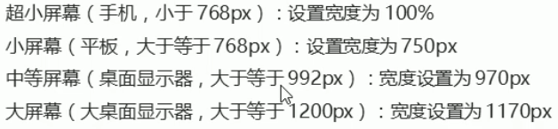
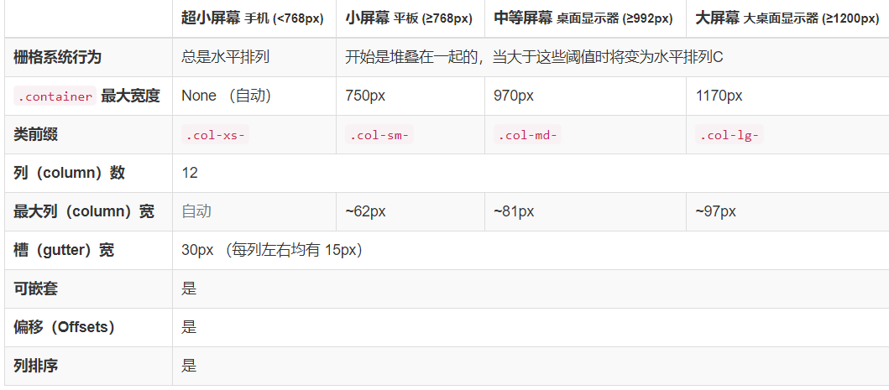
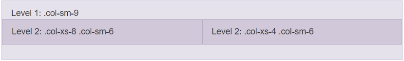
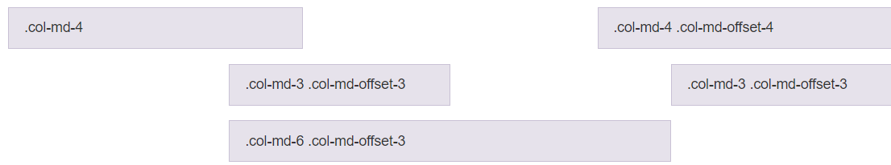
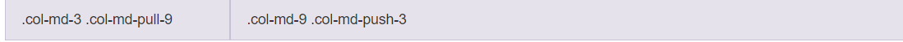

### 视口

**布局视口**

layout viewport，一般移动设备的浏览器都默认设置了一个布局视口，用于解决早期 PC 页面显示问题。

IOS、Android基本上都将这个视口分辨率默认设置为 980px，所以 PC 页面通过这个视口在手机上呈现时元素相对比较小。


**视觉视口**

visual viewport，指的是用户正在看到的**网站区域**。可以通过缩放操作视觉视口，但不会影响布局视口。


#### 理想视口

ideal viewport，为了使网站在移动端设备有最理想的阅读和浏览设定，需要手动添加`meta 视口标签`告知浏览器。

#### meta 视口标签

主要目的是让布局视口的宽度和理想视口的宽度一致。

```html
<meta name="viewport"
    content="width=device-width,user-scalable=no, initial-scale=1.0,maximum-scale=1.0,minmum-scale=1.0">
```


###  二倍图

#### 背景缩放

background-size 规定背景图像的尺寸，后设置宽度和高度，如果只写一个值，则只是设置背景宽度，**高度会等比例缩放**。

- cover，把背景图片扩展至足够大，以使背景图像完全覆盖背景区域。
- contain，把图像扩展至最大尺寸，使背景宽度和高度能完全适应内容区域。

```css
test {
	background-size: 100px 100px;	
}
```


#### 二倍精灵图

1. 先将精灵图等比例缩放为相应像素。
2. 重新测量对应背景图片大小。


### 特殊样式解决方案

```css
/* 去除超链接标签点击高亮 */
-webkit-tap-highlight-color: transparent;
/* 去除按钮和输入框默认样式 */
-webkit-appearance: none;
/* 去除长按页面时弹出菜单 */
img,a { -webkit-touch-callout: none; }
```


### 布局

#### 流式布局（百分比布局）

流式布局就是百分比布局，通过将盒子的宽高设置成百分比来根据屏幕的宽度**动态伸缩**，不受固定像素的限制，内容向两侧填充。

流式布局方式是移动 web 开发中比较常见的布局方式。

为了解决盒子在流式布局下，过度伸缩从而影响盒子中元素内容的问题，通常会设置盒子宽高的最大和最小值：

- max-width：最大宽度（max-height）
- min-width：最小宽度（min-height）

#### flex 弹性布局

##### 基本概念

为盒装模型提供最大的灵活性，任何一个容器都可以指定为 flex 布局。

- 操作方便，布局极为简单，移动端应用很广泛
- PC 端浏览器支持情况较差
- IE 核心浏览器低版本不支持。

> 如果是 PC端页面，还是考虑使用传统布局。如果是 移动端或者不考虑兼容性问题的PC端布局页面，推荐使用 flex 弹性布局。

- 当设置父盒子为 flex 布局时，里面所有子盒子的float、clear、vertical-align 属性都将失效。
- 伸缩布局 = 弹性布局 = 伸缩盒布局 = 弹性盒布局 = flex 布局


采用 flex 布局的元素，被称为 flex 容器（简称：容器）。它的所有子元素被称为 flex 项目（简称：项目）。

> 通过给父元素添加 flex 属性，可以控制子元素的位置和排列方式。此时容器中所有项目可以横向排列也可以纵向排列。


##### 常见属性

**flex-direction**

在 flex 布局中，是分为主轴和侧轴两个方向的，默认主轴方向就是 x 轴方向，侧轴是 y 轴方向，**元素都是跟着主轴进行排列的**。

可以通过 `flex-direction` 设置主轴方向。

> 主轴和侧轴会发生变化，就看 flex-direction 设置哪个方向为主轴，剩下的就是侧轴。


**justify-content**

设置主轴上子元素的排列方式。


**flex-wrap**

设置子元素在排列时是否换行，默认 no-wrap 不换行，但子元素过多过大时，会自动缩小子元素宽高来保证一行显示。


**align-items**

设置侧轴上子元素的排列方式（**只适合单行元素使用**）。


> stretch 对子盒子进行拉伸，当子盒子没有高度的时候会将高度**拉伸到父盒子等高**。


**align-content**

设置子项目出现**换行**时在侧轴上的排列效果。


**flex-flow**

针对 flex-direction 和 flex-wrap 的简写属性。

```css
flex-flow: row wrap;
```


**flex**

定义容器中项目分配剩余空间，用`flex`表示占用份数。


**align-self**

控制子项自己在侧轴的排列方式，允许某一个子项拥有和其他子项不同的**对齐方式**，覆盖 align-items 属性。

默认为 auto，表示继承父元素的 align-items 属性，如果没有父元素，则等同于 stretch。

**order**

定义子项的排列顺序（前后顺序），数值越小，排列越靠前，默认为0。

> z-index：控制的是优先级。order：控制的是排列顺序。


#### less + rem + 媒体查询布局

##### rem 单位

rem 是一个相对单位，类似于 em，em是父元素字体大小。

不同的 rem 的基准是相对于 html 元素的**字体大小**。

比如：根元素 html 设置 font-size=12px，非根元素设置 width:2rem，此时 rem 换成 px 就是 24px。

##### 媒体查询

媒体查询（Media Query）是 C3 新语法，一般按照从大到小或者从小到大的顺序书写。

- 使用 @media 查询，可以针对不同的媒体类型定义不同的样式。
- @media 可以针对不同的屏幕尺寸设置不同样式。
- 当你重置浏览器大小的过程中，页面也会根据浏览器的宽度和高度重新渲染页面。
- 目前针对很多苹果手机、安卓手机、平板等设备都用得到多媒体查询。

语法规范：

```css
@media mediatype and|not|only (media feature){
    CSS-Code;
}
```

- 使用 @media 开头
- mediatype 媒体类型。
    - all：所有设备；
    - print：打印机和打印预览；
    - scree：电脑屏幕、手机、平板等。
- 关键字，主要是将媒体类型或者多个媒体特性连接到一起作为媒体查询的条件。
    - and：并且，将多个媒体特性连接到一起；
    - not：排除某个媒体类型；
    - only：指定某个特定的媒体类型，可以省略。
- media feature 媒体特性，每个媒体类型可以设置不同的展示风格。必须在小括号里。
    - width：定义输出设备中页面可见区域的宽度。
    - min-width：定义输出设备中页面最小可见区域的宽度。
    - max-width：定义输出设备中页面最大可见区域的宽度。

##### 引入资源

当样式比较多的时候，可以针对不同的媒体使用不同的样式表（css文件）。

原理：直接在 link 中判断设备的尺寸，然后引用不同的 CSS 文件。

语法：

```html
<link rel="stylesheet" media="mediatype and|not|only (media feature)" href="test.css">
```


##### 适配方案

1. 让一些不同等比自适应的元素，当设备尺寸发生改变的时候，等比例适配当前设备。
2. 使用媒体查询根据不同设备按比例设置 html 的字体大小，然后页面元素使用 rem 做尺寸单位，当 html 字体大小大声变化，元素尺寸也会发生变化。

实现方式：

- less + 媒体查询 + rem
- flexible.js + rem

#### 混合布局


#### 响应式 bootstarp

响应式需要一个父级作为布局容器，来配合子容器实现在不同屏幕大小下的变化效果。

原理就是在不同屏幕下，通过媒体查询来改变这个布局容器的带下，在改变里面子元素的排列方式和大小。从而实现不同屏幕下，看到不同的页面布局和样式变化。




##### 布局容器

bootstrap 需要为页面内容和栅格系统包裹一个 `.container`容器，bootstrap 预先定义好了这个类，叫`.container`。

提供了两个作此用处的类：

`container` 类

- **响应式布局**的容器，固定宽度

- 大屏（>= 1200px）宽度固定为 `1170px`；中屏（>= 992px）宽度固定为 `970px`；小屏（>= 768px）宽度固定为 `750px`；超小屏宽度固定为 `100%`；

    > 上述媒体查询设置是 bootstrap3 版本。4.xx之后，宽度默认为 **百分之百宽度**：
    >
    > - 当宽度大于 768px，宽度固定为 720px；
    > - 当 768px > 宽度 > 576px，宽度固定为 540px


`container-fluid` 类

- **流式布局容器**，百分之百宽度。
- 占据全部视口的容器。
- 适合移动端开发。


##### 栅格系统

Bootstrap 提供了一套响应式、移动设备优先的流式栅格系统，随着屏幕或视口（viewport）尺寸的增加，系统会自动分为最多12列（可以理解为将 container 容器划分为 12 列）。

栅格系统用于通过一系列的行（row）和列（column）的组合来创建页面布局。

`.row`定义行，定义列：



- row 必须放在container容器中。
- 如果要通过 bootstrap 实现列的划分，必须添加**类前缀**。
- xs: extra small； sm: small；md：medium；lg：large
- 如果一行（row）中包含了的列（column）大于 12，多余的列（column）所在的元素将被作为一个整体另起一行排列。
- 每一列默认有左右 15px 的 padding。
- 可以为一个元素指定多个设备的类前缀，以便在不同屏幕下划分不同份数。

##### 嵌套列

为了使用内置的栅格系统将内容再次嵌套，可以通过添加一个新的 `.row` 元素和一系列 `.col-sm-*` 元素到已经存在的 `.col-sm-*` 元素内。被嵌套的行（row）所包含的列（column）的个数不能超过12（其实，没有要求你必须占满12列）



##### 列偏移

使用 `.col-md-offset-*` 类可以将列向右侧偏移。这些类实际是通过使用 `*` 选择器为当前元素增加了左侧的边距（margin）。例如，`.col-md-offset-4` 类将 `.col-md-4` 元素向右侧偏移了4个列（column）的宽度。




##### 排序

通过使用 `.col-md-push-*` 和 `.col-md-pull-*` 类就可以很容易的改变列（column）的顺序。




为了加快对移动设备友好的页面开发工作，利用媒体查询功能并使用这些工具类可以方便的针对不同设备展示或隐藏页面内容。另外还包含了针对打印机显示或隐藏内容的工具类。

有针对性的使用这类工具类，从而避免为同一个网站创建完全不同的版本。相反，通过使用这些工具类可以在不同设备上提供不同的展现形式。

##### 可用的类

通过单独或联合使用以下列出的类，可以针对不同屏幕尺寸隐藏或显示页面内容。

|                 | 超小屏幕手机 (<768px) | 小屏幕平板 (≥768px) | 中等屏幕桌面 (≥992px) | 大屏幕桌面 (≥1200px) |
| :-------------- | :-------------------- | :------------------ | :-------------------- | :------------------- |
| `.visible-xs-*` | 可见                  | 隐藏                | 隐藏                  | 隐藏                 |
| `.visible-sm-*` | 隐藏                  | 可见                | 隐藏                  | 隐藏                 |
| `.visible-md-*` | 隐藏                  | 隐藏                | 可见                  | 隐藏                 |
| `.visible-lg-*` | 隐藏                  | 隐藏                | 隐藏                  | 可见                 |
| `.hidden-xs`    | 隐藏                  | 可见                | 可见                  | 可见                 |
| `.hidden-sm`    | 可见                  | 隐藏                | 可见                  | 可见                 |
| `.hidden-md`    | 可见                  | 可见                | 隐藏                  | 可见                 |
| `.hidden-lg`    | 可见                  | 可见                | 可见                  | 隐藏                 |

### Less

#### less 基础

css 扩展语言，css 预处理器。在现有 css 语法中，为 css 计入了程序式语言的特性，扩展了 css 的动态特性。

在 css 的语法基础上，引入了变量、Mixin（混入）、运算以及函数等功能，简化了 css 编写。

#### 变量

语法格式：

```css
@变量名:值;
```

#### 编译

less 是一套独立于 css 的语法规范，最终需要重新编译成 css 文件，才能在 html 页面中使用。

#### 嵌套

语法规范：

```less
header {
  color: black;
  .navigation {
    font-size: 12px;
  }
  .logo {
    width: 300px;
  }
}
// .navigation 和 .logo 是 header 的子元素
```

如果有 交集|伪类|伪元素 选择器还可以使用此方法将伪选择器与混入打包在一起。这是经典的 clearfix hack，重写为混入（`&` 代表当前选择器父级）：

```less
.clearfix {
  display: block;
  zoom: 1;

  &:after {
    content: " ";
    display: block;
    font-size: 0;
    height: 0;
    clear: both;
    visibility: hidden;
  }
}
```

> 如果内层选择器中没有 `&` 符号，会被解析为父选择器的后代，如果有会被解析为父元素自身或者伪类选择器。

#### 运算

任何数据、颜色或者变量都可以参与运算，less 提供了加减乘除的算术运算。

- 运算符左右两侧必须被空格隔开
- 如果运算中存在不同的单位，结果以第一个单位为主。

```less
@width: 100px;

div {
    width: @width * 2;
    height: @width;
    border: 5px solid red;
}
```


