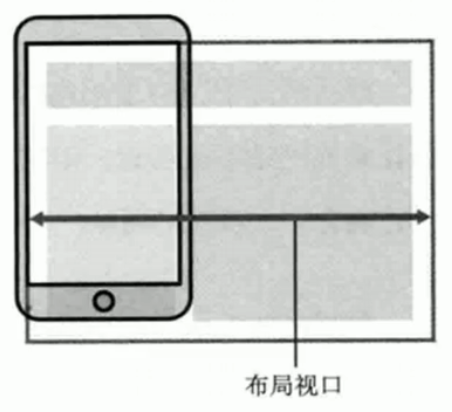
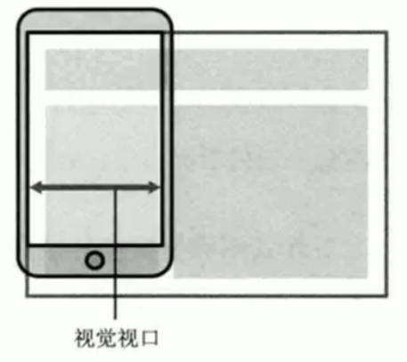
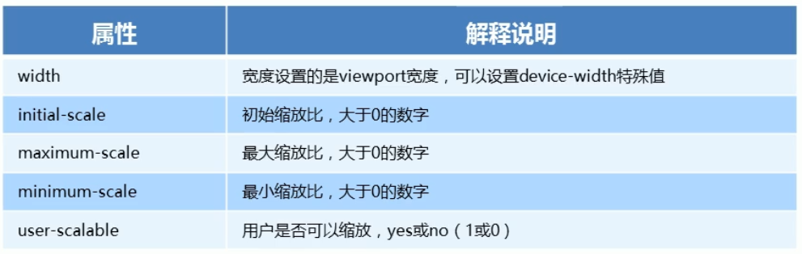
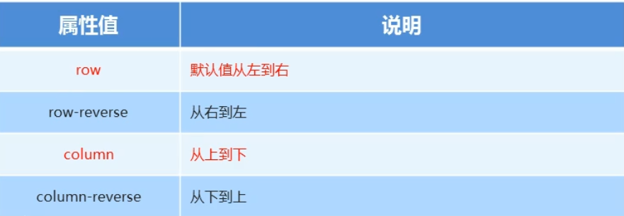
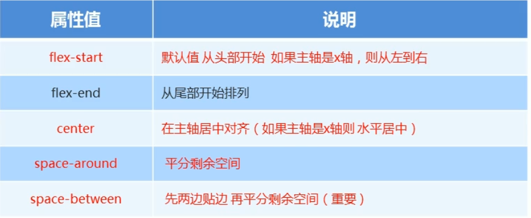
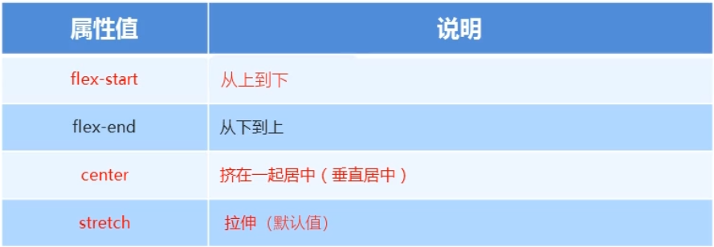
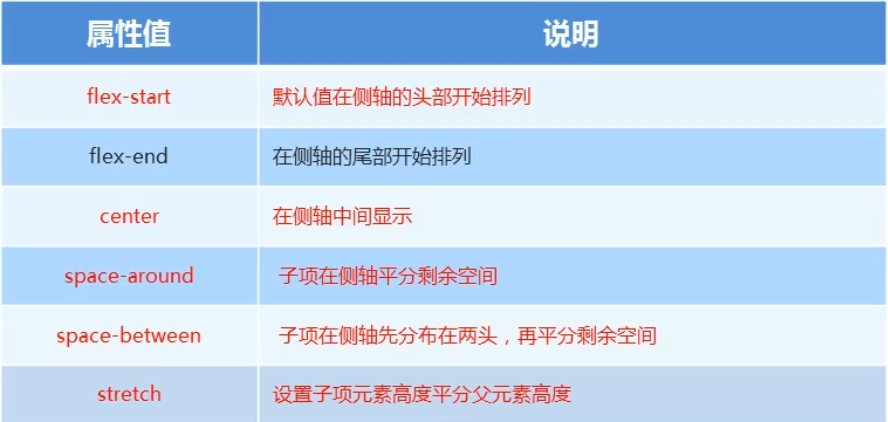
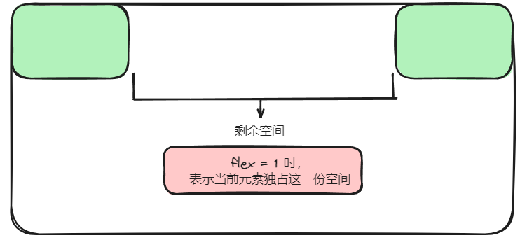

### 视口

**布局视口**

layout viewport，一般移动设备的浏览器都默认设置了一个布局视口，用于解决早期 PC 页面显示问题。

IOS、Android基本上都将这个视口分辨率默认设置为 980px，所以 PC 页面通过这个视口在手机上呈现时元素相对比较小。



**视觉视口**

visual viewport，指的是用户正在看到的**网站区域**。可以通过缩放操作视觉视口，但不会影响布局视口。



#### 理想视口

ideal viewport，为了使网站在移动端设备有最理想的阅读和浏览设定，需要手动添加`meta 视口标签`告知浏览器。

#### meta 视口标签

主要目的是让布局视口的宽度和理想视口的宽度一致。

```html
<meta name="viewport"
    content="width=device-width,user-scalable=no, initial-scale=1.0,maximum-scale=1.0,minmum-scale=1.0">
```



###  二倍图

#### 背景缩放

background-size 规定背景图像的尺寸，后设置宽度和高度，如果只写一个值，则只是设置背景宽度，**高度会等比例缩放**。

- cover，把背景图片扩展至足够大，以使背景图像完全覆盖背景区域。
- contain，把图像扩展至最大尺寸，使背景宽度和高度能完全适应内容区域。

```css
test {
	background-size: 100px 100px;	
}
```


#### 二倍精灵图

1. 先将精灵图等比例缩放为相应像素。
2. 重新测量对应背景图片大小。


### 特殊样式解决方案

```css
/* 去除超链接标签点击高亮 */
-webkit-tap-highlight-color: transparent;
/* 去除按钮和输入框默认样式 */
-webkit-appearance: none;
/* 去除长按页面时弹出菜单 */
img,a { -webkit-touch-callout: none; }
```


### 布局

#### 流式布局（百分比布局）

流式布局就是百分比布局，通过将盒子的宽高设置成百分比来根据屏幕的宽度**动态伸缩**，不受固定像素的限制，内容向两侧填充。

流式布局方式是移动 web 开发中比较常见的布局方式。

为了解决盒子在流式布局下，过度伸缩从而影响盒子中元素内容的问题，通常会设置盒子宽高的最大和最小值：

- max-width：最大宽度（max-height）
- min-width：最小宽度（min-height）

#### flex 弹性布局

##### 基本概念

为盒装模型提供最大的灵活性，任何一个容器都可以指定为 flex 布局。

- 操作方便，布局极为简单，移动端应用很广泛
- PC 端浏览器支持情况较差
- IE 核心浏览器低版本不支持。

> 如果是 PC端页面，还是考虑使用传统布局。如果是 移动端或者不考虑兼容性问题的PC端布局页面，推荐使用 flex 弹性布局。

- 当设置父盒子为 flex 布局时，里面所有子盒子的float、clear、vertical-align 属性都将失效。
- 伸缩布局 = 弹性布局 = 伸缩盒布局 = 弹性盒布局 = flex 布局


采用 flex 布局的元素，被称为 flex 容器（简称：容器）。它的所有子元素被称为 flex 项目（简称：项目）。

> 通过给父元素添加 flex 属性，可以控制子元素的位置和排列方式。此时容器中所有项目可以横向排列也可以纵向排列。


##### 常见属性

**flex-direction**

在 flex 布局中，是分为主轴和侧轴两个方向的，默认主轴方向就是 x 轴方向，侧轴是 y 轴方向，**元素都是跟着主轴进行排列的**。

可以通过 `flex-direction` 设置主轴方向。

> 主轴和侧轴会发生变化，就看 flex-direction 设置哪个方向为主轴，剩下的就是侧轴。




**justify-content**

设置主轴上子元素的排列方式。




**flex-wrap**

设置子元素在排列时是否换行，默认 no-wrap 不换行，但子元素过多过大时，会自动缩小子元素宽高来保证一行显示。


**align-items**

设置侧轴上子元素的排列方式（**只适合单行元素使用**）。



> stretch 对子盒子进行拉伸，当子盒子没有高度的时候会将高度**拉伸到父盒子等高**。


**align-content**

设置子项目出现**换行**时在侧轴上的排列效果。




**flex-flow**

针对 flex-direction 和 flex-wrap 的简写属性。

```css
flex-flow: row wrap;
```


**flex**

定义容器中项目分配剩余空间，用`flex`表示占用份数。



**align-self**

控制子项自己在侧轴的排列方式，允许某一个子项拥有和其他子项不同的**对齐方式**，覆盖 align-items 属性。

默认为 auto，表示继承父元素的 align-items 属性，如果没有父元素，则等同于 stretch。

**order**

定义子项的排列顺序（前后顺序），数值越小，排列越靠前，默认为0。

> z-index：控制的是优先级。order：控制的是排列顺序。


#### less + rem + 媒体查询布局


#### 混合布局


#### 响应式 bootstarp

