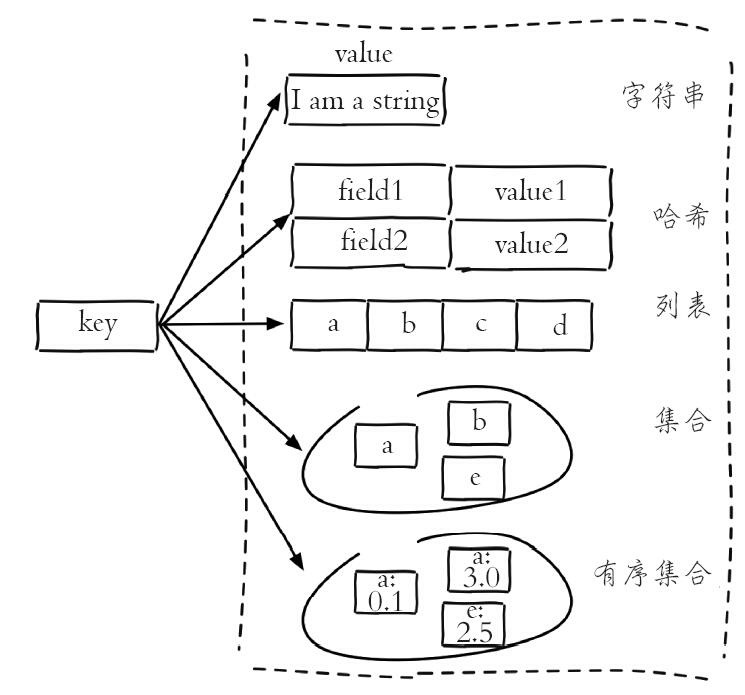
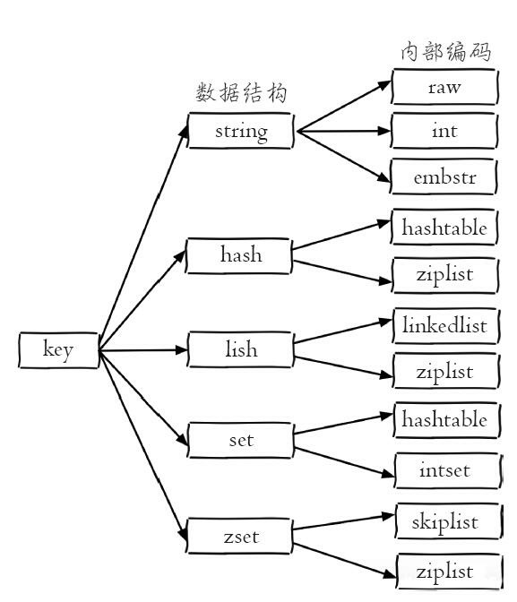

# Redis

## 数据结构



Redis这样设计有两个好处：

- 第一，可以改进内部编码，而对外的数据结构和命令没有影响，这样一旦开发出更优秀的内部编码，无需改动外部数据结构和命令
- 第二，多种内部编码实现可以在不同场景下发挥各自的优势，例如`ziplist`比较节省内存，但是在列表元素比较多的情况下，性能会有所下降，这时候Redis会根据配置选项将列表类型的内部实现转换为`linkedlist`。

#### 字符串

使用场景

1. 缓存
2. 计数
3. 分布式 Session
4. 限速


#### list 列表

- lpush+lpop=Stack（栈）
- lpush+rpop=Queue（队列）
- lpsh+ltrim=Capped Collection（有限集合）
- `lpush+brpop`/ `rpush+lrpop` =Message Queue（消息队列）

> blpop brpop 均为阻塞操作

#### 哈希

#### Set 集合

##### 应用场景

集合类型比较典型的使用场景是标签（tag）。模拟：

（1）给用户添加标签

```lua
sadd user:1:tags tag1 tag2 tag5
sadd user:2:tags tag2 tag3 tag5
...
sadd user:k:tags tag1 tag2 tag4
```

（2）给标签添加用户

```lua
sadd tag1:users user:1 user:3
sadd tag2:users user:1 user:2 user:3
...
sadd tagk:users user:1 user:2
```

> 用户和标签的关系维护应该在一个事务内执行，防止部分命令失败造成的数据不一致


（3）删除用户下的标签

```lua
srem user:1:tags tag1 tag5
...
```

（4）删除标签下的用户

```lua
srem tag1:users user:1
srem tag5:users user:1
...
```

（3）和（4）也是尽量放在一个事务执行。

（5）计算用户共同感兴趣的标签

可以使用sinter命令，来计算用户共同感兴趣的标签，如下代码所示：

```lua
sinter user:1:tags user:2:tags
```

集合类型的应用场景通常为以下几种：

- sadd=Tagging（标签）
- spop/srandmember=Random item（生成随机数，比如抽奖）
- sadd+sinter=Social Graph（社交需求

#### Zset 有序集合

##### 应用场景

有序集合比较典型的使用场景就是排行榜系统。举例：统计点赞数这个维度，实现排行榜。主要需要实现以下4个功能。

（1）添加用户赞数

例如用户mike上传了一个视频，并获得了3个赞，可以使用有序集合的zadd和zincrby功能：

```lua
zadd user:ranking:2016_03_15 3 mike
```

如果之后再获得一个赞，可以使用zincrby：

```lua
zincrby user:ranking:2016_03_15 1 mike
```

（2）取消用户赞数

由于各种原因（例如用户注销、用户作弊）需要将用户删除，此时需要将用户从榜单中删除掉，可以使用zrem。例如删除成员mike：

```lua
zrem user:ranking:2016_03_15 mike
```

（3）展示获取赞数最多的十个用户

此功能使用zrevrange命令实现：

```lua
zrevrangebyscore user:ranking:2016_03_15 9 0
```

> zrangebyscore key min max [WITHSCORES] [LIMIT offset count]按照分数从低到高返回
>
> zrevrangebyscore key max min [WITHSCORES] [LIMIT offset count] 按照分数从高到低返回

（4）展示用户信息以及用户分数

此功能将用户名作为键后缀，将用户信息保存在哈希类型中，至于用户的分数和排名可以使用zscore和zrank两个功能：

```lua
hgetall user:info:tom
zscore user:ranking:2016_03_15 mike
zrank user:ranking:2016_03_15 mike
```


### 关系型数据库记录缓存方案

- **数据分散且字段较多**：推荐使用 Hash 结构，将每个用户或每个对象作为一个哈希存储。

- **需要排序或排名**：使用 Sorted Set 存储，并根据不同维度设置不同的 score。

- **数据量较大且相对静态**：可以采用 String 结构，结合数据压缩技术（如 gzip）减少存储空间。

    > 查询数据的性能瓶颈在于序列化或者解压缩

## 架构

Redis使用了单线程架构和I/O多路复用模型来实现高性能的内存数据库服务


### 为什么单线程还能这么快

- 纯内存访问，Redis将所有数据放在内存中，内存的响应时长大约为100纳秒，这是Redis达到每秒万级别访问的重要基础。
- 非阻塞I/O，Redis使用epoll作为I/O多路复用技术的实现，再加上Redis自身的事件处理模型将epoll中的连接、读写、关闭都转换为事件，不
    在网络I/O上浪费过多的时间
- 单线程避免了线程切换和竞态产生的消耗
    - 单线程可以简化数据结构和算法的实现。并发数据结构实现不但困难而且开发测试比较麻烦。
    - 单线程避免了线程切换和竞态产生的消耗，对于服务端开发来说，锁和线程切换通常是性能杀手


## 性能优化


redis是基于单线程模型实现的,也就是说redis是使用一个线程来处理所有的客户端请求,尽管redis做了一系列的优化,使用非阻塞io,对命令进行优化(操作时间复杂度都是o(1)),但是由于是单线程的原因,性能的要求还是非常苛刻。

可以通过一些优化手段来提升redis的运行速度。


### 1.缩短键值对的存储长度。

**问题**：

redis在数据存储时，在key不变的情况下，value值越大操作效率越慢。

**原因**：

因为redis对于同一种数据类型会使用不同的内部编码进行存储，比如字符串的内部编码就有3种：
**int（整数编码），raw（优化内存分配的字符串编码），embstr（动态字符串编码）**
这样做的目的是为了通过不同编码实现效率和空间的平衡，然而数据量越大使用的内部编码就越复杂，而越复杂的内部编码存储性能就越低。

当数据内容较大时，还会带来另外几个问题：

- 内容越大需要的持久化时间就越长，需要挂起的时间越长，redis性能就会越低。

- 内容越大在网络上传输的内容就越多，需要时间就越长，整体运行数据就会越低。

- 内容越大占用的内存就越多，就会更频繁的触发内存淘汰机制，从而给redis带来了更多的运行负担。

    

**解决**：

在保证完整语义的同时，尽量缩短**键值对**的存储长度，必要时可以对数据进行**序列化**和**压缩**再存储。


> 序列化可以使用protostuff,kryo   压缩可以使用snappy


### 2.使用lazy free(延迟删除/惰性删除)特性。

> lazy free特性是redis4.0新增的一个经常使用的功能，表示为惰性删除或者延迟删除。

在删除的时候提供异步延时释放键值的功能，把键值释放操作放在 BIO（background i/o）单独的子线程处理，以减少删除操作对 redis 主线程的阻塞，可以有效的避免删除 big key 时带来的性能和可用性问题。

lazy free 对应了4种场景，默认都是关闭的：

```shell
lazyfree-lazy-eviction no
#表示当 redis 运行内存超过maxmeory时，是否开启lazy free机制删除。

lazyfree-lazy-expire no
#表示设置了过期时间的键值，当过期之后是否开启lazy free机制删除。

lazyfree-lazy-server-del no
#有些指令在处理已存在的键时，会带有一个隐式的del键的操作，比如rename命令，当目标键已存在，redis会先删除目标键，如果这些目标键是一个big key，就会造成阻塞删除的问题，此配置表示在这种场景中是否开启lazy free机制删除。

slave-lazy-flush no
#针对slave（从节点）进行全量数据同步，slave在加载master的RDB文件前，会运行flushall来清理自己的数据，它表示此时是否开启lazy free机制删除。
```


> 建议开启其中的 lazyfree-lazy-eviction、lazyfree-lazy-expire、lazyfree-lazy-server-del 等配置，这样就可以有效的提高主线程的执行效率。


### 3.设置键值的过期时间


存储数据时应该根据实际的业务情况，对键值设置合理的过期时间，这样redis会自动清除过期的键值对，以节约对内存的占用，以避免键值过多的堆积，频繁的触发内存淘汰策略。


### 4.禁用长时间的查询命令

redis绝大多数读写命令的时间复杂度都在O(1)到O(N)之间

> 其中O(1)表示可以安全使用的，而O(N)使用时需要注意，N表示不确定该，数据越大查询的速度可能会越慢。因为Redis只用一个线程来做数据查询，如果这些指令耗时很长，就会阻塞Redis，造成大量延迟。

要避免O(N)命令对Redis造成的影响，可以从以下几个方面改造：

- 决定禁止使用keys命名；
- 避免一次查询所有的成员，要使用scan命令进行分批的，游标式的遍历；
- 通过机制严格控制hash，set，sorted Set 等结构的数据大小；
- 将排序，并集，交集等操作放在客户端执行，以减少redis服务器运行压力；
- 删除一个大数据的时候，可能会需要很长时间，所以建议用异步删除的方式UNlink，它会启动一个新的线程来删除目标数据，而不是阻塞redis的主线程；


### 5.使用slowlog优化耗时命令


slowlog功能可以用来找出**最耗时的redis命令**进行相关的优化，以提升redis的运行速度，慢查询有两个重要的 配置项：


- slowlog-log-slower-than：用于设置慢查询的评价时间，也就是说超过此配置项的命令，将会被当成慢操作记录在慢查询日志中，它执行单位是微秒；
- slowlog-max-len：用来配置慢查询日志的最大记录数；


可以根据实际的业务情况进行相应的配置，其中慢日志是按照插入的顺序倒序存入慢查询日志中，我们可以使用slowlog get n 来获取相应的慢查询日志，在找到这些慢查询对应的业务进行相关优化。

### 6.使用pipeline批量操作数据


Pipeline（管道技术）是客户端提供的一种批处理技术，用于一次处理多个redis命令，从而提高整个交互的性能。


Pipeline测试代码：

```java
public class PipelineExample {
    public static void main(String[] args) {
		Jedis jedis = new Jedis("127.0.0.1", 6379);
        // 记录执行开始时间
        long beginTime = System.currentTimeMillis();
        // 获取 Pipeline 对象
        Pipeline pipe = jedis.pipelined();
        // 设置多个 Redis 命令
        for (int i = 0; i < 100; i++) {
        	pipe.set("key" + i, "val" + i);
            pipe.del("key"+i);
        }
        // 执行命令
        pipe.sync();
        // 记录执行结束时间
        long endTime = System.currentTimeMillis();
        System.out.println("执行耗时：" + (endTime - beginTime) + "毫秒");
    }
}
```

以上程序执行结果为：

执行耗时：297 毫秒

普通的操作代码如下：

```java
public class PipelineExample {
	public static void main(String[] args) {
        Jedis jedis = new Jedis("127.0.0.1", 6379);
        // 记录执行开始时间
        long beginTime = System.currentTimeMillis();
        for (int i = 0; i < 100; i++) {
            jedis.set("key" + i, "val" + i);
            jedis.del("key"+i);
        }
        // 记录执行结束时间
        long endTime = System.currentTimeMillis();
        System.out.println("执行耗时：" + (endTime - beginTime) + "毫秒");
    }
}
```

以上程序执行结果为：

执行耗时：17276 毫秒


从以上的结果可以看出，管道的执行时间是 297 毫秒，而普通命令执行时间是 17276 毫秒，管道技术要比普通的执行大约快了 58 倍。

### 7.避免大量数据同时失效

redis过期键值删除策略使用惰性+定期删除策略，每秒会进行1次过期扫描，此配置可在redis，conf进行配置，默认值是hz10，redis会随机抽取20个值，删除这20个键中过期的键，如果过期key的比例超过20%，重复执行此流程；


如果在大型系统中有大量缓存在同一时间同时过期，就会导致redis循环多次持续扫描删除过期字典，直到过期字典中过期键值被删除的比较稀疏为止，而在整个执行过程中会导致redis的读写出现卡顿，卡顿的另一种原因是内存管理器需要频繁回收内存页，因此也会消耗一定的CPU。

为了避免这种卡顿现象的产生，我们需要预防大量的缓存在同一时刻一起过期，简单的解决方案就是

**在过期时间的基础上添加一个指定范围的随机数**。


### 8.客户端使用优化


在客户端的使用上我们除了要尽量使用pipeline的技术外，还需要注意尽量使用redis连接池，而不是频繁创建销毁redis连接，这样就可以减少网络传输次数和减少了非必要调用指令。


### 9.限制redis内存大小


在64位操作系统中redis的内存大小是没有限制的，也就是配置项maxmemory< bytes >是被注释掉的，这样就会导致在物理内存不足时，使用swap空间既交换空间，而当操作系统将redis所用的内存分页移至swap空间时，将会阻塞redis进程，导致redis出现延迟，从而影响redis的整体性能。因此我们需要限制redis的内存大小为一个固定的值，当redis的运行到此值会触发内存淘汰策略，**内存淘汰策略在redis4.0**之后有8种：

1. noevication：不淘汰任何数据，当内存不足时，新增操作会报错


### 10.使用物理机而非虚拟机安装redis服务


### 11.检查数据持久化策略


### 12.禁用THP特性


### 13.使用分布式架构来增加读写速度