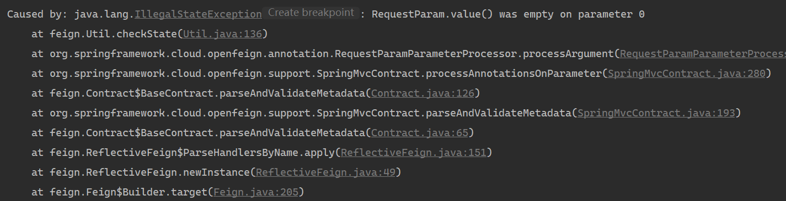

## JavaWeb

**解决过滤器中请求转发导致CSS样式失效**

```jsp
<%
String path = request.getContextPath();
String basePath = request.getScheme()+"://"+request.getServerName()+":"+request.getServerPort()+path+"/";
%>
<base href="<%=basePath%>"/>
```

**解决过滤器中重定向重复**

```Java
//登录过滤
HttpServletRequest request = (HttpServletRequest) req;
HttpServletResponse response = (HttpServletResponse) resp;
HttpSession session = request.getSession();
Object user =  session.getAttribute("user");
	if (user == null) {
		if(!request.getRequestURI().contains("index.jsp")){
    		response.sendRedirect(request.getContextPath() + "/index.jsp");
    		return;
    	}
	}
```


<hr/>

## MySQL


MySQL语句错误

解决方案:修改SQL语句


 

映射文件异常

解决办法：查看与该项目中的所有#{}，应该是 #{}的中间没有写值


## Spring框架

#### 使用spring事务发生的错误


原因:未导入对应的依赖

解决方法:导入spring-aspects依赖


#### 对象创建失败


> 

原因:未引入对应的配置


#### aop配置类创建失败

**Annotation-specified bean name 'businessAspect' for bean class [com.study.config. BusinessAspect] conflicts with existing, non-compatible bean definition of same name and class [com.study.aop.BusinessAspect]**


```
原因：1.当前项目缓存中存在同名的bean对象，因为此项目名变动过
解决方案：1.通过项目构建工具maven/gradle将项目缓存clean，再重新编译
```


**java.lang.IllegalStateException: No thread-bound request found: Are you referring to request attributes outside of an actual web request, or processing a request outside of the originally receiving thread?  If you are actually operating within a web request and still receive this message, your code is probably running outside of DispatcherServlet: In this case, use RequestContextListener or RequestContextFilter to expose the current request.**

没有发现线程绑定的请求:您是在引用实际web请求之外的请求属性，还是在最初接收线程之外处理请求?如果你实际上在web请求中操作并且仍然收到这个消息，你的代码可能在DispatcherServlet之外运行:在这种情况下，使用RequestContextListener或RequestContextFilter来公开当前请求。

```markdown
问题原因：在一个请求调用链中涉及到一些同步方法（跟主线程处于一个时间片中）和异步方法（通过@Async注解实现），在异步方法中会通过HttpServletRequest对象获取请求头数据；但异步方法流程较长，此时这个请求的主线程已经结束，导致在异步方法中出现这个问题。

解决思路：避免在异步线程中操作httpservlet数据，如果异步线程调用链中需要使用此时请求中的信息，可以考虑通过通信技术（方法透传，缓存）将数据传到异步线程中。
```


#### Openfeign 接口参数配置问题

**报错日志**：



**错误位置**：


**原因**：由 @RequestParam 注解导致，根据堆栈日志翻译后得知，是 Param 注解未添加 `value` 参数。

**解决方案**：

1.  @RequestParam 注解添加 value 参数。

2.  去除 @RequestParam 注解。

    >   在 feign 接口中，如果当前接口只有一个基本类型参数，而不是实体，那就可以不用添加 @RequestParam 注解。


### nacos

#### 错误详情

nacos注册中心连接失败，启动日志如下：


nacos服务运行正常


#### 错误原因


Nacos 2.x版本以上多了几个端口（`9848`,`9849`），在 nacos 部署的时候也需要暴露这两个端口，如果不暴露就会出现这种问题。

>   如果是 docker 部署 nacos，记得也要做这两个端口的映射，不然还会出现报错。


## Redis

### 1.项目中redis序列化问题

**spring项目中redis模板类包含两个种,StringRedisTemplate和RedisTemplate两种序列化类，它们都只能读自己存的数据，即数据互不相通。StringRedisTemeplate,这两种模板的序列化格式不同,当存入key值redis**

```markdown
1. 采用的序列化策略不同
        StringRedisTemplate采用的是String的序列化策略；RedisTemplate默认采用的是jdk的序列化策略
2. 存的数据形式不同
        StringRedisTemplate存的是字符串；RedisTemplate存的是字节数组，在redis-cli中看好像乱码
3. 使用范围不同
		StringRedisTemplate只能处理字符串类型的数据，如果存取复杂的对象，又不想做额外的处理，最好用RedisTemplate
4. RedisTemplate可以根据需要设置序列化策略
        默认的是jdk的JdkSerializationRedisSerializer，常用的还有Jackson2JsonRedisSerializer等
```


**not annotated with HTTP method type (ex. GET, POST)**

当项目在web层调用不同的feign接口时，新版的open-feign支持spring-MVC注解和原生注解，但如果调用多个feign并且每个feign的注解格式不同，此时open-feign就会采用最先引用的feign对象中的注解格式，但是原生注解格式就会不支持

```yml
#配置文件方式修改
feign:
  client:
    config:
      #此处为feign的beanname
      provider:
        contract: feign.Contract.Default
```

```java
//配置类修改
@Configuration
public class MyFeignConfiguration {

    @Bean
    public Contract feignContract(){
        //采用原生注解契约
        return new feign.Contract.Default();
    }
    @Bean
    public Logger.Level logLevel(){
        return Logger.Level.FULL;
    }
}
```


